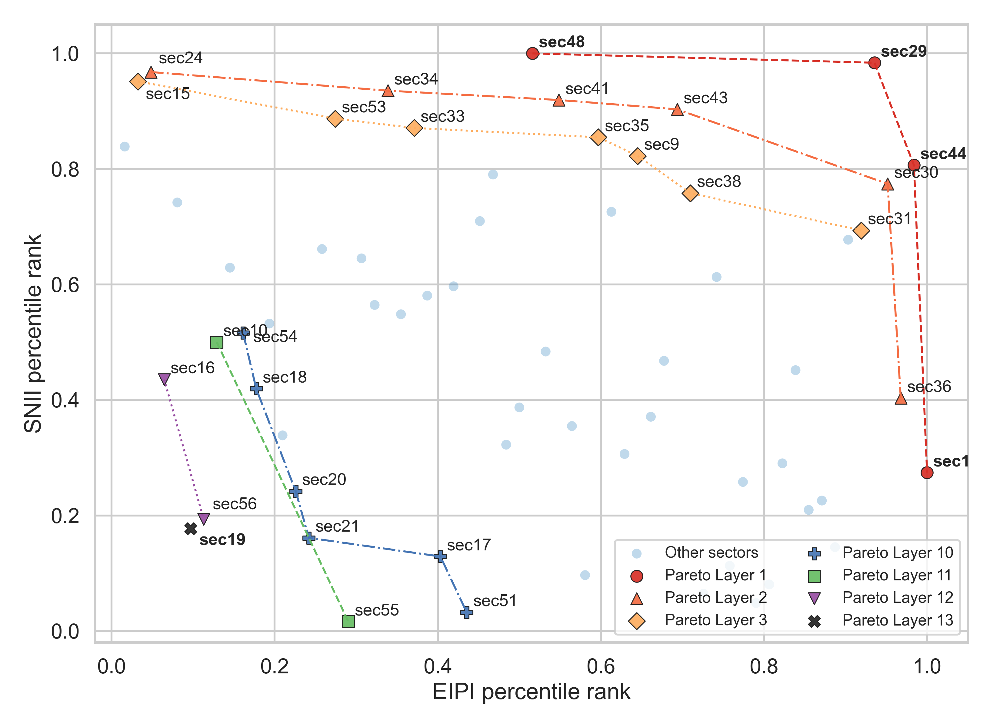
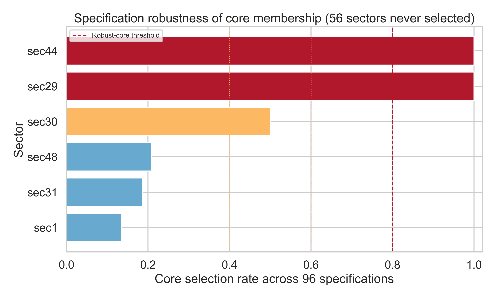
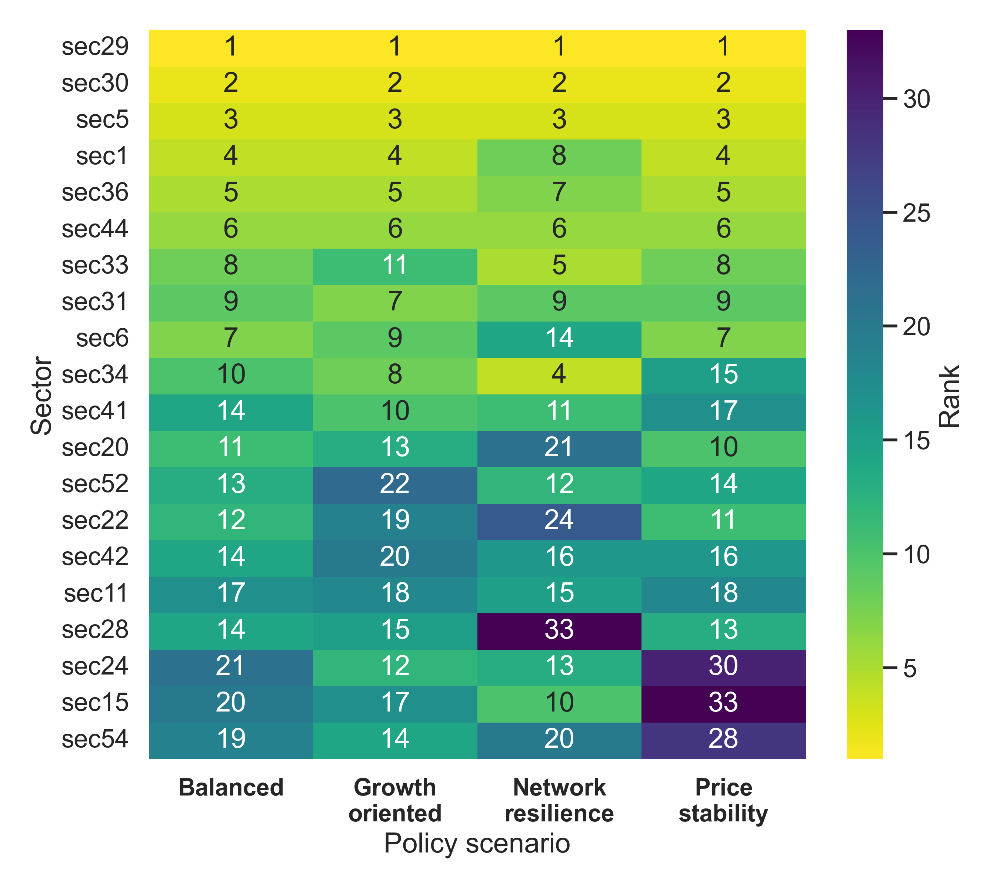
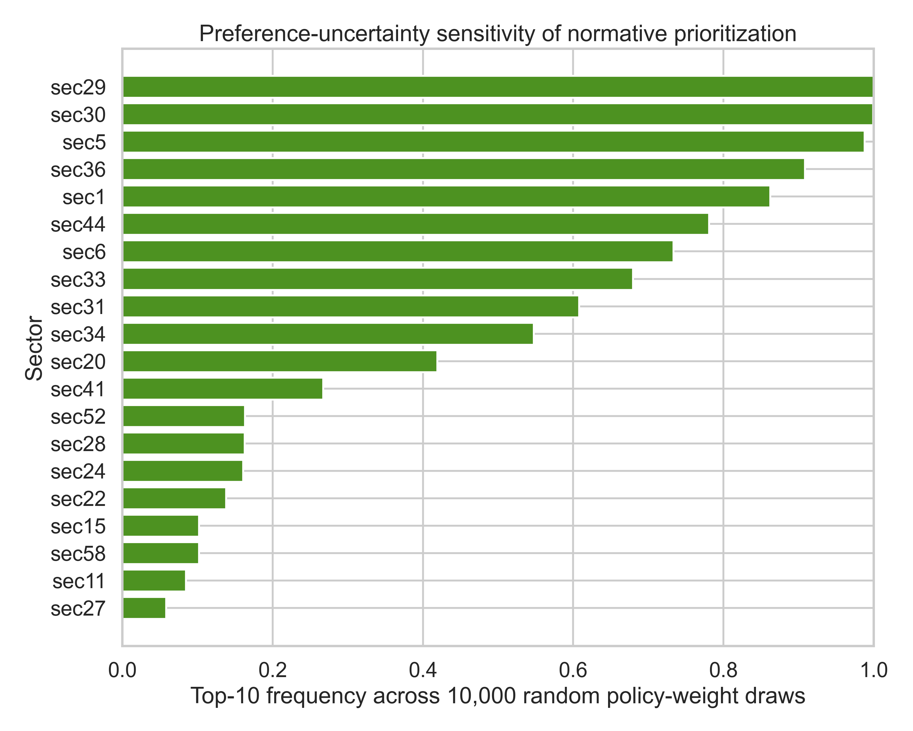

# Analiz IV: Pareto-Etkinlik, Spesifikasyon Sağlamlığı ve Normatif Tercihler Altında Çekirdek Sektörlerin Belirlenmesi

## Özet

Bu analiz, SNII ve EIPI ortalamalarını kesim noktası olarak kullanan önceki dört-çeyrek sınıflamasını daha bilimsel ve normatif olarak şeffaf bir karar çerçevesine dönüştürmektedir. Yeni yöntem üç ayrımı birlikte uygular: (i) iki amaçlı Pareto-etkinlik, (ii) her iki eksende dengeli performans ve alternatif ölçüm tercihlerine karşı üyelik sağlamlığı, (iii) açık politika amaçları altında normatif sıralama. Ana SNII–doğrudan EIPI düzleminde birinci Pareto katmanı `sec29`, `sec44`, `sec48` ve `sec1` sektörlerinden oluşmuştur. Dengeli performans filtresi `sec1` ve `sec48`i dışarıda bırakarak `sec29` ve `sec44`ü birincil aday olarak seçmiştir. Dört SNII, dört EIPI, iki dönüşüm ve üç denge kuralından oluşan 96 spesifikasyonda `sec29` ve `sec44` her defasında seçilmiş; `sec31` %25.0, `sec1` %14.6, `sec30` %12.5 ve `sec48` yalnızca %1.0 seçim oranı göstermiştir. Bu nedenle nihai sağlam çekirdek `sec29` ve `sec44` olarak belirlenmiştir. Bu sınıflama istatistiksel bir üyelik olasılığı değil, açıkça tanımlanmış spesifikasyon evrenindeki karar kararlılığıdır.

## 1. Araştırma Problemi

Önceki yöntemde bir sektör aşağıdaki iki koşulu sağladığında Stratejik Çekirdek olarak sınıflandırılmıştır:

$$
SNII_i\geq \overline{SNII}, \qquad EIPI_i\geq \overline{EIPI}.
$$

Bu kural kolay yorumlanmakla birlikte ortalamanın uç değerlere duyarlılığı, eşik çevresindeki süreksizlik, örtük eşit-ağırlık tercihi ve ölçüm yöntemi belirsizliğini göz ardı etmesi nedeniyle nihai politika kuralı olarak zayıftır. Analiz IV ortalama çeyreklerini karşılaştırmalı baseline olarak korur; çekirdek üyeliğini ise çok aşamalı bir eleme ve sağlamlık problemi olarak yeniden kurar.

## 2. Veri ve Girdiler

Ana girdi, Analiz III'teki 62 sektör × 43 değişkenlik birleşik paneldir. Dört SNII ve dört EIPI varyantı doğrudan kullanılmıştır:

| Katman | Varyantlar |
|---|---|
| SNII | `SNII_DIM`, `SNII_TOPSIS`, `SNII_PCA`, `SNII_AVG` |
| EIPI | `EIPI_CH`, `EIPI_TOPSIS`, `EIPI_PCA`, `EIPI_AVG` |
| Normatif kanallar | `SNII_DIM`, büyüme-yayılma, refah-dağılım, dış denge, fiyat istikrarı |

Girdiler klasör içine kopyalanarak analiz dış klasör bağımlılığından arındırılmıştır. Ana analiz `EIPI_CH` değerini doğrudan kullanır; TOPSIS, PCA ve AVG skorları alternatif toplulaştırma yöntemleridir. Sektörler `sec1…sec62` kodlarıyla temsil edilmektedir.

## 3. Yöntem

### 3.1. Yüzdelik dönüşüm

Ana analizde endekslerin örneklem içi yüzdelik sıraları kullanılmıştır:

$$
S_i=F_{SNII}(SNII_i),\qquad E_i=F_{EIPI}(EIPI_i).
$$

Bu dönüşüm ölçek farkını ortadan kaldırır ve uç değerlerin min–max dönüşümü üzerindeki etkisini azaltır. Min–max dönüşümü sağlamlık evreninde ayrıca korunmuştur.

### 3.2. Pareto katmanları

Sektör $j$, sektör $i$yi aşağıdaki durumda domine eder:

$$
S_j\geq S_i,\qquad E_j\geq E_i,
$$

ve en az bir eşitsizlik katıdır. Başka bir sektör tarafından domine edilmeyen gözlemler birinci Pareto katmanına atanır. Ardından bu katman örneklemden çıkarılarak ikinci ve sonraki katmanlar hesaplanır. Pareto birinci katmanı keyfî ağırlık gerektirmeyen bir "elenmemesi gereken adaylar" kümesidir; tek başına çekirdek üyeliği değildir.

### 3.3. Dengeli performans

Üç denge kuralı hesaplanmıştır:

$$
G_i=\sqrt{S_iE_i},\qquad
M_i=\min(S_i,E_i),\qquad
H_i=0.5G_i+0.5M_i.
$$

Geometrik skor telafiyi sınırlar; bottleneck skoru en zayıf ekseni cezalandırır; hibrit skor iki özelliği birleştirir. Ana kuralda bir sektörün birinci Pareto katmanında bulunmasına ek olarak $H_i$ değerinin örneklem 75. yüzdeliğine eşit veya yüksek olması gerekir. Ana eşik $H_{0.75}=0.505907$ olarak bulunmuştur.

### 3.4. Spesifikasyon sağlamlığı

Karar kuralının yöntem seçimine bağımlılığı aşağıdaki tam faktöriyel evrende sınanmıştır:

$$
4\;SNII\times4\;EIPI\times2\;dönüşüm\times3\;denge\;kuralı=96\;spesifikasyon.
$$

Her spesifikasyonda Pareto katmanları yeniden hesaplanmış, ilgili denge skorunun 75. yüzdeliği yeniden belirlenmiş ve çekirdek kararı tekrar verilmiştir. Sektör $i$ için sağlamlık oranı:

$$
R_i=\frac{1}{96}\sum_{m=1}^{96}\mathbb{1}(i\in Core_m).
$$

Sınıflar önceden şu şekilde tanımlanmıştır:

| Sağlamlık oranı | Sınıf |
|---:|---|
| $R_i\geq0.80$ | Sağlam Çekirdek |
| $0.60\leq R_i<0.80$ | Muhtemel Çekirdek |
| $0.40\leq R_i<0.60$ | Spesifikasyona Duyarlı |
| $R_i<0.40$ | Sağlam Çekirdek Değil |

Nihai üyelik, ana spesifikasyonda çekirdek adayı olma ile $R_i\geq0.80$ koşullarının kesişimidir.

### 3.5. Normatif politika senaryoları

Normatif analiz kompozit EIPI'yi yeniden ağırlıklandırmak yerine çift sayımı önlemek amacıyla SNII ile EIPI'nin dört iktisadi kanalını kullanır:

$$
V_i=w_NS_i+w_1C1_i+w_2C2_i+w_3C3_i+w_4C4_i,
\qquad \sum_kw_k=1.
$$

| Senaryo | Ağ | Büyüme | Refah | Dış denge | Fiyat |
|---|---:|---:|---:|---:|---:|
| Dengeli | 0.20 | 0.20 | 0.20 | 0.20 | 0.20 |
| Büyüme odaklı | 0.20 | 0.35 | 0.20 | 0.15 | 0.10 |
| Fiyat istikrarı | 0.15 | 0.15 | 0.20 | 0.15 | 0.35 |
| Ağ dayanıklılığı | 0.40 | 0.15 | 0.15 | 0.20 | 0.10 |

Ek olarak 10.000 ağırlık vektörü beş boyutlu simplex üzerinde Dirichlet$(1,1,1,1,1)$ dağılımından çekilmiştir. Buradan elde edilen ilk-10 ve birinci-sıra frekansları örnekleme belirsizliği değil, politika tercihi belirsizliğidir.

## 4. Bulgular

### 4.1. Ana Pareto ve denge sonuçları

| Sektör | SNII yüzdeliği | EIPI yüzdeliği | Pareto katmanı | Hibrit denge | Ana aday |
|---|---:|---:|---:|---:|---|
| `sec29` | 0.984 | 0.919 | 1 | 0.935 | Evet |
| `sec44` | 0.806 | 0.984 | 1 | 0.849 | Evet |
| `sec48` | 1.000 | 0.500 | 1 | 0.604 | Evet |
| `sec1` | 0.274 | 1.000 | 1 | 0.399 | Hayır |
| `sec30` | 0.774 | 0.968 | 2 | 0.820 | Hayır |

`sec1`, EIPI'de en yüksek sıraya sahip olduğu için Pareto sınırındadır; fakat SNII yüzdeliği 0.274 olduğundan dengeli çekirdek koşulunu karşılamamaktadır. `sec30` her iki eksende de güçlü ve yüksek dengeli skora sahip olmasına rağmen ana endeks çiftinde `sec29`/`sec44` tarafından domine edildiği için ikinci Pareto katmanında kalmıştır. Bu iki örnek Pareto ve denge filtrelerinin neden birlikte gerektiğini gösterir.

### 4.2. Spesifikasyon sağlamlığı

| Sektör | Seçilme | Oran | Birinci-katman frekansı | Sonuç |
|---|---:|---:|---:|---|
| `sec29` | 96/96 | 1.000 | 1.000 | Sağlam Çekirdek |
| `sec44` | 96/96 | 1.000 | 1.000 | Sağlam Çekirdek |
| `sec31` | 24/96 | 0.250 | 0.250 | Sağlam Çekirdek Değil |
| `sec48` | 21/96 | 0.219 | 0.250 | Sağlam Çekirdek Değil |
| `sec30` | 12/96 | 0.125 | 0.125 | Sağlam Çekirdek Değil |
| `sec1` | 12/96 | 0.125 | 0.250 | Sağlam Çekirdek Değil |

Diğer 56 sektör hiçbir spesifikasyonda çekirdek seçilmemiştir. En önemli bulgu `sec48`in ana modelde aday olmasına karşın yalnızca 21 spesifikasyonda seçilmesidir. SNII eksenindeki maksimum değer, alternatif EIPI/endeks/dönüşüm tercihlerinde dengeli üstünlüğe dönüşmemektedir. Buna karşılık `sec29` ve `sec44` bütün yöntem tercihlerinde hem Pareto-etkin hem yüksek dengeli performans göstermiştir.

### 4.3. Eski ve yeni yöntemin karşılaştırılması

Ortalama-eşikli yöntemde sekiz Stratejik Çekirdek sektör bulunurken yeni katı kural iki Sağlam Çekirdek sektör üretmiştir:

| Geçiş | Sektör sayısı |
|---|---:|
| Her iki yöntemde çekirdek | 2 |
| Ortalama-eşikli çekirdek, sağlam çekirdek değil | 7 |
| Her iki yöntemde çekirdek dışı | 53 |
| Yeni yöntemde sonradan çekirdeğe giren | 0 |

Bu sonuç eski sekiz sektörün ekonomik olarak önemsiz olduğunu göstermez. Yeni sınıflama daha dar bir soruya cevap verir: "hangi sektörler hem iki eksende elenemez hem dengeli hem de ölçüm tercihlerinin neredeyse tamamında aynı kararı korur?"

### 4.4. Normatif senaryolar

`sec29`, `sec5`, `sec30`, `sec44` ve `sec31` dört sabit politika senaryosunun tamamında ilk 10'da yer almıştır. Ancak bunlardan yalnızca `sec29` ve `sec44` spesifikasyon-sağlam çekirdektir. Özellikle `sec5`, ağ–EIPI Pareto kuralında sağlam çekirdek olmamasına rağmen dört normatif senaryoda da ikinci sıradadır ve rastgele ağırlıkların %98.3'ünde ilk 10'a girmektedir. Bu ayrım politika açısından önemlidir:

- **Sağlam yapısal çekirdek:** `sec29`, `sec44`.
- **Yüksek normatif değer fakat Pareto-sağlam çekirdek olmayan aday:** başta `sec5`, ardından `sec30`, `sec31` ve `sec6`.
- **Tek kanalda uç fakat dengesiz aday:** `sec1` ve `sec48`.

10.000 ağırlık çekilişinde `sec29` %99.83 oranında ilk 10'a, %66.66 oranında ilk sıraya girmiştir. `sec44` için bu oranlar %75.89 ve %12.62'dir. `sec6`, sağlam çekirdek olmadığı hâlde politika ağırlıklarına bağlı olarak %78.29 ilk-10 ve %17.44 birinci-sıra frekansı göstermiştir. Dolayısıyla bilimsel çekirdek üyeliği ile normatif politika çekiciliği aynı kavram değildir.

## 5. Nihai Karar Çerçevesi

Önerilen raporlama üç ayrı etiketi korumalıdır:

1. **Robust Structural Core:** `sec29`, `sec44` — ölçüm tercihlerine dirençli bilimsel çekirdek.
2. **Policy-Priority Candidates:** politika senaryolarında sürekli üst sıralarda kalan fakat sağlam Pareto çekirdeği olmayan sektörler; özellikle `sec5`, `sec30`, `sec31`, `sec6`.
3. **Channel-Specialist Sectors:** tek bir eksen veya politika kanalında uç performans gösteren fakat dengeli olmayan sektörler; ana örnekler `sec1` ve `sec48`.

Bu ayrım, bir sektörün "core değilse desteklenmemesi gerekir" biçimindeki hatalı ikili yorumu önler. Sağlam çekirdek sınıfı sistemik ve yöntemden bağımsız önemi; normatif sıralama ise hükümetin açık amaçları altında toplumsal tercihleri temsil eder.

## 6. Sınırlılıklar

- %75 denge eşiği ve %80 sağlamlık eşiği normatif tasarım kararlarıdır; şeffaf olmakla birlikte doğal sabitler değildir.
- 96 spesifikasyon mevcut endeks ailesini tarar; CGE esneklik, kapanış ve şok duyarlılığı henüz bu evrene dahil değildir.
- Spesifikasyon oranı güven aralığı bulunan bir örnekleme olasılığı değildir.
- Normatif Dirichlet ağırlıkları politika tercihlerine ilişkin nötr bir duyarlılık taramasıdır; gözlenmiş vatandaş veya uzman tercihleri değildir.
- Destek maliyetleri ve kamu bütçesi bulunmadığından sonuç bir portföy optimizasyonu değildir.
- Sektör adlarının eksikliği ekonomik mekanizma yorumunu sınırlar.

## 7. Makaleye Entegrasyon Önerisi

Ana makalede ortalama-eşikli dört çeyrek şekli betimsel harita olarak tutulmalı; nihai çekirdek tanımı Analiz IV yöntemiyle verilmelidir. Yöntem bölümünde Pareto katmanları ve üç denge skoru; sağlamlık bölümünde 96 spesifikasyon; politika bölümünde ise dört açık normatif senaryo sunulmalıdır. Ana sonuç "sekiz core sektör" yerine şu biçimde yazılabilir:

> Ana endeks çiftinde üç sektör Pareto-etkin ve dengeli çekirdek adayıdır; ancak alternatif endeks, dönüşüm ve denge kurallarından oluşan 96 spesifikasyonun tamamında yalnızca `sec29` ve `sec44` üyeliğini korumaktadır. Normatif politika sıralamaları ek adaylar üretmekte, böylece ampirik sistemik çekirdek ile tercih-koşullu politika önceliğinin aynı olmadığı gösterilmektedir.

## 8. Yeniden Üretilebilirlik

Tüm analiz [00_RobustCoreAnalysis.py](00_RobustCoreAnalysis.py) ile tek komutta yeniden üretilebilir. Rastgele ağırlık analizinin tohumu `20260715` olarak sabitlenmiştir. [13_Robust_Core_Analysis.ipynb](13_Robust_Core_Analysis.ipynb) aynı betiği çalıştıran notebook arayüzüdür. [15_run_audit.json](15_run_audit.json) gözlem sayısı, spesifikasyon sayısı ve nihai sektör kümelerini makine-okunabilir biçimde kaydeder.
