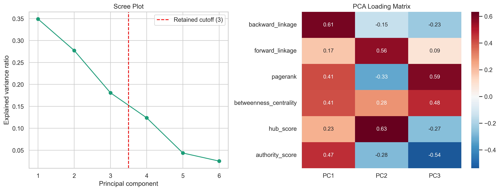
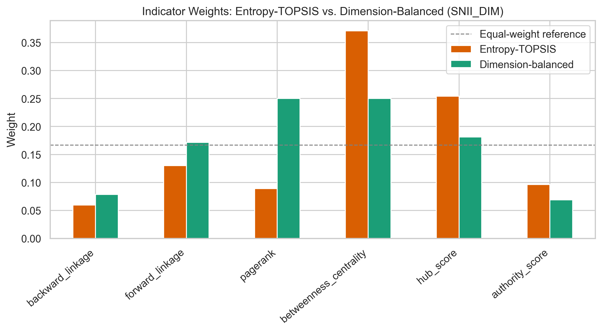
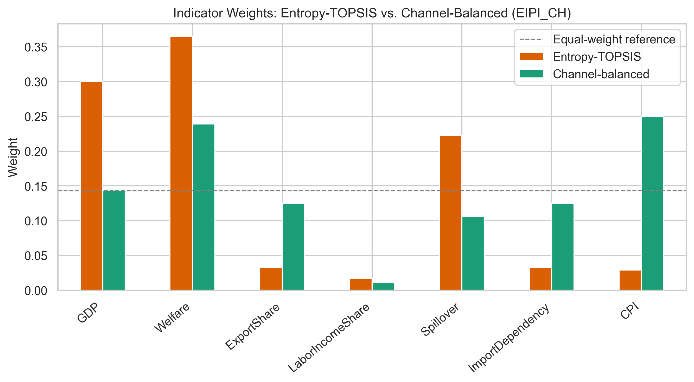
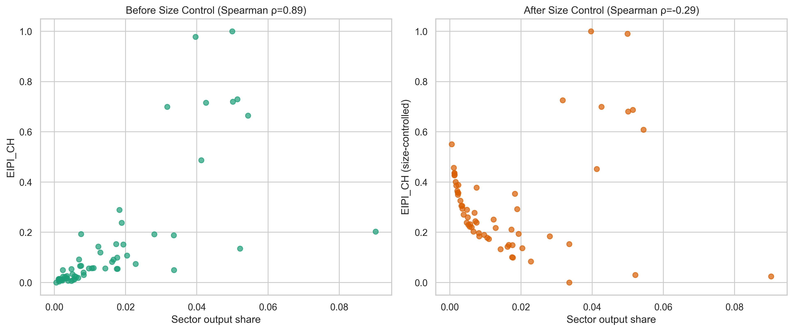
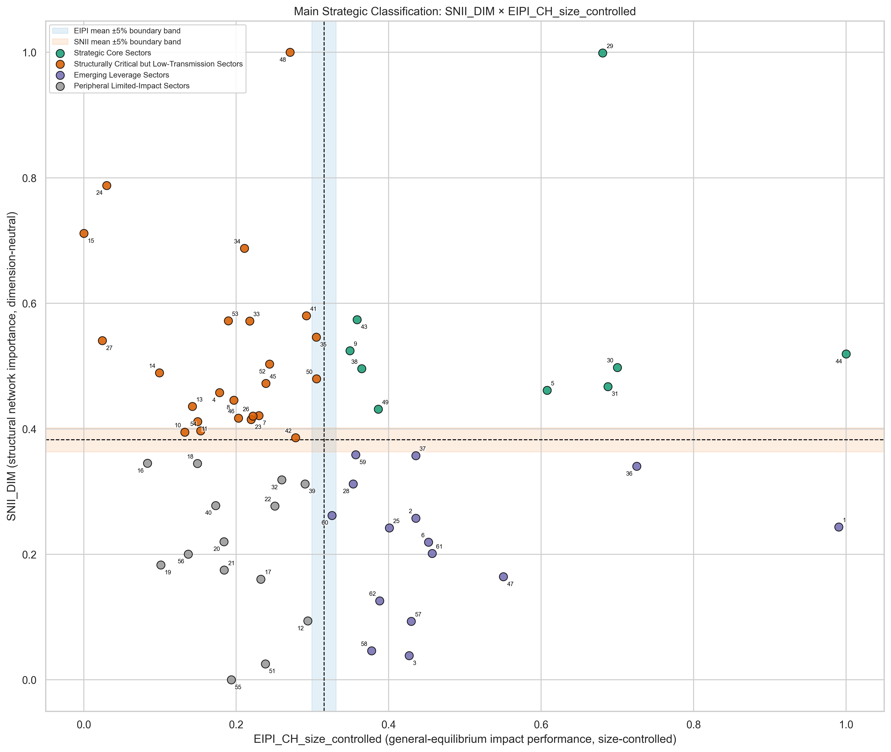
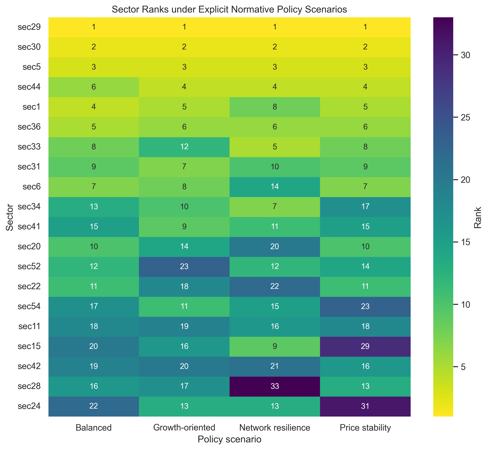

# Sectoral Prioritization in Turkey’s Socio-Economic Production System: Integrating Production-Network Centrality and CGE Impact Analysis

---

## ABSTRACT

Sectoral prioritization carries the risk of treating a sector's structural position in the production network and its economy-wide impact as equivalent information. This study tests that assumption using Turkey's 2023 production network and a computable general equilibrium framework calibrated to a Social Accounting Matrix. For the same 62 sectors, it compares the Structural Network Importance Index (SNII), which summarizes each sector's structural position in the production network, with the Economy-wide Impact Performance Index (EIPI), which summarizes the consequences of productivity shocks across growth, welfare, external-balance, and price channels after removing the effect of sector size. The findings show that network centrality does not, by itself, imply a high and balanced general-equilibrium impact. Network indicators provide limited information about sectors' production and spillover effects, whereas price, foreign-trade, and income-distribution outcomes are determined more by sector size, dependence on imported inputs, and price adjustments than by network position. The study therefore treats network centrality not as a substitute for general-equilibrium performance but as complementary structural information. The proposed framework combines a two-dimensional sector map with Pareto priority, balanced performance, and specification robustness, thereby distinguishing a robust structural core from candidates that depend on explicit policy preferences. The results suggest that industrial policy in Turkey should rely not on a one-dimensional list of “winning sectors,” but on cautious decision support that is sensitive to policy objectives and transmission channels.

**Keywords:** socio-economic systems; systems analysis; production networks; input-output analysis; computable general equilibrium; network centrality; sectoral prioritization; industrial policy; decision support; Turkey

**JEL Codes:** C63, C67, C68, D57, L52, O25.

## 1. INTRODUCTION

### 1.1. Subject and Motivation

In developing countries where public resources are limited, sectoral prioritization (*picking winners*) is central to industrial policies intended to stimulate economic growth and reduce systemic vulnerabilities. Supporting the right sector can generate multiplier effects through input–output linkages and improve economy-wide resource efficiency; an ill-chosen sectoral focus, by contrast, can waste public resources when support leaks into imports, price increases, or rents accruing to a narrow group. In policy practice, this choice is generally based on only one of two analytical traditions: linkage/centrality rankings derived from input–output tables or impact rankings derived from general-equilibrium simulations. This study systematically tests the extent to which these two rankings overlap for the same economy, year, and 62 sectors (the code–name mappings of the 62 sectors analyzed are reported in Appendix A).

### 1.2. Literature Framework

The central question in key-sector research is whether the sector with the greatest number of economic linkages is also the sector that yields the highest social return on public resources. The classical forward–backward linkage approach largely conflates these two attributes (**Hirschman, 1958; Rasmussen, 1956; Chenery and Watanabe, 1958**). This equivalence is nevertheless contested because different key-sector measures generate different rankings (**Temurshoev and Oosterhaven, 2014**), hypothetical extraction and direct linkages do not produce the same results (**Pereira López et al., 2021; Bhusal, 2025**), and the selected sector changes with the objective—production, the environment, regional development, or foreign trade (**Alcántara and Padilla, 2020; Ernawati et al., 2024; Ojaleye and Narayanan, 2022; Nugroho, 2021**). Comparative network analysis that includes Turkey (**Jahangard and Keshtvarz, 2012**) and a recent input–output network application for Turkey (**Çırpıcı, 2024**) suggest that linkages provide indispensable starting information, but not an automatic, policy-objective-independent list of sectors to support.

This debate has become more concrete with the production-networks approach. Hub/authority, eigenvector, PageRank, betweenness, and random-walk measures consider not only the volume of sectors' purchases and sales, but also the nodes through which shocks are transmitted and the intermediate positions in which they become concentrated (**Alatriste-Contreras, 2015; Alatriste-Contreras and Lugo, 2022; DePaolis et al., 2022; An et al., 2024**). Studies of the EU, Ecuador, Korea, the world input–output network, and multi-country sensitivity show that central sectors often overlap only partially with those selected by traditional linkage measures (**Ramírez-Álvarez et al., 2023; Lee and Ishiro, 2025; Tran et al., 2017; Wirkierman et al., 2021**). This evidence does not diminish the value of centrality; rather, it positions centrality as an indicator of propagation, vulnerability, and structural intermediation. Dynamic-network and disaggregated-shock studies likewise show that the level of sectoral detail and the linkage structure affect the results (**Guerrieri et al., 2014; Roson and Sartori, 2016; Jiang et al., 2024; Kharazi et al., 2025**).

The general-equilibrium literature makes clear why centrality alone is insufficient for policy. Under efficient conditions, Domar weights and input–output multipliers may summarize first-order aggregate effects; once substitution, distortions, complementarities, and factor mobility enter the analysis, however, the impact of sectoral shocks changes nonlinearly (**Fadinger et al., 2022; Baqaee and Farhi, 2019b, 2020a, 2020b; Bahal and Lenzo, 2023**). Applied CGE studies make visible the growth, welfare, price, and structural-transformation channels of productivity or technology shocks (**Cutler and Davies, 2010; Burnett et al., 2012; Antoszewski, 2019; Khan, 2020; Blackburn and Moreno-Cruz, 2021; Jin and Li, 2025**), while particularly emphasizing the sensitivity of CGE–sectoral model linkages to their assumptions (**Delzeit et al., 2020; Bolarinwa, 2024; Odior and Arinze, 2022**). Yet most of these studies do not directly test whether network centrality predicts size-adjusted, multichannel CGE effects out of sample within the same universe of sectors.

The industrial-policy literature turns this gap into a normative warning: support priorities should derive not only from topological position, but also from where distortions accumulate, the cost of intervention, and the targeted outcome (**Liu, 2019; Martinez and Orrillo, 2024**). Multi-criteria ranking tools are therefore useful, but they cannot substitute for a decision rule. Entropy weighting, PCA, TOPSIS, fuzzy multi-criteria decision making, and machine-learning applications make it possible to combine different indicators transparently (**André and Cardenete, 2009; Jin et al., 2022; Tsoulfidis and Athanasiadis, 2022; Çalık et al., 2018; Türegün, 2022; Jamwal et al., 2021; Ionașcu et al., 2024; Hlushko et al., 2025; Faridzad, 2025**). It must nevertheless also be shown which indicator is selected for which objective and whether the ranking persists across alternative reasonable specifications.

This study brings these two strands of literature together around the same empirical question for Turkey. Within the same 62-sector data universe, it compares four structural dimensions of the network with a size-controlled and channel-balanced EIPI derived from the SAM/CGE results of 62 separate TFP shocks. It evaluates their relationship not only through correlations, but also through classification agreement, LOOCV prediction, a Pareto–balance filter, and robustness across 96 specifications. It thereby tests which types of outcomes contain information from centrality, when that information is confounded by sector size, and to what extent it diverges from explicit policy preferences. This design treats network mapping, CGE shock analysis, and composite rankings—often conducted separately in the literature—not as interchangeable validations, but as complementary bodies of evidence that test one another.

### 1.3. Theoretical Gap, Original Contribution, and Methodological Rigor

The existing literature either assumes that topological position carries macroeconomic importance or takes topology as given when producing general-equilibrium outcomes. Different theoretical mechanisms underlying this approach have been developed by **Hulten (1978)**, **Gabaix (2011)**, **Acemoglu et al. (2012)**, **Carvalho (2014)**, and **Baqaee and Farhi (2019a)**. The empirical relationship between these two analytical approaches, however, has not been systematically tested using the same data, sectoral universe, and measurement discipline. In particular, whether standard production-network centrality measures predict size-controlled general-equilibrium impacts out of sample within the same set of sectors remains an open question. Although studies such as **Baqaee and Farhi (2020a)** and **Fadinger et al. (2022)** provide a theoretical foundation, the empirical strength of this relationship in a medium-scale applied model has not been established.

The study's original contribution to the literature can be summarized in five layers:

- **Integration of Two Independent Measurement Objects:** It separately constructs topological importance and general-equilibrium impact for the same sectoral universe and tests their relationship under out-of-sample discipline.
- **Management of Methodological Bias:** Self-loop bias is removed to prevent empirical distortion; to avoid a degenerate CPI, an aggregate domestic-absorption-weighted price index is selected as the numeraire.
- **Control for Sector Size (Domar Weight):** Performance indicators are purged of scale effects to prevent sector size from dominating the indices.
- **Out-of-Sample Predictive Discipline:** Rather than in-sample fit, the models report LOOCV (Leave-One-Out Cross-Validation) out-of-sample $R^2$, and models with insufficient predictive variance are eliminated.
- **Separation of Positive and Explicit Policy Decision Layers:** Descriptive mapping is transformed into a scientific core selection through Pareto layers, balance scores that limit compensation, and analysis of membership stability across 96 specifications. The empirical systemic core is additionally separated from subjective policy choices based on explicit policy weights, increasing transparency in decision making.

### 1.4. Research Questions and Testable Hypotheses

The following research questions and corresponding testable empirical hypotheses are formulated:

- **Research Question 1:** Do sectors that occupy topologically central positions in the production network also generate high macroeconomic and welfare effects in general-equilibrium simulations?
  - **H1 (Alignment):** There is a positive monotonic relationship between the Structural Network Importance Index ($SNII_i$) and the size-controlled Economy-wide Impact Performance Index ($EIPI_i$).
- **Research Question 2:** How large is the divergence between network-based structural importance and general-equilibrium impact, and what leakage mechanisms underlie this mismatch?
  - **H2 (Divergence):** Network-central/low-GE and network-peripheral/high-GE groups account for a substantial share of sectors.
- **Research Question 3:** With what degree of heterogeneity can network structure predict macroeconomic general-equilibrium outcomes?
  - **H3 (Channel Heterogeneity):** Network subdimensions predict real-quantity and spillover outcomes with better out-of-sample performance than price, trade, and distributional outcomes.
- **Research Question 4:** Does network position offer meaningful incremental predictive value for general-equilibrium performance beyond sector size (the Domar weight)?
  - **H4 (Incremental Value):** Adding network information to sector size provides only a limited incremental out-of-sample contribution to general-equilibrium impact prediction.
- **Research Question 5:** Which sectors maintain priority under alternative measurement and aggregation methods, both structurally and in terms of explicit policy objectives?
  - **H5 (Robust Core):** Only a subset of mean-threshold Strategic Core members constitutes a Pareto-efficient, two-dimensionally balanced structural core that is stable across alternative specifications.

### 1.5. Organization of the Study

Section 2 presents the data infrastructure, construction of SNII/EIPI, the CGE model, and the robust-core algorithm; Section 3 reports the empirical tests; Section 4 presents the Pareto priority frontier, specification robustness, and explicit policy-preference results; Section 5 provides robustness analyses; Section 6 discusses the findings; and Section 7 concludes.

## 2. METHODOLOGY AND DATA INFRASTRUCTURE

The proposed methodology integrates structural analysis, which uses network-theory tools to examine sectoral linkages at the microeconomic level, with a computable general equilibrium (CGE) model that simulates macroeconomic constraints, substitution mechanisms, and price equilibria. First, the Structural Network Importance Index (SNII) is defined to measure sectors' topological positions in the input–output network. Next, the general-equilibrium-based Economy-wide Impact Performance Index (EIPI) is formulated to summarize the economy-wide effects of productivity shocks applied to each sector. Finally, the sectoral indicators obtained from the two independent analytical channels are combined with size controls in a unified cross-sectional panel.

The analyses are based on a CGE model calibrated to Turkey's Social Accounting Matrix (SAM) and on sectoral total factor productivity (TFP) shock simulations conducted with that model. Details of the sector-level data and model-calibration infrastructure are presented in the relevant sections. Figure 1 summarizes the integrated process from combining data sources within the SAM to identifying the robust structural core.

In Figure 1, Supply and Use Tables (SUTs) are first transformed into an input–output table, which is used together with the national accounts to construct the SAM (**İnce, 2022**). Two simultaneous branches derived from the SAM produce the four-dimensional SNII through production-network centrality measures and the channel-balanced, size-controlled EIPI through 62 sector-specific 10% TFP shocks in the CGE model. In the final stage, these two indices are combined with sector size in the integrated panel; H1–H4 tests, LOOCV, and robustness checks across 96 specifications are then used to identify the policy-relevant robust structural core.

The empirical database is based on the Turkish Statistical Institute's (TurkStat) 2023 Supply and Use Tables. Published in sector–product form, these tables are transformed into a sector-based analytical structure that directly represents intersectoral production relations. The resulting input–output table is the common starting point for both production-network analysis and CGE calibration. This choice ensures that network measures and general-equilibrium outcomes are derived from the same intermediate-input and final-demand accounting rather than from different data universes.

The sectoral classification is harmonized from 64 to 62 sectors to prevent activities without intermediate-input flows from mechanically diluting the network topology. L68A (imputed rents of owner-occupied dwellings) is merged with L68B (real-estate services excluding imputed rents), while T (services of households as employers and goods and services produced for own use) is merged with S96 (other personal services). The network, CGE model, and all indices are thus built on the same 62-sector universe.

The SAM is completed with national-accounts data and the Presidency of Strategy and Budget's 2023 tax-revenue information while maintaining row–column equality. VAT components associated with household, government, and investment demand are separately disaggregated, producing a balanced 135 × 135 SAM. While this matrix forms the CGE model's benchmark equilibrium, its 62 × 62 intermediate-input block—after self-loop removal—provides the technical coefficients and centrality calculations used in Section 2.1.

### 2.1. Network-Based Structural Importance Index (SNII)

The Structural Network Importance Index (SNII) is a composite indicator that assesses a sector's importance within the production network without reducing it to a single link count or centrality measure. It combines four complementary dimensions: the strength of demand- and supply-side linkages, embeddedness in the system, the bridging role between production flows, and the sector's supply–distribution position. SNII therefore aims to identify not only highly connected sectors, but also those that occupy strategic positions in the economy-wide transmission and propagation of shocks.

#### 2.1.1. Modeling the Input–Output Matrix as a Network and Removing Self-Loops

The economy is modeled as a directed, weighted network consisting of a set of nodes $V = \{1, 2, \dots, N\}$ for $N = 62$ sectors (sector codes, NACE Rev. 2 classifications, and full descriptions are provided in Appendix A) and a set of edges $E$ representing nominal intersectoral intermediate-input flows. The starting point is the nominal intermediate-transactions matrix of the input–output table ($Z \in \mathbb{R}^{N \times N}$). The network structure and all centrality metrics are defined directly from the technical-coefficients matrix $A$.

Intermediate purchases by sectors from themselves (the diagonal entries $Z_{i,i}$) introduce an artificial scale bias into network indicators. Self-loops are removed to eliminate this bias:

$$\tilde{Z}_{i,j} = \begin{cases} Z_{i,j} & \text{if } i \neq j \\ 0 & \text{if } i = j \end{cases}$$

The adjusted nominal intermediate-transactions matrix $\tilde{Z}$ is divided by each sector $j$'s gross output ($X_j$) to obtain the technical-coefficients matrix: $A_{i,j} = \tilde{Z}_{i,j} / X_j$. The production-network visualization in Figure 2 is constructed directly from $A$.

Figure 2 presents the self-loop-adjusted production network constructed from $A$, representing directed intermediate-input relationships among 62 sectors. Each node represents one sector. Node size and color indicate eigenvector centrality; larger nodes and lighter colors indicate stronger connections to other centrally positioned sectors. Arrows show the direction of intermediate-input flows, while line thickness represents the relative magnitude of the technical coefficients $A_{i,j}$. For legibility, the visualization includes only the strongest links in the top decile of the positive technical-coefficient distribution. By this measure, `sec33` (air-transport services) is the network's most central sector, with normalized eigenvector centrality of 1.000; its strong input relationships with central sectors place it in an important position for transmitting intermediate-input shocks toward the network core. `sec52` (travel-agency, tour-operator, and reservation services) ranks second at 0.951; its high PageRank (0.820) and backward linkage (0.691) indicate a node that draws inputs intensively from important network activities and is exposed to their systemic effects. `sec9` (printing and recording services), with eigenvector centrality of 0.833 and similar backward and forward linkages (0.636 and 0.671), plays a two-way network role as both an input user and a supplier to other activities. These high-eigenvector-centrality sectors are therefore concentrated in the production-network core not merely because of the number of their links, but also because the sectors to which they are connected are themselves central.

#### 2.1.2. Candidate Network Centrality Indicators

A sector's importance within the production network cannot be reduced to a single structural feature. Seven candidate indicators are therefore calculated to jointly represent demand- and supply-side propagation, systemic embeddedness, bridging position, and supplier–user roles:

- **Backward Linkage Effect ($BL_j$):** The Leontief inverse is first calculated to capture direct and indirect demand-side linkages in the production network: $L=(I-A)^{-1}$. Each $L_{i,j}$ represents the total direct and indirect increase in sector $i$'s production generated throughout the production chain by a one-unit increase in final demand for sector $j$. The sector's total demand-side propagation strength is the column sum of the Leontief inverse: $BL_j^{raw}=\sum_{i=1}^N L_{i,j}$.

- **Forward Linkage Effect ($FL_i$):** To measure total supply-side propagation capacity, the Ghosh allocation-coefficients matrix $B_{i,j}=\tilde{Z}_{i,j}/X_i$ and the Ghosh inverse $G=(I-B)^{-1}$ are first constructed, after which row sums are calculated: $FL_i^{raw}=\sum_{j=1}^N G_{i,j}$. Forward linkage is thus derived from the **Ghosh inverse**, not from row sums of the Leontief inverse.

- **PageRank Centrality ($PR_i$):** Measures recursive system-wide embeddedness ($d=0.85$):

  $$PR_i = \frac{1-d}{N} + d \sum_{j \in M(i)} \frac{PR_j}{L_{\text{out}}(j)}$$

- **Betweenness Centrality ($BC_i$):** Measures the bridging role among production chains using shortest paths based on economic distance $D_{i,j}=-\ln(A_{i,j})$: $BC_i=\sum_{s \neq i \neq t}\sigma_{st}(i)/\sigma_{st}$ (**Freeman, 1977**).

- **Hub Score ($H_i$):** In Kleinberg's (1999) HITS algorithm, measures a sector's capacity to provide inputs to critical authority nodes: $H_i=\mu\sum_{i \to j}A_j$. A high hub score indicates an “aggregator” sector supplying intermediate inputs to many critical users/supply centers.

- **Authority Score ($A_i$):** In the HITS algorithm, measures the intensity with which a sector receives inputs from high-hub suppliers: $A_i=\lambda\sum_{j \to i}H_j$. A high authority score indicates a major intermediate-input user or supply center served by many critical suppliers.

- **Eigenvector Centrality ($EC_i$):** The conventional recursive centrality measure based on the importance of neighboring nodes (eliminated below because of collinearity).

All seven candidate indicators are benefit-oriented and min–max transformed to the $[0,1]$ interval. Table 1 reports their Spearman correlations.

#### Table 1. Spearman rank correlations among candidate SNII indicators

| Indicator | BL | FL | EC | PR | BC | H | A |
|---|---:|---:|---:|---:|---:|---:|---:|
| **BL** | 1.00 | 0.09 | 0.82 | 0.49 | 0.32 | 0.14 | 0.80 |
| **FL** | 0.09 | 1.00 | −0.15 | −0.03 | 0.46 | 0.52 | −0.15 |
| **EC** | 0.82 | −0.15 | 1.00 | 0.71 | 0.18 | −0.10 | 0.82 |
| **PR** | 0.49 | −0.03 | 0.71 | 1.00 | 0.29 | −0.29 | 0.26 |
| **BC** | 0.32 | 0.46 | 0.18 | 0.29 | 1.00 | 0.61 | 0.14 |
| **H** | 0.14 | 0.52 | −0.10 | −0.29 | 0.61 | 1.00 | 0.15 |
| **A** | 0.80 | −0.15 | 0.82 | 0.26 | 0.14 | 0.15 | 1.00 |

*Note: BL = backward linkage; FL = forward linkage; EC = eigenvector centrality; PR = PageRank; BC = betweenness; H = hub; A = authority. Source: Author's calculations.*

The Spearman correlation matrix in Table 1 shows that the candidate indicators do not measure a single homogeneous dimension of centrality, but capture different economic functions within the production network. The clearest correlation cluster is observed among eigenvector centrality, backward linkage, and authority score ($\rho \approx 0.80 - 0.82$). This close relationship indicates that connections to strong suppliers and the direct ability to draw inputs largely contain common information. Eigenvector centrality is also highly related to PageRank ($\rho = 0.71$), suggesting that PageRank can represent information on recursive systemic embeddedness. Betweenness centrality, which represents bridging roles, and the hub score, which measures intermediate-input distribution potential, have a moderately strong relationship ($\rho = 0.61$). By contrast, the near-zero association between supply-side forward and demand-side backward linkages ($\rho = 0.09$) shows that demand-driven input absorption and supply-driven propagation represent different structural properties. The negative relationship between PageRank and hub scores ($\rho = -0.29$) further indicates that systemically embedded sectors do not necessarily perform broad intermediate-input distribution roles. This correlation structure supports retaining indicator diversity to preserve distinctive information from different network channels, while also justifying the elimination of eigenvector centrality to reduce multicollinearity.

#### 2.1.3. Managing Collinearity: VIF Elimination and Factorability Diagnostics

Multicollinearity among the candidate indicators is assessed using the Variance Inflation Factor (VIF), with a threshold of 5.0. Eigenvector centrality is eliminated with VIF $=10.57$; all six remaining indicators have VIF < 3.2, as shown in Table 2.

#### Table 2. Candidate-indicator VIF diagnostics and selection decisions

| Indicator | VIF (before elimination) | VIF (after elimination) | Decision |
|---|---:|---:|---|
| Backward linkage ($BL$) | 3.504 | 3.186 | Retained |
| Forward linkage ($FL$) | 1.558 | 1.467 | Retained |
| Eigenvector centrality | **10.566** | — | **Eliminated** (VIF ≥ 5; PageRank represents dimension $D_2$) |
| PageRank ($PR$) | 6.206 | 2.553 | Retained |
| Betweenness ($BC$) | 1.914 | 1.860 | Retained |
| Hub score ($H$) | 2.368 | 2.366 | Retained |
| Authority score ($Auth$) | 4.738 | 2.344 | Retained |

Factorability diagnostics show that a single-factor latent structure does not adequately represent the data. KMO sampling adequacy is $0.386$ (the “poor” region, < 0.5), whereas Bartlett's test of sphericity is significant ($\chi^2=127.73$, $p=5.9\times10^{-20}$). This combination—correlations differ from zero, but the common-factor structure is weak—provides the empirical rationale for aggregating indicators under **conceptual dimensions** rather than along a single PCA axis. The scree plot and component loadings in Figure 3 complement this assessment visually.

Figure 3 shows that the first principal component explains only 35% of total variance, while the second and third components contribute 28% and 18%, respectively. The distribution of information across the first three components rather than concentration in one dominant dimension confirms that the indicators are not interchangeable alternatives for one centrality factor. The loading matrix suggests that the first component represents demand-side integration (backward linkage, PageRank, betweenness, and authority), while the second reflects supply-side distribution strength (forward linkage and hub score). The indicators' different loading signs and magnitudes across components support retaining theoretically defined conceptual dimensions—linkage strength, systemic embeddedness, bridging role, and supply–distribution orientation—instead of constructing a single undifferentiated centrality index.

#### 2.1.4. Construction of the Main SNII and Methodological Alternatives

Individual network indicators are not used directly as independent final criteria because each captures only a particular aspect of structural importance, and some are highly overlapping representations of the same economic mechanism. Backward linkage, for example, measures the ability to draw inputs; forward linkage measures the capacity to propagate output through the economy; PageRank captures connections to important nodes; betweenness measures a sector's bridging role; and hub and authority scores measure directed supply–distribution position. Treating any one of these indicators as “sectoral structural importance” would reduce centrality to the narrow perspective of the chosen metric. Using all six separately as policy criteria, on the other hand, would count common information more than once, introduce multicollinearity, and generate rankings that are difficult to interpret and potentially contradictory.

The four-dimensional structure is designed to address both problems. First, indicators measuring similar economic transmission mechanisms are combined under the same conceptual heading, reducing information duplication. Second, linkage strength, systemic embeddedness, bridging role, and supply–distribution orientation remain separate so that non-substitutable network functions are represented in the composite index. This choice is not merely theoretical: the low KMO value indicates that one common factor is inadequate; PCA variance is distributed across several components; and interdimensional correlations remain low to moderate. The purpose is therefore not to discard individual metrics, but to organize them within higher-level transmission channels that preserve their economic meaning. Individual indicators are retained for indicator-level mechanism analysis, whereas the more stable and interpretable four-dimensional `SNII_DIM` is used to compare sectors' overall structural importance and conduct policy classification.

The six retained indicators are combined into four dimensions according to predefined structural transmission channels. Indicator elimination does not alter dimension membership; it only removes eigenvector centrality from $D_2$:

- **$D_1$ — Demand- and Supply-Linkage Strength:** Entropy-weighted TOPSIS combination of Leontief-based backward linkage ($BL$) and Ghosh-based forward linkage ($FL$).
- **$D_2$ — Systemic Embeddedness:** PageRank ($PR$).
- **$D_3$ — Bridge/Spillover Role:** Weighted betweenness centrality ($BC$).
- **$D_4$ — Supply–Distribution Orientation:** Entropy-weighted TOPSIS combination of HITS hub ($H$) and authority ($Auth$) scores.

The single-indicator dimensions $D_2$ and $D_3$ are min–max scaled to $[0,1]$. The multi-indicator dimensions $D_1$ and $D_4$ are constructed not with simple arithmetic means, but with TOPSIS ideal-solution proximity scores based on within-dimension Shannon-entropy weights; by definition, these scores also lie in $[0,1]$. The four dimensions are then combined with equal weights, and the resulting raw composite score is again min–max scaled:

$$SNII\_DIM_i^{raw} = \sum_{k=1}^4 w_k D_{k,i}, \qquad w_k = 0.25.$$

#### Table 3. Spearman rank correlations among the four SNII dimensions

| Dimension | $D_1$: Linkage strength | $D_2$: Systemic embeddedness | $D_3$: Bridging role | $D_4$: Supply–distribution orientation |
|---|---:|---:|---:|---:|
| **$D_1$: Linkage strength** | 1.00 | 0.06 | 0.48 | 0.44 |
| **$D_2$: Systemic embeddedness** | 0.06 | 1.00 | 0.29 | −0.21 |
| **$D_3$: Bridging role** | 0.48 | 0.29 | 1.00 | 0.56 |
| **$D_4$: Supply–distribution orientation** | 0.44 | −0.21 | 0.56 | 1.00 |

*Source: Author's calculations.*

The Spearman correlation matrix in Table 3 shows that relationships among the subscores range from −0.21 to 0.56 and that no pairwise relationship creates a multicollinearity risk. The strongest relationship is between bridge/spillover intermediation ($D_3$) and supply–distribution orientation ($D_4$), at $\rho = 0.56$. Thus, sectors that connect transmission paths within the network also tend to be strong in supply and distribution. Linkage strength ($D_1$) is moderately related to $D_3$ ($\rho = 0.48$) and $D_4$ ($\rho = 0.44$), whereas systemic embeddedness ($D_2$) is almost unrelated to direct linkage strength ($D_1$), at $\rho = 0.06$. The generally weak-to-moderate correlation pattern indicates that the four dimensions represent distinct and complementary structural transmission channels.

Figure 4 shows that Shannon entropy produces a distinctly unequal weighting scheme by assigning large weights to betweenness centrality (0.37) and the hub score (0.25), while weights for backward linkage, PageRank, and authority remain quite low, at approximately 6–10%. This data-driven scheme gives bridge and hub characteristics a dominant role. The dimension-balanced approach, by contrast, first aggregates indicators within four conceptual dimensions and assigns each dimension an equal weight of 25% ($0.25$). It thereby prevents any single high-variance centrality indicator from dominating the index and balances the influence of the four theoretical transmission channels.

To test the sensitivity of rankings to aggregation and weighting methods, three alternative methodological variants are calculated alongside the main dimension-balanced index, as reported in Table 4.

#### Table 4. Calculation of the main and robustness SNII indices

| Index | Status | Summary formula |
|---|---|---|
| `SNII_DIM` | **Main index** | $SNII\_DIM_i = MM\!\left[\frac{D_{1i}+D_{2i}+D_{3i}+D_{4i}}{4}\right]$ |
| `SNII_TOPSIS` | Robustness variant | $C_i^E = \frac{d_i^-}{d_i^+ + d_i^-}$; weights $w_j^E$ are obtained from entropy |
| `SNII_PCA` | Robustness variant | $SNII\_PCA_i = MM\!\left[\sum_{m=1}^{3}\tilde{\lambda}_m\,PC_{im}^{*}\right]$, $\;\tilde{\lambda}_m=\lambda_m/\sum_{r=1}^{3}\lambda_r$ |
| `SNII_AVG` | Robustness/consensus variant | $SNII\_AVG_i = MM\!\left[\frac{Z(DIM_i)+Z(TOPSIS_i)+Z(PCA_i)}{3}\right]$ |

The variants are as follows:

- **`SNII_TOPSIS`:** An entropy-TOPSIS variant using data-driven variable weights obtained from Shannon entropy and distances from ideal and negative-ideal solutions.
- **`SNII_PCA`:** A variant representing the empirical common-variance structure of the indicators, constructed as a linear combination of the first three principal components weighted by their explained-variance shares.
- **`SNII_AVG`:** A hybrid consensus variant that averages the standardized dimension-balanced, TOPSIS, and PCA scores to reduce dependence on any one method.

Understanding the empirical relationship between network position and economic scale—and controlling the resulting size bias—is an important stage of the study. Table 5 reports Spearman and Pearson correlations of the indicators and indices with sector size (Domar weights) based on gross output.

#### Table 5. Correlations of indices and indicators with sector size

| Indicator / Index | Spearman $\rho$ | Pearson $r$ |
|---|---:|---:|
| SNII_DIM (primary) | 0.268 | 0.296 |
| SNII_TOPSIS (entropy) | 0.574 | 0.578 |
| SNII_PCA | 0.378 | 0.397 |
| SNII_AVG | 0.413 | 0.435 |
| Backward linkage | 0.168 | 0.256 |
| Forward linkage | 0.060 | −0.007 |
| PageRank | −0.342 | −0.267 |
| Betweenness | 0.439 | 0.433 |
| **Hub score** | **0.818** | **0.674** |
| Authority score | 0.224 | 0.243 |

Table 5 shows that among the individual indicators, the hub score has an extremely high Spearman correlation with sector size ($\rho = 0.818$). Because entropy-based `SNII_TOPSIS` assigns this indicator a high weight, it is also correlated with size at $0.574$. One important reason for selecting dimension-balanced `SNII_DIM` as the main model is its more limited relationship with size ($\rho = 0.268$).

#### 2.1.5. SNII Results and Findings

The Structural Network Importance Index (`SNII_DIM`) identifies the relative topological importance of 62 sectors in Turkey's production network. Unlike individual centrality measures, this composite index examines network position holistically through four transmission channels: $D_1$ linkage strength, $D_2$ systemic embeddedness, $D_3$ bridging role, and $D_4$ supply–distribution orientation. It therefore identifies not only sectors with large direct intermediate-input flows, but also strategic actors capable of propagating shocks indirectly or bridging critical production chains. Table 6 reports the five highest-ranked sectors under dimension-balanced `SNII_DIM` and details their subdimensional performance.

#### Table 6. SNII ranking: top five sectors and dimension subscores

| Rank | Sector | SNII_DIM | $D_1$ (Linkage) | $D_2$ (Embeddedness) | $D_3$ (Bridge) | $D_4$ (Supply–distribution) |
|---:|---|---:|---:|---:|---:|---:|
| 1 | sec48 | 1.000 | 0.767 | 1.000 | 0.561 | 0.107 |
| 2 | sec29 | 0.999 | 0.304 | 0.640 | 1.000 | 0.490 |
| 3 | sec24 | 0.788 | 1.000 | 0.190 | 0.118 | 0.654 |
| 4 | sec15 | 0.711 | 0.560 | 0.126 | 0.273 | 0.831 |
| 5 | sec34 | 0.688 | 0.587 | 0.392 | 0.284 | 0.474 |

*Source: Model simulation results. Bottom five sectors: sec57 (0.093), sec58 (0.046), sec3 (0.038), sec51 (0.026), and sec55 (0.000).*

The results in Table 6 confirm that structural importance in the production network is not a uniform topological property and that sectors can become prominent through very different network roles. Top-ranked sec48 (`SNII_DIM` = 1.000) derives its strength almost entirely from PageRank-based systemic embeddedness ($D_2 = 1.000$). Although it also performs relatively strongly in direct linkage strength ($D_1 = 0.767$) and bridging role ($D_3 = 0.561$), it has a very weak supply–distribution orientation ($D_4 = 0.107$), indicating a node located in the densely connected core rather than a hub distributing intermediate goods broadly. Second-ranked sec29 (`SNII_DIM` = 0.999) is the leading intermediary connecting critical flow paths in the production network ($D_3 = 1.000$). Third-ranked sec24 (`SNII_DIM` = 0.788) has the economy's greatest capacity in the linkage dimension ($D_1 = 1.000$), which measures direct input absorption and output propagation.

The bottom five sectors reported in the note—sec57, sec58, sec3, sec51, and sec55—occupy the periphery of the production network. Their weak direct intermediate-input integration and lack of systemic intermediary or supplier roles place them in the lowest-priority group by structural importance. These findings show that using individual network indicators for sectoral prioritization may yield incomplete or biased conclusions, underscoring the value of the balanced four-dimensional composite structure.

### 2.2. General-Equilibrium-Based Economy-wide Impact Performance Index (EIPI)

A static, single-country, open-economy **Computable General Equilibrium (CGE)** model is constructed to simulate the macroeconomic, foreign-trade, and welfare consequences of sectoral productivity increases. The model follows the SAM-based development CGE tradition (**Dervis, de Melo, and Robinson, 1982**), with revisions to the numeraire and distributional channels to improve empirical accuracy. A productivity shock—specifically, a total factor productivity (TFP) shock—is chosen to measure general-equilibrium impact because productivity growth is an appropriate instrument for simulating sector-level supply-side structural improvements. Whereas demand-side interventions such as government-expenditure or final-demand shocks may produce temporary and limited propagation, sectoral productivity shocks represent persistent improvements in production technology. By reducing intermediate-input prices and generating direct and indirect cost reductions across the production network, they make it possible to test the economy's structural capacity and multiplier mechanisms.

#### 2.2.1. Model Structure and Numerical Setup

The model is formulated as a nonlinear programming (NLP) system reflecting general-equilibrium conditions and is solved using standard optimization algorithms. Its main blocks are as follows:

- **Value-added production:** In each sector, value added is produced from labor ($L$) and capital ($K$) using a CES function:
  $$VA_j = A_j \left[ \delta_j L_j^{-\rho_j} + (1 - \delta_j) K_j^{-\rho_j} \right]^{-1/\rho_j}$$
  The substitution elasticity ($\omega_j = 1/(1+\rho_j)$) varies by the sector's main activity group; baseline values are provided in Appendix C, Table C1. $A_j$ is the shockable total factor productivity (TFP) parameter. Group-based ±20% sensitivity analysis for the CES substitution elasticity is reported in Appendix C, Table C3.
- **Intermediate-input demand:** Sectors' intermediate-input demands are in fixed proportions according to Leontief coefficients **(Leontief, 1936)**.
- **Foreign trade:** Domestic production ($X_i$) is allocated between exports ($E_i$) and domestic sales of the domestic good ($D_i$) under a CET (Constant Elasticity of Transformation) function:
  $$X_i = \gamma_i^E \left[ \delta_i^E E_i^{\rho_i^E} + (1 - \delta_i^E) D_i^{\rho_i^E} \right]^{1/\rho_i^E}$$
  Imports ($M_i$) and the domestic good ($D_i$) are combined under an Armington CES function to produce composite supply ($Q_i$):
  $$Q_i = \gamma_i^M \left[ \delta_i^M M_i^{-\rho_i^M} + (1 - \delta_i^M) D_i^{-\rho_i^M} \right]^{-1/\rho_i^M}$$
  CET transformation and Armington substitution elasticities are also assigned at the sector level according to the main activity group. The group-based elasticity triplets are reported in Appendix C, Table C1, and sector classification maps one-to-one to the final column of Appendix A. The CES, CET, and Armington share/scale parameters of 3 agricultural, 24 industrial, and 35 service sectors are therefore calibrated separately under their group-specific elasticities. Appendix C, Table C2 reports a sensitivity analysis in which CET and Armington elasticities are jointly varied by ±20% relative to each sector's own baseline. Under the macroeconomic closure, the excess of imports over exports is financed by foreign savings.
- **Nominal anchor (numeraire):** Unlike conventional applications, the wage is not fixed; the aggregate absorption-weighted price index is set to zero in log form:
  $$\sum_{i=1}^N \theta_i \ln(pq_i) = 0$$
  Here, $\theta_i$ is sector $i$'s nominal budget share in economy-wide composite-good absorption (domestic demand), with $\sum_{i=1}^N \theta_i = 1$, and $pq_i$ is the price of sector $i$'s composite good. The total number of sectors is $N = 62$. This choice leaves both $w$ and $r$ endogenous, ensures that the CPI contains genuine relative-price information, and prevents a tautological correlation between GDP and the functional income-distribution indicator $wL/(wL+rK)$.
- **Household behavior:** The representative household's utility maximization is represented by a Cobb–Douglas utility function:
  $$U = \prod_{i=1}^N C_i^{c_i}$$
  Here, $C_i$ denotes final household demand for the composite good of sector $i$, while $c_i$ is sector $i$'s budget share in total consumption expenditure, with $\sum_{i=1}^N c_i = 1$. Total household income consists of factor income from labor and capital. The household pays income tax, saves a fixed share of disposable income, and spends the remainder on consumption.
- **Taxes and government:** Three types of tax represent government behavior: income tax, production/activity tax, and value-added tax (VAT) on products. All tax revenue accrues to the government budget. The government uses this public revenue for government consumption and generates public saving according to the difference between revenue and expenditure.
- **Investment–saving balance:** Under the investment–saving identity (neoclassical savings-driven closure), private saving (household saving), public saving (the government budget balance), and foreign saving (the current-account deficit) jointly finance total investment expenditure.

The model's macroeconomic closure rules rest on neoclassical assumptions. Aggregate labor and capital supplies are fixed, and factor prices (the wage and return to capital) adjust endogenously to ensure full employment. Real government expenditure is fixed, while government saving is determined endogenously by the budget balance. The current-account deficit (foreign saving) is fixed, while the exchange rate adjusts endogenously to ensure external balance; the absorption-weighted price index is the economy's single nominal anchor. The investment–saving block follows a savings-driven closure, under which total investment is determined by aggregate domestic and foreign saving.

For the 62-sector economy, the existing CGE model is a square and closed NLP system of 5,471 equations (constraints) and the same number of endogenous variables. Of these equations, 3,844 are matrix-form identities representing Leontief intermediate-input demand; the remaining 1,627 define production, factor demand, foreign trade, and institutional balances. The system also includes 16 scalar (non-sector-specific) equations determining macroeconomic aggregates and tax balances. Exogenous variables and parameters include aggregate labor ($L_{bar}$) and capital ($K_{bar}$) supplies; world export and import prices ($Pwe_i$, $Pwm_i$); tax rates; saving propensities; and calibrated scale and budget-share coefficients for production and consumption functions.

For model stability and numerical solution, the fundamental assumptions of neoclassical general-equilibrium theory apply. Consumer and producer optimization problems are specified with CES, CET, and Cobb–Douglas structures. In the robustness scenario where the Armington substitution elasticity is exactly one, the Cobb–Douglas limiting form of the CES is used explicitly. Because nominal price determination and zero-degree homogeneity apply, an aggregate absorption-weighted price index is added as the nominal anchor; under Walras' Law, the commodity-market equation for the final sector is omitted. Numerical solutions are obtained with Pyomo and IPOPT. The heterogeneous-elasticity benchmark equilibrium converges optimally; the maximum absolute deviation in reproducing SAM gross outputs is $1.14\times10^{-10}$, and the Walras residual in the omitted equation is $1.13\times10^{-10}$. All 62 counterfactual solutions in the main 10% shock set terminate optimally.

#### 2.2.2. Counterfactual Experimental Design

For each sector $s \in \{1,\dots,62\}$, a +10% TFP shock is applied sequentially and independently ($A_s^{cf} = 1.10 \times A_s^{base}$), and percentage changes from baseline are recorded for seven indicators:

- *Benefit-oriented:* real GDP (`GDP`), representative-household utility (`Welfare`), export share (`ExportShare`), functional labor share (`LaborIncomeShare`), and indirect propagation to the production of the other 61 sectors (`Spillover`).
- *Cost-oriented:* import dependence (`ImportDependency`) and the consumer price index (`CPI`).

Let the shocked sector be $s$, the baseline equilibrium carry superscript $0$, and the counterfactual equilibrium carry superscript $cf(s)$. For real GDP, export share, functional labor share, import dependence, and CPI—all of which have nonzero baseline values—the relative change is:

$$
\Delta_s(g)=100\,\frac{g^{cf(s)}-g^0}{|g^0|}.
$$

Because baseline values are positive for these five indicators, the absolute value in the denominator does not alter the economic interpretation. Baseline-equilibrium values for welfare and spillover relative to that same baseline are zero by definition. Division by zero is therefore avoided, and the counterfactual values defined below—already expressed in percentage units—are recorded directly as `Welfare_pct_change` and `Spillover_pct_change`. The seven indicators are operationally defined as follows:

- **Real GDP (benefit):** Calculated from the expenditure side at fixed Laspeyres-type base-year prices:
  $$GDP^{r,cf}_s=\sum_i\left(p_{C,i}^0C_i^{cf}+p_{G,i}^0G_i^{cf}+p_{I,i}^0I_i^{cf}+p_{E,i}^0E_i^{cf}-p_{M,i}^0M_i^{cf}\right).$$
  The value entering the index is $\Delta_s(GDP^r)$; a positive value is a benefit in the form of a higher level of real activity.
- **Welfare (benefit):** Cobb–Douglas utility $U=\prod_i C_i^{c_i}$ is calculated with household budget shares $c_i$, and Hicksian equivalent variation is measured at baseline prices:
  $$EV_s=e(p_C^0,U^{cf(s)})-e(p_C^0,U^0),\qquad Welfare_s=100\frac{EV_s}{Y^0},$$
  $$e(p,U)=U\prod_i\left(\frac{p_i}{c_i}\right)^{c_i}.$$
  `Welfare` is therefore not the raw utility level, but equivalent variation as a percentage of baseline household income; $EV_s>0$ indicates a welfare gain.
- **Export share (benefit):** The ratio of total exports at current prices to nominal GDP:
  $$ExportShare^{cf}_s=100\frac{\sum_i p_{E,i}^{cf}E_i^{cf}}{GDP^{n,cf}},$$
  $$GDP^{n,cf}=\sum_i\left(p_{C,i}^{cf}C_i^{cf}+p_{G,i}^{cf}G_i^{cf}+p_{I,i}^{cf}I_i^{cf}+p_{E,i}^{cf}E_i^{cf}-p_{M,i}^{cf}M_i^{cf}\right).$$
  The EIPI input is the relative percentage change in this share, not a percentage-point change.
- **Functional labor share (benefit):** Using the endogenous wage and return to capital:
  $$LaborIncomeShare^{cf}_s=\frac{w^{cf}\bar L}{w^{cf}\bar L+r^{cf}\bar K}.$$
  The EIPI input is the percentage change in this ratio relative to baseline; an increase is treated as a benefit because labor's share of factor income rises.
- **Intersectoral spillover (benefit):** Excluding the shocked sector, the aggregate production change of the other 61 sectors is measured as:
  $$Spillover_s=100\frac{\sum_{j\neq s}(Z_j^{cf(s)}-Z_j^0)}{\sum_{j\neq s}Z_j^0}.$$
  A positive value indicates that the productivity gain produces a net expansion of production outside the shocked sector.
- **Import dependence (cost):** Calculated as an import-penetration-style share of nominal imports in domestic use:
  $$ImportDependency^{cf}_s=100\frac{M^{n,cf}}{Q^{n,cf}+M^{n,cf}-E^{n,cf}},$$
  where $Q^{n}=\sum_i p_{Q,i}Q_i$, $M^{n}=\sum_i p_{M,i}M_i$, and $E^{n}=\sum_i p_{E,i}E_i$. If the denominator degenerates, the import share is calculated over total domestic use. An increase is cost-oriented because it raises dependence on external inputs.
- **Consumer price index (cost):** Constructed as a geometric price index using baseline household consumption shares:
  $$CPI^{cf}_s=100\exp\left[\sum_i c_i\ln\left(\frac{p_{C,i}^{cf}}{p_{C,i}^{0}}\right)\right],\qquad CPI^0=100.$$
  A positive CPI change raises consumption costs and is therefore a cost; a negative change is a gain through the price-stability channel.

**Translating benefit/cost orientation into EIPI.** All counterfactual indicators are stored with their original economic signs and without transformation. In the EIPI calculation, benefit indicators retain their signs, while cost indicators are sign-reversed:

$$
y_{is}=\begin{cases}
\Delta_s(g_i), & i\in\mathcal{B}=\{GDP,Welfare,ExportShare,LaborIncomeShare,Spillover\},\\
-\Delta_s(g_i), & i\in\mathcal{C}=\{ImportDependency,CPI\}.
\end{cases}
$$

Higher values thus indicate better performance for every transformed criterion. In multi-indicator channels, these benefit-oriented series enter entropy-weighted TOPSIS, with the column maximum as the positive ideal and the column minimum as the negative ideal. The single-indicator price-stability channel is the min–max transformation of $-\Delta CPI$. This procedure does not alter the signs of the raw economic outcomes; it only imposes the common “higher = better” direction in the composite performance index. Table 7 reports the full channel profiles of the five sectors with the largest GDP effects.

#### Table 7. Top five sectors by GDP effect: full channel decomposition (percentage change)

| Sector | GDP | Welfare | Export share | Labor share | Spillover | Import dependence | CPI |
|---|---:|---:|---:|---:|---:|---:|---:|
| sec1 | 0.617 | 0.638 | −0.300 | 0.189 | 0.188 | −0.347 | −0.289 |
| sec31 | 0.614 | 0.480 | 0.122 | 0.401 | 0.357 | 0.084 | −0.039 |
| sec44 | 0.586 | 0.571 | −0.461 | 0.476 | 0.318 | −0.120 | −0.338 |
| sec30 | 0.584 | 0.432 | 0.034 | −0.039 | 0.298 | −0.027 | −0.086 |
| sec29 | 0.563 | 0.413 | 0.124 | −0.024 | 0.349 | −0.009 | −0.061 |

Sectors generating similarly sized GDP effects have strikingly different channel signatures. A shock to `sec1` raises GDP by 0.617%, lowers the CPI by 0.289%, and increases welfare by 0.638%. Industrial sector `sec27`, which immediately follows the top five, raises GDP by a similar 0.557%, yet increases the CPI by 0.308% and yields a welfare gain of only 0.043%. This contrast, which persists under heterogeneous elasticities, shows that a single “GDP multiplier” cannot adequately represent welfare and price outcomes.

#### Table 8. Spearman rank correlations among the seven CGE outcomes

| Outcome | GDP | Welfare | Export share | Labor-income share | Spillover | Import dependence | CPI |
|---|---:|---:|---:|---:|---:|---:|---:|
| **GDP** | 1.00 | 0.87 | −0.11 | −0.09 | 0.92 | −0.13 | 0.08 |
| **Welfare** | 0.87 | 1.00 | −0.09 | 0.09 | 0.82 | −0.11 | −0.18 |
| **Export share** | −0.11 | −0.09 | 1.00 | −0.14 | −0.10 | 0.76 | −0.13 |
| **Labor-income share** | −0.09 | 0.09 | −0.14 | 1.00 | −0.02 | 0.06 | −0.08 |
| **Spillover** | 0.92 | 0.82 | −0.10 | −0.02 | 1.00 | −0.03 | 0.18 |
| **Import dependence** | −0.13 | −0.11 | 0.76 | 0.06 | −0.03 | 1.00 | 0.21 |
| **CPI** | 0.08 | −0.18 | −0.13 | −0.08 | 0.18 | 0.21 | 1.00 |

*Source: Model simulation results.*

The strongest relationships in Table 8 are between real GDP and spillover ($\rho=0.92$), GDP and welfare ($\rho=0.87$), and welfare and spillover ($\rho=0.82$). In the foreign-trade block, export share and import dependence also move strongly together ($\rho=0.76$). By contrast, the functional labor share has weak relationships with other outcomes, and CPI correlations are no greater than $0.21$. Heterogeneous elasticities strengthen co-movement within the quantity/welfare and foreign-trade channels while preserving separation across channels. This pattern indicates that directly combining the seven outcomes with a single data-driven weighting system could allow particular co-movement clusters to dominate the index, motivating a channel-balanced EIPI design.

Collinearity diagnostics show particularly high common variance among GDP, welfare, and spillover outcomes (VIF 21.56, 25.66, and 14.99, respectively); VIF also exceeds 5 for export share and import dependence (5.12 and 7.65). Because these variables represent distinct economic outcomes rather than repeated technical measures of the same structural concept, they are not eliminated as in SNII. Instead, they are separated into growth–spillover, welfare–distribution, external-balance, and price-stability channels, which receive equal weight in the final EIPI.

#### 2.2.3. Channel-Balanced EIPI, Methodological Alternatives, and Size Control

The seven indicators are divided into four economic channels to manage collinearity, and within-channel aggregation is performed with TOPSIS. Cost indicators (import dependence and CPI) are converted to benefit orientation by reversing their signs.

#### Table 9. Economic channels and indicator composition of the channel-balanced EIPI

| Channel | Economic content | Included metrics |
|---|---|---|
| $C1$ — Growth and spillover | Measures how a productivity shock affects aggregate real activity and production outside the shocked sector | Real GDP (`GDP`); production change in the other 61 sectors (`Spillover`) |
| $C2$ — Welfare and functional distribution | Measures the effect on representative-household welfare and the functional distribution of income between labor and capital | Hicksian equivalent variation (`Welfare`); functional labor-income share (`LaborIncomeShare`) |
| $C3$ — External balance | Measures the foreign-trade composition between export orientation and dependence on imported inputs | Export share (`ExportShare`); import dependence (`ImportDependency`) |
| $C4$ — Price stability | Measures the effect of the productivity shock on household consumption costs | Consumer price index (`CPI`) |

The two-indicator channels $C1$–$C3$ are TOPSIS proximity scores calculated with within-channel Shannon-entropy weights; for $C3$, `ImportDependency` is first converted from cost to benefit orientation. The single-indicator $C4$ channel is constructed by min–max transforming $-\Delta CPI$. Benefit-oriented indicators retain their signs, while cost-oriented indicators (import dependence and the consumer price index) are multiplied by −1 to create a common direction. Under the channel-balanced EIPI design, each of the four main economic channels ($C1$, $C2$, $C3$, and $C4$) receives an equal 25% weight ($0.25$). Table 10 reports Spearman rank correlations among the four channel subscores.

#### Table 10. Spearman rank correlations among the four EIPI economic-channel subscores

| Channel | $C1$ Growth/Spillover | $C2$ Welfare/Distribution | $C3$ External balance | $C4$ Price stability |
|---|---:|---:|---:|---:|
| **$C1$ Growth/Spillover** | 1.0000 | 0.8364 | 0.0124 | −0.1242 |
| **$C2$ Welfare/Distribution** | 0.8364 | 1.0000 | 0.1212 | 0.1923 |
| **$C3$ External balance** | 0.0124 | 0.1212 | 1.0000 | 0.4452 |
| **$C4$ Price stability** | −0.1242 | 0.1923 | 0.4452 | 1.0000 |

*Source: Model simulation results.*

The strongest relationship in Table 10 is between growth–spillover ($C1$) and welfare–distribution ($C2$), at $\rho=0.8364$. Under heterogeneous trade elasticities, external balance ($C3$) is almost unrelated to growth ($\rho=0.0124$), whereas it has a moderately positive association with price stability ($\rho=0.4452$). The price channel is weakly negatively related to growth–spillover ($\rho=-0.1242$) and weakly positively related to welfare–distribution ($\rho=0.1923$). This pattern shows that the four channels cannot be reduced to a single dimension and that equal channel weights continue to balance co-movement clusters in the data.

Balancing data-driven approaches and theoretical structure is important when determining aggregation weights. Figure 5 compares the entirely data-driven Shannon-entropy weighting scheme with the proposed channel-balanced scheme.

In Figure 5, Shannon entropy assigns 66.5% of total weight to real GDP and household welfare and, once spillover is included, 88.8% to the quantity/welfare cluster. Indicator-level weighting of this kind does not ensure that the distinct policy objectives of growth–spillover, welfare–distribution, external balance, and price stability have equal influence in the composite index. The channel-balanced EIPI therefore increases the relative visibility of CPI and external-balance components. The index preserves growth and welfare information while offering a more balanced cross-objective assessment that also incorporates price stability and external balance.

The absolute general-equilibrium impact of sectoral productivity shocks reflects not only linkage and propagation characteristics, but also initial economic scale. Sectors with large gross output and Domar weights can mechanically produce larger changes in GDP, welfare, and spillovers in response to a unit productivity increase; this scale logic follows the Domar framework for measuring technological change (**Domar, 1961**). That information is policy-relevant, but absolute impact must be separated from scale-independent leverage to test whether network position explains economy-wide performance beyond scale alone. `EIPI_CH` is therefore regressed on log output. After removing the component explained by sector-specific size, the residuals are min–max normalized to $[0,1]$ to derive the primary `EIPI_CH_size_controlled` index. This transformation does not invalidate the policy importance of large sectors; it simply emphasizes each sector's general-equilibrium impact relative to its own scale in the main comparison:

$$EIPI\_CH_i = \beta_0 + \beta_1 \ln(X_i) + u_i \implies EIPI\_CH\_size\_controlled_i = \frac{u_i - \min u}{\max u - \min u}.$$

This procedure addresses the question: “Which sector is important not because it is large, but because it generates the greatest general-equilibrium leverage per unit of size?” Figure 6 shows the effects of OLS residualization.

The left panel of Figure 6 shows the strong positive relationship between raw `EIPI_CH` and sector size. The right panel shows how OLS adjustment neutralizes the systematic scale component. This adjustment prevents sectoral prioritization from automatically favoring only large sectors whose scale affects macroeconomic variables and instead helps identify those with the greatest structural productivity leverage.

To test EIPI sensitivity to aggregation methods while holding the effect of sector size constant, all variants are residualized using the same log-output control. Table 11 presents the main and alternative indices.

#### Table 11. Calculation of the main and robustness EIPI indices

| Index | Status | Summary formula |
|---|---|---|
| `EIPI_CH_size_controlled` | **Main index** | Min–max transformation of the OLS residual from regressing the channel-balanced $EIPI\_CH$ score on $\ln(X_i)$ |
| `EIPI_TOPSIS_size_controlled` | Robustness variant | Entropy-TOPSIS score residualized using the same $\ln(X_i)$ control |
| `EIPI_PCA_size_controlled` | Robustness variant | PCA score residualized using the same $\ln(X_i)$ control |
| `EIPI_AVG_size_controlled` | Robustness/consensus variant | AVG score residualized using the same $\ln(X_i)$ control |

Raw `EIPI_CH` is retained only as an intermediate calculation; the published main and robustness indices consist of the four size-controlled series. Differences among EIPI methods therefore arise from the aggregation rule rather than sector scale. Table 12 reports Spearman rank correlations among these four size-controlled variants.

#### Table 12. Spearman rank correlations among EIPI index variants

| Index variant | `CH_sc` | `TOPSIS_sc` | `PCA_sc` | `AVG_sc` |
|---|---:|---:|---:|---:|
| **`CH_sc`** | 1.0000 | 0.9330 | 0.9641 | 0.9857 |
| **`TOPSIS_sc`** | 0.9330 | 1.0000 | 0.9005 | 0.9381 |
| **`PCA_sc`** | 0.9641 | 0.9005 | 1.0000 | 0.9845 |
| **`AVG_sc`** | 0.9857 | 0.9381 | 0.9845 | 1.0000 |

*Source: Model simulation results.*

The high correlations in Table 12 ($\rho=0.901$–$0.986$) show that, once size is removed consistently, alternative aggregation rules largely agree on the general ranking information. This reduces the risk that the main results are driven by one method assigning more weight to sector size. Table 13 lists the five highest-ranked sectors under the size-controlled `EIPI_CH_size_controlled` index and reports their channel-level performance.

#### Table 13. EIPI_CH_size_controlled ranking: top five sectors, pre-adjustment rank, and channel scores

| Rank | Sector | EIPI_CH_size_controlled | EIPI_CH rank (before size control) | $C1$ Growth | $C2$ Welfare | $C3$ External balance | $C4$ Price |
|---:|---|---:|---:|---:|---:|---:|---:|
| 1 | sec44 | 1.0000 | 2 | 0.8548 | 0.8949 | 0.3898 | 1.0000 |
| 2 | sec1 | 0.9904 | 1 | 0.6948 | 0.9709 | 0.5991 | 0.9241 |
| 3 | sec36 | 0.7253 | 6 | 0.5174 | 0.5664 | 0.4673 | 0.9585 |
| 4 | sec30 | 0.6999 | 5 | 0.8252 | 0.6748 | 0.4364 | 0.6096 |
| 5 | sec31 | 0.6876 | 3 | 0.9213 | 0.7541 | 0.3645 | 0.5374 |

*Source: Model simulation results.*

Table 13 reports the five highest-ranked sectors under size-controlled EIPI, their raw `EIPI_CH` ranks before size control, and their channel performance. `sec44` and `sec1` retain the first two positions; `sec36` rises from sixth to third and `sec30` from fifth to fourth, while `sec31` falls from third to fifth. More pronounced examples of scale adjustment include small sectors `sec47` (from 62nd to 8th), `sec3` (from 61st to 14th), and `sec2` (from 50th to 11th); in the opposite direction, `sec15` falls from 36th to 62nd. These opposing movements show directly that size control emphasizes general-equilibrium leverage relative to a sector's own scale rather than absolute impact.

### 2.3. Data Integration and the Merged Panel

All 62 sectors are aligned and combined in a single 62 × 43 analytical panel containing SNII variants/dimensions, EIPI variants/channels, seven raw centrality measures, baseline and percentage-change values for seven CGE outcomes, total output, Domar weight, and log output. All hypothesis tests in Section 3 use this panel; complete index values for the 62 sectors are reported in Appendix B.

The next section uses this common data infrastructure to test the relationship between network centrality and general-equilibrium impact, agreement in sector classifications, the predictive power of network indicators, and their incremental contribution beyond sector size.

## 3. EMPIRICAL HYPOTHESIS TESTS AND FINDINGS

This section provides a multilayered test of the extent to which structural importance in the production network explains sectors' general-equilibrium performance. It first examines the relationship between the headline indices (H1) and the divergence in the strategic-priority rankings they generate (H2), and then assesses the capacity of network indicators to predict different CGE outcomes (H3) and their incremental explanatory power beyond sector size (H4). The findings therefore rest not on a single correlation coefficient, but on complementary evidence at the association, prediction, and decision levels. All tests pertain to Turkey's 2023 Supply and Use Tables and the corresponding SAM/CGE calibration; the findings should not be generalized directly to other countries, periods, or production-network structures.

### 3.1. H1: Relationship between Network Centrality and General-Equilibrium Impact

H1 directly tests whether network centrality is a sufficient proxy for general-equilibrium impact. The primary comparison is between `SNII_DIM`, which combines the four conceptual network dimensions, and `EIPI_CH_size_controlled`, the channel-balanced general-equilibrium index adjusted for sector scale, across the same 62 sectors. Table 14 reports both the rank-based and linear forms of this relationship.

#### Table 14. Headline SNII–EIPI correlations

| Variable pair | Spearman $r_s$ | 95% bootstrap CI | $p$ | Pearson $r$ | 95% bootstrap CI | $p$ |
|---|---:|---|---:|---:|---|---:|
| SNII_DIM ↔ EIPI_CH_size_controlled (primary) | **−0.135** | [−0.376, 0.125] | 0.295 | −0.044 | [−0.316, 0.215] | 0.733 |

*Source: Model simulation results.*

Table 14 provides no evidence in support of H1. The Spearman coefficient is negative ($r_s=-0.135$) but statistically insignificant ($p=0.295$), and its resampling-based 95% confidence interval $[-0.376, 0.125]$ contains zero. The Pearson coefficient is likewise close to zero ($r=-0.044$, 95% CI $[-0.316, 0.215]$, $p=0.733$). Network centrality therefore cannot be described in this sample as a positive monotonic or linear proxy for size-controlled general-equilibrium impact. This is not evidence of complete independence, however; with $n=62$, small or nonlinear relationships may remain undetected. The next subsection decomposes which indicator–outcome pairs underlie this headline disconnect.

#### 3.1.1. Indicator-Level Decomposition: Where Does the Disconnect Arise?

Does the absence of association at the composite-index level also hold for individual indicators? Table 15 reports pairwise correlations between the seven network indicators and size-controlled EIPI. In the unadjusted pairwise tests, only the hub score has a *negative* sign and $p<0.05$ ($\rho=-0.336$, $p=0.008$). After a Benjamini–Hochberg false-discovery-rate adjustment within the same test family, however, this result lies just above the 5% threshold ($q=0.054$).

#### Table 15. Correlations of individual network indicators with size-controlled EIPI

| Indicator | Spearman $\rho$ | Raw $p$ | BH $q$ | Pearson $r$ | Raw $p$ |
|---|---:|---:|---:|---:|---:|
| Backward linkage | −0.136 | 0.293 | 0.410 | −0.130 | 0.314 |
| Forward linkage | −0.197 | 0.125 | 0.289 | −0.186 | 0.148 |
| Eigenvector centrality | 0.011 | 0.933 | 0.933 | −0.021 | 0.870 |
| PageRank | 0.208 | 0.104 | 0.289 | 0.061 | 0.639 |
| Betweenness | −0.100 | 0.441 | 0.515 | 0.144 | 0.264 |
| **Hub score** | **−0.336** | **0.008** | 0.054 | −0.098 | 0.447 |
| Authority score | −0.179 | 0.165 | 0.289 | −0.129 | 0.318 |

*Source: Model simulation results.*

The pattern changes fundamentally when the same indicators are paired with *raw* CGE outcomes (Table 16). The hub score is strongly positively associated with real GDP ($\rho=0.709$), welfare ($\rho=0.723$), and spillover ($\rho=0.855$); betweenness is also clearly related to spillover ($\rho=0.561$). Authority is positively related to export and import channels ($\rho=0.424$ and $0.421$), while forward linkage is positively related to the labor share ($\rho=0.443$).

#### Table 16. Spearman correlation matrix: network indicators × CGE outcomes

| Indicator | GDP | Welfare | Export share | Labor share | Spillover | Import dependence | CPI |
|---|---:|---:|---:|---:|---:|---:|---:|
| Backward linkage | 0.007 | 0.036 | 0.200 | −0.146 | 0.129 | 0.255 | −0.086 |
| Forward linkage | −0.042 | 0.117 | −0.119 | **0.443** | 0.196 | 0.186 | **0.339** |
| Eigenvector | −0.147 | −0.145 | 0.229 | −0.283 | −0.029 | 0.140 | −0.190 |
| PageRank | −0.309 | −0.238 | −0.123 | −0.224 | −0.234 | −0.266 | −0.181 |
| Betweenness | **0.378** | **0.431** | −0.043 | 0.033 | **0.561** | −0.069 | 0.076 |
| Hub score | **0.709** | **0.723** | 0.106 | 0.144 | **0.855** | 0.212 | 0.236 |
| Authority score | 0.075 | 0.056 | **0.424** | −0.244 | 0.187 | **0.421** | −0.115 |

*Source: Model simulation results.*

Reading Tables 15 and 16 together reveals the study's central mechanism. First, hub-type supply-side centrality strongly predicts the *scale* of GE impact, but the hub score is also correlated with sector size at $\rho=0.818$ (Table 5). Once size is removed (Table 15), the sign reverses: the scale-independent component of hub position is *negatively* related to GE leverage per unit of size. This pattern is consistent with the logic of Hulten (1978)—the first-order impact of a TFP shock is proportional to the Domar weight, and centrality largely constitutes a topological reflection of this size channel. Second, the positive relationship between authority/eigenvector-type centrality and increased import dependence supports the leakage hypothesis that productivity gains in deeply embedded sectors partly leak into demand for imported intermediate inputs. Third, the positive relationship between forward linkage and CPI indicates that shocks in sectors with strong supply-side propagation can alter the relative-price structure to consumers' disadvantage. Together, these three channels show that the apparent “nonrelationship” between the composite indices arises not from an absence of information, but from the netting out of channels with opposing signs.

### 3.2. H2: Classification Agreement, Magnitude of Divergence, and Leakage Mechanisms

This subsection tests the magnitude and direction of systematic decision disagreement between network-centrality and general-equilibrium-effectiveness rankings. Under H2, binary decisions based on sample-mean thresholds classify sectors as Central/Peripheral by network centrality and High/Low impact by general-equilibrium effectiveness. Table 17 presents the confusion matrix and Cohen's Kappa coefficient for agreement between the two sector-prioritization decisions.

#### Table 17. SNII × EIPI decision matrix

| | EIPI: High impact | EIPI: Low impact | Total |
|---|---:|---:|---:|
| **SNII: Central** | 9 | 24 | 33 |
| **SNII: Peripheral** | 15 | 14 | 29 |
| **Total** | 24 | 38 | 62 |

**Cohen's $\kappa = -0.240$.** *Source: Model simulation results.*

Table 17 shows pronounced disagreement between the indices' classification decisions. Under mean-threshold binary classification, 39 of 62 sectors (62.9%) lie in off-diagonal (disagreement) quadrants. Only 9 of the 33 sectors (27%) classified as “Central” by network topology are high-impact in the general-equilibrium simulations, while 15 of 29 network-“Peripheral” sectors (52%) belong to the high-GE-impact group. The negative point estimate $\kappa = -0.240$ indicates that observed agreement lies below the chance agreement implied by marginal proportions; the 95% interval from 10,000 resamples, $[-0.470,-0.006]$, also remains below zero. A classification based solely on network centrality therefore does not reliably represent general-equilibrium impact in this sample.

The nine sectors in the upper-left cell of Table 17—central in the network and high in GE impact—may be read as **operational key sectors** corresponding to Hirschman's idea of a “key sector.” Their codes are `sec5`, `sec9`, `sec29`, `sec30`, `sec31`, `sec38`, `sec43`, `sec44`, and `sec49`. This label does not mean that conventional Hirschman linkage coefficients are directly recalculated; it denotes an initial classification that simultaneously satisfies high structural embeddedness and high size-controlled GE impact. These nine sectors serve as the reference starting group in the subsequent specification-robustness analysis.

### 3.3. H3: Which GE Outcomes Can Network Indicators Predict Out of Sample?

H3 tests the predictive information that network structure provides for general-equilibrium outcomes in sectors left out of model fitting. In Table 18, `D1–D4` are not four separately evaluated models, but one multivariate predictor set jointly used to predict each CGE outcome; one LOOCV performance result is therefore reported per outcome. Table 18 reports out-of-sample LOOCV performance for the four network-dimension subscores and seven CGE outcomes, while Table 19 reports sensitivity to the predictor set.

#### Table 18. LOOCV out-of-sample predictive performance (predictors: four network dimensions, ElasticNet)

| Dependent variable (percentage change) | LOOCV $R^2$ | Spearman $\rho$ (predicted–actual) | Status |
|---|---:|---:|---|
| **Real GDP** | **0.325** | 0.699 | Successful prediction |
| **Spillover** | **0.446** | 0.760 | Successful prediction |
| Welfare | 0.043 | 0.586 | Weak prediction |
| Labor-income share | 0.002 | 0.250 | Very weak prediction |
| Export share | −0.033 | — | Degenerate |
| Import dependence | −0.080 | −1.000 | Negative $R^2$ / reversed ranking |
| CPI | −0.033 | — | Degenerate |

*Source: Model simulation results.*

The pattern in Table 18 is consistent with H3. Network position predicts **quantity-oriented** outcomes (GDP and spillover) with meaningful out-of-sample power, while its contribution is weak for welfare and the labor share and unreliable for price and foreign-trade outcomes. The values 32.5% and 44.6% are not percentages of the effect; they are $R^2$ statistics measuring error reduction relative to a constant-mean prediction. A negative $R^2$ means that the model performs worse than the mean in held-out observations. For import dependence, $R^2=-0.080$ combined with a rank correlation of $-1.000$ is not a success, but a warning about direction/calibration. CPI and export-share models fall below the predefined prediction-variance threshold, are treated as degenerate, and have no interpreted rank correlations.

#### Table 19. Predictor-set sensitivity: LOOCV $R^2$ for selected outcomes

| Predictor set | GDP | Spillover | Welfare |
|---|---:|---:|---:|
| Four dimension subscores (primary) | **0.325** | **0.446** | 0.043 |
| Five selected indicators | 0.287 | 0.409 | −0.109 |
| Seven raw indicators | 0.270 | 0.369 | −0.109 |
| Single SNII_DIM composite | −0.060 | 0.099 | −0.037 |

*Source: Model simulation results.*

Table 19 has two messages. First, out-of-sample performance *declines* as the number of indicators increases ($5 \to 7$): reducing the data to conceptual dimensions is the strategy that best controls overfitting in this small cross-section. Second, and more strikingly, the single `SNII_DIM` composite—the *composite average* of the four dimensions—loses the entire signal for GDP prediction ($R^2=-0.060$). Equal-weight aggregation destroys information by combining channels with opposing signs. This is the mechanical explanation for the composite-index nonrelationship in H1 and a direct warning for applications that use composite centrality indices for policy rankings.

### 3.4. H4: Does Network Position Add Value beyond Sector Size?

H4 tests whether network position is merely a feature that co-moves with sector scale or carries independent predictive information beyond scale. Nested LOOCV models compare the relative and incremental predictive power of sector size (log output) and network information; Table 20 reports the results.

#### Table 20. Nested LOOCV prediction results (ElasticNet; network block = four dimensions)

| Target | Model A: Size only | Model B: Size + network | Model C: Network only | Incremental contribution (B−A) |
|---|---:|---:|---:|---:|
| EIPI_CH_size_controlled (primary) | −0.072 | −0.087 | −0.061 | **−0.015** |
| EIPI_CH (raw) | **0.273** | 0.230 | 0.081 | **−0.044** |

*Source: Model simulation results.*

**Model A** shows the out-of-sample predictive power of sector size (log output) alone; **Model B** uses size and the four network dimensions ($D_1$–$D_4$) jointly; **Model C** uses only the four network dimensions. Each entry is LOOCV $R^2$: positive values indicate error reduction relative to the constant-mean prediction, while negative values indicate weaker prediction. The final column, **incremental contribution (B−A)**, shows whether adding network dimensions improves predictive performance beyond the information supplied by size.

Table 20 provides no evidence that network information adds incremental out-of-sample value beyond sector size:

- When the primary size-controlled index is the target, the size-only model produces $R^2=-0.072$ and the size-plus-network model $R^2=-0.087$, for an incremental contribution of $-0.015$. Size-adjusted GE leverage cannot be predicted out of sample with these predictor sets.
- When raw `EIPI_CH` is the target, sector size alone produces $R^2_{LOOCV}=0.273$; adding the four network dimensions *reduces* performance to 0.230. The network block provides no additional out-of-sample information absent from size. This is evidence of “no incremental contribution in this model and sample,” not an absolute claim that network information is never valuable.

H3 and H4 together yield a coherent picture. The ability of network position to predict raw GE outcomes (H3) operates largely through the size channel. Once size is separately controlled (H4), no measurable incremental signal remains from topology. This is an empirical counterpart, in a 62-sector applied CGE model, to the first-order implication of the Hulten theorem—macroeconomic impact of a sectoral shock ≈ Domar weight. Baqaee–Farhi-type second-order topological effects are not detectable at this resolution and shock magnitude.

---

## 4. STRATEGIC SECTOR CLASSIFICATION AND SCIENTIFIC/EXPLICIT POLICY CORE SELECTION

This section first classifies sectors descriptively using the level values of the main network and general-equilibrium indices. It then evaluates the same two axes more selectively using percentile ranks, Pareto dominance, balance, and specification robustness. The initial mean-threshold screening is therefore used as the starting point for, but not conflated with, final scientific core selection.

`SNII_DIM` is shown on the vertical axis and size-controlled `EIPI_CH_size_controlled` on the horizontal axis. Dashed horizontal and vertical lines represent the cross-sectional means (0.3825 and 0.3152, respectively), while colored bands show ±5% around these thresholds. The lines are descriptive classification thresholds for comparing sectors, not absolute policy optima. Figure 7 presents this initial classification.

In Figure 7, the upper-right quadrant contains the **Strategic Core** candidates that are above average in both network importance and size-adjusted general-equilibrium impact: `sec5`, `sec9`, `sec29`, `sec30`, `sec31`, `sec38`, `sec43`, `sec44`, and `sec49`. Sectors in the upper-left quadrant are structurally critical but have relatively low general-equilibrium transmission, while those in the lower-right are emerging leverage sectors that generate high GE leverage relative to their size despite more peripheral network positions. The lower-left quadrant contains peripheral/limited-impact sectors below the mean on both axes. These quadrants provide an initial screening. Because the classification of sectors within the boundary bands is sensitive to threshold choice, the analysis below strengthens this initial view with percentile ranks, Pareto dominance, and balanced-performance measures.

### 4.1. Pareto Priority Frontier and Balanced-Performance Filter

For industrial-policy design, sectors should be identified in the network-topology/general-equilibrium-impact plane through a methodologically rigorous empirical test that does not depend on arbitrary thresholds. **Pareto Efficiency (Dominance) Analysis** is therefore applied first to identify the highest non-dominated frontier on both axes.

The main SNII and size-controlled EIPI values are transformed into cross-sector percentile ranks:

$$S_i = F_{SNII}(SNII_i), \qquad E_i = F_{EIPI}(EIPI_i).$$

Sector $j$ dominates sector $i$ if $S_j \geq S_i$ and $E_j \geq E_i$, with strict superiority on at least one dimension ($S_j > S_i$ or $E_j > E_i$). The highest-level sectors not dominated by any other sector form the **First Pareto Layer (Pareto-1)**. After these members are removed, dominance is evaluated within the remaining subset to obtain the second layer, and the procedure is repeated sequentially. Pareto layers capture dominance, while three complementary scores measure balance across the two axes:

$$G_i = \sqrt{S_i E_i}, \qquad M_i = \min(S_i,E_i), \qquad H_i = 0.5G_i+0.5M_i.$$

$G_i$ measures geometric balance, $M_i$ applies a bottleneck rule based on the weaker axis, and $H_i$ is their equally weighted hybrid. Table 21 therefore presents Pareto ranking and balanced-performance information jointly for the same candidates.

#### Table 21. Top and bottom five sectors in the Pareto ranking: layer and balanced-performance profile

| Pareto priority rank | Sector | $S_i$ | $E_i$ | Layer | $G_i$ | $M_i$ | Hybrid $H_i$ |
|---:|---|---:|---:|---:|---:|---:|---:|
| 1 | sec29 | 0.984 | 0.919 | 1 | 0.951 | 0.919 | **0.935** |
| 2 | sec44 | 0.806 | 1.000 | 1 | 0.898 | 0.806 | **0.852** |
| 3 | sec48 | 1.000 | 0.516 | 1 | 0.718 | 0.516 | **0.617** |
| 4 | sec30 | 0.774 | 0.952 | 2 | 0.858 | 0.774 | 0.816 |
| 5 | sec43 | 0.903 | 0.694 | 2 | 0.791 | 0.694 | 0.743 |
| ⋮ | ⋮ | ⋮ | ⋮ | ⋮ | ⋮ | ⋮ | ⋮ |
| 58 | sec51 | 0.032 | 0.435 | 10 | 0.119 | 0.032 | 0.075 |
| 59 | sec56 | 0.194 | 0.129 | 11 | 0.158 | 0.129 | 0.144 |
| 60 | sec16 | 0.435 | 0.065 | 11 | 0.168 | 0.065 | 0.116 |
| 61 | sec55 | 0.016 | 0.290 | 11 | 0.068 | 0.016 | 0.042 |
| 62 | sec19 | 0.177 | 0.097 | 12 | 0.131 | 0.097 | 0.114 |

*Source: Author's calculations.*

Table 21 shows both ends of the Pareto ranking. At the top, `sec29`, `sec44`, and `sec48` belong to the First Pareto Layer. `sec29` and `sec44` have high values on both percentile axes, while `sec48` occupies an extreme position in network importance. `sec30` and `sec43` in the second layer rank relatively highly on both axes but are dominated by First-Layer sectors. At the bottom, `sec51` is in Layer 10; `sec56`, `sec16`, and `sec55` are in Layer 11; and `sec19` is in the final Layer 12. Under the two-index prioritization rule, these sectors are sequentially dominated by sectors in higher layers and are therefore the first candidates for exclusion. The balance profiles of Pareto-admissible candidates must consequently be assessed separately. Figure 8 jointly visualizes the distribution of Table 21's layers across all sectors and the first three, ninth, and bottom three Pareto frontiers.

Figure 8 places all 62 sectors in a two-dimensional percentile-rank plane. The horizontal axis shows the percentile rank ($E_i$) of each sector's general-equilibrium performance score ($EIPI$), adjusted for log-output size; the vertical axis shows the percentile rank ($S_i$) of its Structural Network Importance Index ($SNII\_DIM$). Each point represents one sector.

The graph demonstrates that Pareto dominance alone does not reveal candidates' balance across the two axes. Accordingly, the mean-threshold Strategic Core candidates in Figure 7 do not coincide one-to-one with the Pareto-1 set. Although `sec5`, `sec9`, `sec30`, `sec31`, `sec38`, `sec43`, and `sec49` in the upper-right quadrant are above the mean on both indices, they do not enter Pareto-1; only `sec29` and `sec44` from that group reach the First Layer. `sec48` is the contrasting case: it is not a Strategic Core candidate in Figure 7 because its size-controlled EIPI level is below the cross-sectional mean, but it enters Pareto-1 because it ranks first in network topology ($S=1.000$) and no sector exceeds it on both percentile axes. Although `sec1` (Agriculture), for example, has a very high general-equilibrium-impact percentile ($E=0.984$), `sec44` dominates it by having both a higher EIPI percentile and a much higher network percentile, leaving `sec1` in the second layer. Conversely, `sec30` ranks high and evenly on both axes ($S=0.774$, $E=0.952$), but lies immediately below the Pareto frontier (Layer 2) because it is dominated vertically and horizontally by `sec29`.

The 75th-percentile reference threshold for the hybrid score across all sectors is $H_{0.75}=0.5150$. `sec29` ($H=0.935$) and `sec44` ($H=0.852$) display strong, balanced profiles on both axes. Although `sec48` is a Pareto-1 member, its lower hybrid score ($H=0.617$) reveals a network-heavy and relatively unbalanced profile. At the bottom, `sec19` ($H=0.114$), `sec55` ($H=0.042$), and `sec51` ($H=0.075$) have low scores—especially bottleneck scores—because of pronounced weakness on at least one axis. `sec30` has a high $H=0.816$ but is not a Pareto-1 member; the balance score is therefore not an independent selection criterion that replaces the dominance rule. The next subsection tests this initial empirical filter for specification robustness.

### 4.2. Specification Robustness

The sensitivity of the three main-model candidates to measurement and aggregation methods is tested across 96 specifications. These are the full factorial combination of four SNII methods (`DIM`, `TOPSIS`, `PCA`, and `AVG`), four size-controlled EIPI variants, two normalizations/transformations (percentile and min–max), and three balance rules:

$$4 \times 4 \times 2 \times 3 = 96 \text{ specifications}.$$

TOPSIS, PCA, and AVG EIPI variants are adjusted for size using OLS residuals from log output. Each sector's specification-stability rate ($R_i$) is the proportion of the 96 specifications in which it is selected as a strategic-core member:

$$R_i = \frac{1}{96} \sum_{m=1}^{96} \mathbb{1}(i \in Core_m).$$

The `Robust Core` threshold is predefined as $R_i \geq 0.80$. Table 22 reports the five leading sectors by specification stability.

#### Table 22. Stability of core membership across 96 specifications

| Sector | Selections | Stability $R_i$ | Pareto-1 frequency | Class | Final robust core |
|---|---:|---:|---:|---|---|
| `sec29` | 96/96 | **1.000** | 1.000 | Robust Core | Yes |
| `sec44` | 96/96 | **1.000** | 1.000 | Robust Core | Yes |
| `sec30` | 48/96 | 0.500 | 0.500 | Specification-Sensitive | No |
| `sec48` | 20/96 | 0.208 | 0.250 | Not Robust Core | No |
| `sec31` | 18/96 | 0.188 | 0.188 | Not Robust Core | No |

*Source: Author's calculations.*

Table 22 strongly supports empirical hypothesis H5. Of the nine mean-threshold Strategic Core members, only `sec29` and `sec44` jointly satisfy Pareto efficiency, balance, and $R_i \geq 0.80$ stability and remain in the **Robust Structural Core**. The fact that seven of the original nine members do not retain this status does not imply that they are economically unimportant; it shows that their core status is sensitive to methodological choices.

This transition structure shows that prioritization decisions based on a single analytical design or simple mean thresholds can be sensitive to the selected method; it does not estimate a statistical Type I error rate. The robustness filter is deliberately selective and conservative, which naturally explains why no additional sectors subsequently enter the core. For support policy, `sec29` and `sec44` should therefore be viewed as robust candidates across the current index family and 96 specifications, while the others remain method-sensitive candidates.

### 4.3. Explicit Policy Function and Preference Robustness

To distinguish network-based empirical core membership from decision models reflecting policymakers' priorities, a weighted explicit policy value function ($V_i$) is defined using the percentile ranks of SNII and the four economic channels:

$$V_i = w_N S_i + w_1 C1_i + w_2 C2_i + w_3 C3_i + w_4 C4_i, \qquad \sum_k w_k = 1.$$

The variables and parameters are defined as follows:

- $V_i$: the composite explicit policy value (priority) score of sector $i$ under alternative policy objectives;
- $S_i$: the sector's network-centrality percentile rank according to the Structural Network Importance Index ($SNII$);
- $C1_i, C2_i, C3_i, C4_i$: percentile ranks of the four economic channels calculated from general-equilibrium outcomes—Growth, Welfare, External Balance, and Price Stability/Network Resilience, respectively;
- $w_N, w_1, w_2, w_3, w_4$: relative policy weights assigned by policymakers to the network dimension and economic channels, summing to one ($\sum_k w_k = 1$).

Table 23 presents four explicit policy scenarios and the coefficients assigned to network topology ($w_N$) and the economic channels ($w_1, \dots, w_4$). In addition, 10,000 random weight draws are taken from a Dirichlet$(1,1,1,1,1)$ distribution to explore uncertainty in the preference space and test weight sensitivity.

#### Table 23. Explicit policy scenarios and weight distributions

| Scenario | Network | Growth | Welfare | External balance | Price |
|---|---:|---:|---:|---:|---:|
| Balanced | 0.20 | 0.20 | 0.20 | 0.20 | 0.20 |
| Growth-oriented | 0.20 | 0.35 | 0.20 | 0.15 | 0.10 |
| Price stability | 0.15 | 0.15 | 0.20 | 0.15 | 0.35 |
| Network resilience | 0.40 | 0.15 | 0.15 | 0.20 | 0.10 |

These values represent each policy scenario's economic focus and the relative priority assigned to each channel:

- **Balanced Scenario:** Assumes complete neutrality by assigning equal 20% weights to network centrality and all four economic channels.
- **Growth-Oriented Scenario:** Places productivity and value-added growth at the center, raising the growth-channel weight to 35% and lowering the price-channel weight to 10%.
- **Price-Stability Scenario:** Prioritizes macroeconomic stability by assigning 35% to the channel that restrains inflationary pressure and price increases.
- **Network-Resilience Scenario:** Places systemic position and production-network topology at the center by assigning them 40%, emphasizing shock-propagation capacity in the network core.

Table 24 reports the performance of the five most robust sectors across the 10,000 random simulations and scenario sensitivities.

#### Table 24. Top five sectors by policy-preference robustness

| Policy-consensus rank | Sector | Explicit scenarios with Top-10 rank (out of 4) | Mean scenario rank | Best rank | Worst rank | Top-10 frequency in 10,000 preferences | Rank-1 frequency | Scientific $R_i$ |
|---:|---|---:|---:|---:|---:|---:|---:|---:|
| 1 | sec29 | 4 | 1.00 | 1 | 1 | 1.0000 | 0.7552 | 1.000 |
| 2 | sec30 | 4 | 2.00 | 2 | 2 | 0.9992 | 0.0000 | 0.500 |
| 3 | sec5 | 4 | 3.00 | 3 | 3 | 0.9879 | 0.0015 | 0.000 |
| 4 | sec36 | 4 | 5.75 | 5 | 6 | 0.9077 | 0.0063 | 0.000 |
| 5 | sec44 | 4 | 4.50 | 4 | 6 | 0.8998 | 0.0776 | 1.000 |

*Source: Author's calculations.*

The columns in Table 24 combine two different information sets. **Policy-consensus rank** is the sector's overall rank across the four explicit scenarios and random preference draws; **Sector** provides the relevant `sec` code. **Explicit scenarios with Top-10 rank** counts how many of the four predefined scenarios place the sector in the top ten; **mean scenario rank** is its average position across the four scenarios (lower is better); and **best** and **worst rank** give its range across scenarios. **Top-10 frequency in 10,000 preferences** measures the share of Dirichlet weight draws in which the sector enters the top ten; **Rank-1 frequency** measures the share in which it takes first place. The final column, **scientific $R_i$**, is not a policy preference: it is the proportion of 96 index/normalization/balance specifications in which the sector is selected for the robust core.

This distinction is illustrated by `sec5` (Food, Beverage, and Tobacco Products), which ranks third in every explicit policy scenario but has scientific stability $R_i=0.000$; it never enters the data-driven robust core in any empirical sensitivity specification. The 96 specifications combine alternative index constructions (dimension-balanced SNII, TOPSIS, PCA, and AVG), variant calculations, normalization methods, and balance rules. The result demonstrates the fundamental distinction between “priority policy objectives” specified by policymakers and “empirical stability and structural-core membership” found in the data. Figure 9 presents sectoral ranking sensitivity under the weighting scenarios.

The heatmap in Figure 9 shows priority rankings and scenario-dependent changes for the top 20 sectors under the Balanced, Growth-Oriented, Network-Resilience, and Price-Stability scenarios:

- **Perfectly Stable Sectors (`sec29`, `sec30`, and `sec5`):** `sec29` (Wholesale Trade), `sec30` (Retail Trade), and `sec5` (Food, Beverage, and Tobacco Products) rank first, second, and third, respectively, in all four scenarios.
- **Sectors with High-Rank Stability (`sec36`, `sec44`, `sec1`, and `sec31`):** All remain in the top ten in each scenario; `sec36` ranges from fifth to sixth, `sec44` from fourth to sixth, `sec1` from fourth to eighth, and `sec31` from seventh to tenth.
- **Preference sensitivity:** Although the top seven candidates retain Top-10 membership across the explicit scenarios, their first-place frequencies differ substantially across random weight draws. `sec29` ranks first in 75.52% of draws, compared with 7.76% for `sec44` and less than 1% for the other top-five candidates.

These findings show that sectoral prioritization should not rely on a single fixed ranking: as policy objectives and scenarios change, some sectors' priority positions may change substantially.

Taken together, the results demonstrate the need to move beyond one-dimensional sectoral rankings. The final decision framework defines three main decision classes:

1. **Robust Structural Core (`sec29`, `sec44`):** Sectors that rank consistently at the top in both network topology and general-equilibrium leverage, independently of methods and assumptions.
2. **Policy-Priority Candidates (especially `sec30`, `sec5`, `sec36`, `sec1`, and `sec31`):** Policy targets that become prominent under particular policy weights and scenarios, but are less stable than the robust core with respect to methodological sensitivity.
3. **Channel Specialists / Unbalanced Sectors (e.g., `sec1`, `sec48`):** Niche sectors with exceptionally high values on only one axis—such as welfare or network embeddedness—but without balance across both axes.

Sensitivity checks for substitution and transformation elasticities are also conducted. When CET, Armington, and CES elasticities are separately varied by ±25% around each sector's group value, the Spearman correlation of size-controlled EIPI with the baseline ranking remains between 0.9995 and 0.9998, with Top-10 overlap of at least 9/10. Under 5% and 20% TFP shocks, the correlations are 0.9998 and 0.9994, respectively, falling to 0.944 under a fixed-wage closure. By contrast, normalizing the shock by sector size changes the ranking more substantially ($\rho=0.714$). For the selected six largest and six smallest sectors, the directions of GDP, welfare, and spillover effects are preserved under group-based ±20% parameter changes. Scenario values and detailed results are reported in Appendix C.

---

## 6. DISCUSSION

### 6.1. Integrated Assessment of H1–H4 Findings

Taken together, H1–H4 show that network centrality carries economic importance in Turkey's 2023 production network and the SAM/CGE framework calibrated to it, but that this importance does not automatically translate into general-equilibrium priority. This distinction is consistent with applications showing that centrality and conventional key-sector measures do not always generate the same rankings (**Alatriste-Contreras, 2015; Çırpıcı, 2024; Ramírez-Álvarez et al., 2023; DePaolis et al., 2022**). H1 finds no reliable headline relationship between the main SNII and size-controlled EIPI. H2 shows the classification-level consequence: a substantial share of sectors that appear central in Turkey's network do not share the same status in terms of general-equilibrium impact. “Being central in the network” and “generating high and balanced returns across the economy” are therefore not the same decision rule.

H3 indicates that network indicators carry limited predictive information for quantity-oriented outcomes, particularly production and spillover. Welfare, external balance, income distribution, and price stability, by contrast, move more independently of network topology because of substitution, imported-intermediate-input use, and relative-price adjustment. Such multichannel divergence is consistent with findings on alternative propagation theories, nonlinear production networks, and general-equilibrium feedback (**Roson and Sartori, 2016; Baqaee and Farhi, 2020a, 2020b; Blackburn and Moreno-Cruz, 2021**). H4 completes the picture: once sector size is taken into account, the incremental predictive value of network information weakens markedly. This result is consistent with the Hulten–Domar logic and emphasis on Domar weights in the aggregate impact of shocks (**Fadinger et al., 2022; Bahal and Lenzo, 2023**). Network position does not provide a scale-independent “automatic policy advantage.”

The economic counterpart of this divergence is visible through three channels. In some central sectors, leakage into imported intermediate inputs or price increases may limit the welfare and general-equilibrium effects of productivity gains. Conversely, some sectors that remain more peripheral in the network can generate high relative leverage because of favorable combinations across price, welfare, and external-balance channels. The findings therefore do not call for rejecting centrality-based support entirely; they imply that centrality must be evaluated jointly with sector scale, import structure, and price effects. This interpretation also aligns with studies emphasizing that network-based industrial policy should consider the policy objective, external dependence, and general-equilibrium transmission alongside propagation (**Liu, 2019; Martinez and Orrillo, 2024**).

The findings should be interpreted cautiously because of the small cross-section. The resampling-based 95% confidence intervals for H1 contain zero for both Spearman and Pearson coefficients, and the raw significance of the hub score at the indicator level no longer crosses the 5% threshold after correction for multiple testing. The conclusions therefore rest not on a single correlation, but on the combined evidence from association, classification, out-of-sample prediction, and robustness across 96 specifications.

SNII and EIPI are consequently not competing measures, but complementary indices answering different questions for Turkish sectors. SNII represents a sector's structural position and propagation potential within the production network; EIPI represents the general-equilibrium counterpart of that position across growth, welfare, external-balance, and price channels after removing the effect of size. Their different messages are not a contradiction, but the central finding that policy selection in Turkey cannot be reduced to a one-dimensional ranking.

### 6.2. Policy Implications

The first step in policy selection is the two-axis screening in Figure 7. The upper-right quadrant makes visible candidates with both high network position and high size-adjusted general-equilibrium impact; the upper-left points to structurally critical but low-transmission sectors; and the lower-right identifies emerging leverage sectors. This framework simultaneously reduces two errors that can arise when support is based only on input–output multipliers or centrality: automatically prioritizing central sectors with limited general-equilibrium payoffs and overlooking more peripheral sectors with strong welfare/price combinations. The mean lines are descriptive thresholds, however; Figure 7 should be used as a first-stage decision map rather than a final list of sectors to support.

In the second stage, candidates from Figure 7 are filtered through the Pareto frontier, balanced performance, and specification robustness. The third stage evaluates which sectors are favored by explicit policy preferences. Table 25 compares the Hirschman-type linkage filter, the jointly high SNII–EIPI group, the first three Pareto layers, and policy-consensus candidates that enter the common Top 10 in all four scenarios within the same 62-sector universe.

#### Table 25. Comparison of structural-linkage, dual-index, Pareto, and policy selections

| Selection approach | Operational rule | Selected sectors | Main overlap with other selections |
|---|---|---|---|
| Hirschman-type key sector | $BL>\overline{BL}$ and $FL>\overline{FL}$ | `sec7`, `sec8`, `sec9`, `sec13`, `sec14`, `sec15`, `sec24`, `sec34`, `sec35`, `sec44`, `sec46`, `sec48` (12) | With dual-index group: `sec9`, `sec44` (2); with Pareto 1–3: `sec9`, `sec15`, `sec24`, `sec34`, `sec35`, `sec44`, `sec48` (7); with policy consensus: only `sec44` |
| Jointly high SNII–EIPI group | $SNII>\overline{SNII}$ and $EIPI>\overline{EIPI}$ | `sec5`, `sec9`, `sec29`, `sec30`, `sec31`, `sec38`, `sec43`, `sec44`, `sec49` (9) | With Pareto 1–3: `sec9`, `sec29`, `sec30`, `sec31`, `sec38`, `sec43`, `sec44` (7); with policy consensus: `sec5`, `sec29`, `sec30`, `sec31`, `sec44` (5) |
| Pareto-admissible sectors | Layers 1–3 in the SNII–EIPI percentile plane | Layer 1: `sec29`, `sec44`, `sec48`; Layer 2: `sec1`, `sec24`, `sec30`, `sec34`, `sec36`, `sec41`, `sec43`; Layer 3: `sec9`, `sec15`, `sec31`, `sec33`, `sec35`, `sec38`, `sec53` (17) | With policy consensus: `sec1`, `sec29`, `sec30`, `sec31`, `sec36`, `sec44` (6); seven sectors in common with the Hirschman group and seven with the dual-index group |
| Policy-consensus candidates | Top 10 in all four explicit scenarios | `sec1`, `sec5`, `sec29`, `sec30`, `sec31`, `sec36`, `sec44` (7) | Five are in the dual-index group and six in Pareto Layers 1–3. `sec44` is the only candidate passing the Hirschman filter. |

*Source: Author's calculations; the merged sector panel for backward/forward linkages, the main SNII and size-controlled EIPI indices for Pareto layers, and results from the four explicit scenarios for policy consensus.*

For Turkey, the policy use of these results should differ by Figure 7 category. Upper-right Strategic Core candidates—especially those such as `sec29` and `sec44` that also pass the robustness filter—are priority monitoring areas for horizontal policies that reduce logistics, digitalization, skills, and transaction costs rather than for broad unconditional support. For upper-left structurally critical/low-transmission sectors, policy may target supply security, reduced imported-input risk, and shock resilience, but large-scale support should be applied cautiously unless its general-equilibrium payoff is demonstrated. For lower-right emerging leverage sectors, time-limited experiments in investment, access to finance, or capacity building can be designed while regularly monitoring price and import effects. Although lower-left peripheral/limited-impact sectors have lower priority for broad support, rationales outside the indices—such as regional employment, social objectives, or strategic public services—may be considered separately.

Table 25 makes concrete that an input–output-based “key sector” label is not by itself a general-equilibrium priority. Only two of the twelve Hirschman-type sectors (`sec9` and `sec44`) are above both SNII and EIPI means; only `sec44` passes all four policy filters. In particular, `sec7`, `sec8`, `sec13`, `sec14`, and `sec46` remain outside the dual-index and Pareto screens despite high two-way linkages. They should be interpreted as sectors whose strong propagation/supply linkages do not receive a sufficiently strong and balanced counterpart in the welfare, external-balance, and price channels aggregated by EIPI.

Pareto layers complement this picture but do not replace the structural-linkage filter. Of the 17 sectors in the first three layers, seven satisfy the Hirschman filter and seven the dual-index filter. Five of the seven policy-consensus sectors are in the dual-index group and six in the first three Pareto layers, showing that explicit policy preferences are not wholly disconnected from general-equilibrium and network information. `sec5`, however, is in the fourth Pareto layer and outside the Hirschman group, yet remains in the Top 10 in every explicit scenario. This example shows that policy preference cannot be replaced automatically by network linkage or two-index dominance; objective weights must be made visible separately.

The narrowest and strongest common candidate is therefore `sec44`. Although `sec29`, `sec30`, and `sec31` do not pass the structural-linkage test, they converge across dual-index, Pareto, and policy-consensus selections and are complementary candidates. `sec9` is strong in linkage, dual-index, and Pareto terms, but does not enter the common Top-10 set across all four explicit scenarios. In policy practice, the Hirschman filter should be used sequentially as an initial structural screen, the dual-index and Pareto layers as empirical filters, and explicit scenarios as preference-conditional portfolio selection. Such sequencing reduces both false positives based solely on multipliers and the risk of overlooking policy-relevant sectors that are not network-intensive.

The central conceptual contribution of Analysis IV is the distinction between sectors that are “systemically robust” and those that are “preferred under a policy objective.” The Pareto and 96-specification layers identify sectors that cannot be directly dominated and that withstand measurement choices under the current data and index family; this is a positive-empirical question of stability. The explicit-policy layer requires transparent weights across growth, welfare, price stability, external balance, and network resilience. `sec5`—not a robust-core sector but third-ranked in every policy scenario—is the empirical illustration: a sector may fail the two-index structural-core definition while generating high social value under a combination of policy objectives. Conversely, `sec48` lies on the main Pareto frontier but does not justify automatic support because its specification stability is low.

Policy reporting should therefore produce three columns rather than one list of “winning sectors”: (i) the method-independent robust core, (ii) preference-conditional policy candidates, and (iii) unbalanced sectors whose specialized axis or channel is stated explicitly. Once public-budget and sectoral-support costs are available, this layer should be extended to budget-constrained portfolio optimization.

### 6.3. Limitations and Future Research

This study is based on Turkey's 2023 production network and a single SAM/CGE calibration; the findings should therefore not be transferred directly to other periods or countries. The indices are conditional on the model closure, foreign-trade elasticities, and representative-household assumptions, while the mean-threshold classification may change for sectors within the boundary bands. The $n=62$ cross-section also limits multivariate predictive power, and min–max normalization and the selected 96 specifications make index results partly dependent on design choices. These limitations do not invalidate the findings; they require them to be read as structured and cautious decision support for Turkey, not as a definitive support list.

Future research could deepen mechanism interpretation by matching sectoral `sec` codes with detailed activity names and could conduct intertemporal and structural sensitivity tests using alternative SAM years, macro closures, and elasticity sets. Incorporating dynamic investment, technology diffusion, and distributional effects across household groups would improve assessment of the long-run policy value of emerging leverage sectors in Turkey. Calibrating policy weights to the preferences of experts, firms, and citizens could also transform the present preference-sensitivity analysis into more concrete portfolio alternatives.

---

## 7. CONCLUSION

This study tests, across 62 sectors, whether network centrality alone is a sufficient proxy for sectoral general-equilibrium performance in Turkey's 2023 production network and the corresponding SAM/CGE calibration. Structural position in the production network is important but not independently decisive. No reliable positive relationship is found between the main network index (`SNII_DIM`) and the size-controlled general-equilibrium index (`EIPI_CH_size_controlled`); under mean-threshold classification, 62.9% of sectors occupy quadrants in which the two indices yield different decisions. The assumption that a “network-central” sector in Turkey automatically yields the highest general-equilibrium return in growth, welfare, external balance, and price stability is therefore unsupported.

The hypothesis tests also clarify why this divergence arises. Network dimensions carry limited out-of-sample information for quantity-oriented outcomes such as real GDP and production spillover, but do not predict welfare, external balance, income distribution, and price effects to the same extent. Once sector size is accounted for, the incremental predictive value of network information weakens; imported-intermediate-input leakage and relative-price movements can limit the general-equilibrium payoff of productivity gains in some central sectors. Conversely, some apparently peripheral sectors can generate relatively strong general-equilibrium leverage through their channel composition. SNII thus measures the propagation potential and structural position of Turkish sectors within the production network, while EIPI measures the multichannel economy-wide consequences of that position after removing the effect of size. Their prioritization of different sectors is not an inconsistency, but a central finding about different economic mechanisms.

The study's contribution to decision making lies in combining these two bodies of information in a staged framework rather than collapsing them into one ranking. The four quadrants in Figure 7 provide the initial screen; the Pareto frontier and balanced-performance score reveal dominance and balance across the two axes; and robustness across 96 specifications distinguishes candidates that withstand methodological choices. At the end of this process, `sec29` and `sec44` emerge as Turkey's Robust Structural Core. The high positions of sectors such as `sec5`, `sec30`, and `sec31` in explicit policy scenarios nevertheless show that scientific robustness and preference-conditional policy value should be reported separately. The framework therefore offers not one list of “winning sectors,” but transparent decision support consisting of a robust core, policy-conditional candidates, and sectors specialized in particular channels.

For Turkey, sectoral support should not be tied solely to multipliers or centrality rankings, but evaluated jointly with size, import dependence, price effects, and explicit policy objectives. The framework can be extended using alternative SAM years, macro closures, dynamic investment processes, and more detailed household/labor disaggregation. Such extensions could transform the screening tool presented here into a policy-evaluation infrastructure that is updated over time and supports portfolio selection under public-budget constraints.

---

## REFERENCES

The consolidated bibliography below includes all works cited in the text or used in the methodological framework, without duplication.

* Acemoglu, D., Carvalho, V. M., Ozdaglar, A., & Tahbaz-Salehi, A. (2012). The network origins of aggregate fluctuations. *Econometrica*, 80(5), 1977–2016.
* Armington, P. S. (1969). A theory of demand for products distinguished by place of production. *IMF Staff Papers*, 16(1), 159–178.
* Baqaee, D. R., & Farhi, E. (2019a). The macroeconomic impact of microeconomic shocks: Beyond Hulten's theorem. *Econometrica*, 87(4), 1155–1203. https://doi.org/10.3982/ECTA15202
* Carvalho, V. M. (2014). From micro to macro via production networks. *Journal of Economic Perspectives*, 28(4), 23–48.
* Carvalho, V. M., & Tahbaz-Salehi, A. (2019). Production networks: A primer. *Annual Review of Economics*, 11, 635–663.
* Chenery, H. B., & Watanabe, T. (1958). International comparisons of the structure of production. *Econometrica*, 26(4), 487–521.
* Dervis, K., de Melo, J., & Robinson, S. (1982). *General Equilibrium Models for Development Policy*. Cambridge University Press.
* Domar, E. D. (1961). On the measurement of technological change. *Economic Journal*, 71(284), 709–729.
* Freeman, L. C. (1977). A set of measures of centrality based on betweenness. *Sociometry*, 40(1), 35–41.
* Gabaix, X. (2011). The granular origins of aggregate fluctuations. *Econometrica*, 79(3), 733–772.
* Hirschman, A. O. (1958). *The Strategy of Economic Development*. Yale University Press.
* Hulten, C. R. (1978). Growth accounting with intermediate inputs. *Review of Economic Studies*, 45(3), 511–518.
* İnce, M. R. (2022). Arz, kullanım ve girdi çıktı tabloları arasındaki ilişkiler kapsamında Türkiye ekonomisi için sanayi bazlı girdi çıktı tablosu üretilmesi. *Gazi Journal of Economics and Business*, 8(1), 145–163.
* İnce, M. R., & Tarı, R. (2023). Verimlilik ve kur şoklarının ihracat, ekonomik büyüme ve refah üzerindeki etkisi: Türkiye üzerine hesaplanabilir genel denge analizi. *Necmettin Erbakan Üniversitesi Siyasal Bilgiler Fakültesi Dergisi*, 5, 15–32.
* İnce, M. R., & Tarı, R. (2026). Assessing the impact of potential energy wealth on Türkiye's non-energy sectors: A CGE model approach. *Economia Politica*, 43, 89–127.
* Kleinberg, J. M. (1999). Authoritative sources in a hyperlinked environment. *Journal of the ACM*, 46(5), 604–632.
* Leontief, W. (1936). Quantitative input and output relations in the economic system of the United States. *Review of Economics and Statistics*, 18(3), 105–125.
* Liu, E. (2019). Industrial policies in production networks. *Quarterly Journal of Economics*, 134(4), 1883–1948. https://doi.org/10.1093/qje/qjz024
* Lofgren, H., Harris, R. L., & Robinson, S. (2002). *A Standard Computable General Equilibrium (CGE) Model in GAMS*. IFPRI.
* Miller, R. E., & Blair, P. D. (2009). *Input-Output Analysis: Foundations and Extensions* (2nd ed.). Cambridge University Press.
* Page, L., Brin, S., Motwani, R., & Winograd, T. (1999). *The PageRank citation ranking: Bringing order to the web*. Stanford InfoLab.
* Rasmussen, P. N. (1956). *Studies in Inter-Sectoral Relations*. Einar Harcks Forlag.
* Baqaee, D. R., & Farhi, E. (2019b). The microeconomic foundations of aggregate production functions. NBER Working Paper No. 25293. https://doi.org/10.3386/w25293
* Baqaee, D. R., & Farhi, E. (2020a). Productivity and misallocation in general equilibrium. *Quarterly Journal of Economics*, 135(1) / NBER WP 24007. https://doi.org/10.3386/w24007
* Baqaee, D., & Farhi, E. (2020b). Nonlinear production networks with an application to the Covid-19 crisis. NBER Working Paper No. 27281. https://doi.org/10.3386/w27281
* Fadinger, H., Ghiglino, C., & Teteryatnikova, M. (2022). Income differences, productivity, and input-output networks. *American Economic Journal: Macroeconomics*, 14(2). https://doi.org/10.1257/mac.20180342
* Bahal, G., & Lenzo, D. (2023). Beyond Domar weights: A new measure of systemic importance in production networks. *SSRN Electronic Journal*. https://doi.org/10.2139/ssrn.4512514
* Blackburn, C. J., & Moreno-Cruz, J. (2021). Energy efficiency in general equilibrium with input-output linkages. *Journal of Environmental Economics and Management* / SSRN. https://doi.org/10.2139/ssrn.3518953
* Alatriste-Contreras, M. G. (2015). The relationship between the key sectors in the European Union economy and the intra-European Union trade. *Journal of Economic Structures*, 4(14). https://doi.org/10.1186/s40008-015-0024-5
* Ramírez-Álvarez, J., Chungandro-Carranco, V., Montenegro-Rosero, N., & Guevara-Rosero, C. (2023). Central industries in the Ecuadorian input–output network. An application of social network analysis. *Networks and Spatial Economics*, 23. https://doi.org/10.1007/s11067-023-09605-z
* DePaolis, F., Murphy, P., & De Paolis Kaluza, M. C. (2022). Identifying key sectors in the regional economy: A network analysis approach using input–output data. *Applied Network Science*, 7, 86. https://doi.org/10.1007/s41109-022-00519-2
* An, P., Qu, S., Yu, K., & Xu, M. (2024). Mapping analytical methods between input–output economics and network science. *Journal of Industrial Ecology*, 28(4). https://doi.org/10.1111/jiec.13493
* Tran, T. K., Sato, H., & Namatame, A. (2017). Key economic sectors and their transitions: Analysis of world input-output network. *Studies in Computational Intelligence* (Robustness in Econometrics), Springer. https://doi.org/10.1007/978-3-319-50742-2_23
* Wirkierman, A. L., Bianchi, M., & Torriero, A. (2021). Leontief meets Markov: Sectoral vulnerabilities through circular connectivity. *Networks and Spatial Economics*, 21. https://doi.org/10.1007/s11067-021-09551-8
* Lee, S., & Ishiro, T. (2025). Identifying key industries and assessing their economic impacts in Korea's regional economies: A network centrality and input–output approach from 2005 to 2015. *Evolutionary and Institutional Economics Review*. https://doi.org/10.1007/s40844-025-00322-5
* Khan, M. A. (2020). Cross sectoral linkages to explain structural transformation in Nepal. *Structural Change and Economic Dynamics*, 52. https://doi.org/10.1016/j.strueco.2019.11.005
* Jin, T., & Li, Z. (2025). Sectoral linkages and their influence on structural change: The case of China. *PLOS ONE*, 20(9). https://doi.org/10.1371/journal.pone.0330908
* Martinez, T. S., & Orrillo, M. (2024). Industrial policy in production networks: Which sectors to promote in Brazil? *Revista Tempo do Mundo*, 36. https://doi.org/10.38116/rtm36art5
* Delzeit, R., Beach, R., Bibas, R., Britz, W., Chateau, J., Freund, F., … Wojtowicz, K. (2020). Linking global CGE models with sectoral models to generate baseline scenarios: Approaches, opportunities and pitfalls. *Journal of Global Economic Analysis*, 5(1). https://doi.org/10.21642/jgea.050105af
* Bolarinwa, T. (2024). Computable general equilibrium (CGE) models: A comprehensive review and future directions. *Management and Economics Review*, 9(1). https://doi.org/10.24818/mer/2024.01-10
* Odior, E. S. O., & Arinze, S. (2022). The concept of computable general equilibrium models. *International Journal of Research in Commerce and Management Studies*, 4(2). https://doi.org/10.38193/ijrcms.2022.4201
* Alcántara, V., & Padilla, E. (2020). Key sectors in greenhouse gas emissions in Spain: An alternative input–output analysis. *Journal of Industrial Ecology*. https://doi.org/10.1111/jiec.12948
* Alatriste-Contreras, M. G., & Lugo, I. (2022). Strategic sectors and the diffusion of the effect of a shock in Mexico for 2008 and 2012.
* André, F. J., & Cardenete, M. A. (2009). Designing efficient subsidy policies in a regional economy: A multicriteria decision-making (MCDM)–computable general equilibrium (CGE) approach. *Regional Studies*.
* Antoszewski, M. (2019). Assessment of energy-related technological shocks within a CGE model for the Polish economy. *Gospodarka Narodowa*, 1(297), 9–45. https://doi.org/10.33119/GN/105510
* Bhusal, L. B. (2025). Key sector identification of Nepal: An integrated approach with linkage and hypothetical extraction method.
* Burnett, P., Cutler, H., & Davies, S. (2012). Understanding the unique impacts of economic growth variables. *Journal of Regional Science*, 52(3), 451–468.
* Cutler, H., & Davies, S. (2010). The economic consequences of productivity changes: A computable general equilibrium (CGE) analysis. *Regional Studies*, 44(10), 1415–1426. https://doi.org/10.1080/00343400701654210
* Çalık, A., Çizmecioğlu, S., & Akpınar, A. (2018). An integrated AHP–TOPSIS framework for foreign direct investment in Turkey.
* Çırpıcı, Y. A. (2024). Key sector analysis by IO networks: Evidence from Türkiye. *Panoeconomicus*, 71(3), 395–432. https://doi.org/10.2298/PAN230326023C
* Ernawati, Ilyas, & Asri, M. (2024). Key industrial sectors in the Sulampua area as a result of Nusantara capital city development. *Iqtishaduna*, 13(1), 50–64.
* Faridzad, A. (2025). Applying machine learning to input–output analysis: A new perspective on identifying key Australian industries.
* Guerrieri, L., Henderson, D., & Kim, J. (2014). Modeling investment-sector efficiency shocks: When does disaggregation matter? *International Economic Review*, 55(3).
* Hlushko, A., Laktionov, O., Yanko, A., & Isaiev, O. (2025). Models for industry differentiation in decision-making systems with an application to the Ukrainian economy. *Modelling and Digitalization*, 37. https://doi.org/10.32620/reks.2025.3.03
* Ionașcu, A. E., Goswami, S. S., Dănilă, A., Horga, M.-G., Barbu, C. A., & Șerban-Comănescu, A. (2024). Analyzing primary sector selection for economic activity in Romania: An interval-valued fuzzy multi-criteria approach. *Mathematics*, 12, 1157. https://doi.org/10.3390/math12081157
* Jahangard, E., & Keshtvarz, V. (2012). Identification of key sectors for Iran, South Korea and Turkey economies: A network theory approach. *Iranian Economic Review*, 16(32).
* Jamwal, A., Agrawal, R., Sharma, M., & Kumar, V. (2021). Review on multi-criteria decision analysis in sustainable manufacturing decision making. *International Journal of Sustainable Engineering*.
* Jiang, L., Kim, Y. S., & Zhang, L. (2024). Sectoral shocks, production linkages, and business cycles in China. *China Economic Review*, 87, 102211.
* Jin, Y., Xu, Y., Li, R., Zhao, C., & Yuan, Z. (2022). Comprehensive evaluation of China’s input–output sector status based on the entropy weight–social network analysis method. *Sustainability*, 14, 14588. https://doi.org/10.3390/su142114588
* Kharazi, A., Hopkinson, P., Zils, M., & Kobayashi, T. (2025). A dynamic production network approach to model resource productivity shocks from policy interventions in the UK. *International Economics and Economic Policy*, 22, 63. https://doi.org/10.1007/s10368-025-00690-8
* Nugroho, Y. D. (2021). Analysis of input–output table: Identifying leading sectors in Indonesia (case study in 2010, 2016, and 2020).
* Ojaleye, D., & Narayanan, B. (2022). Identification of key sectors in Nigeria: Evidence of backward and forward linkages from input–output analysis. *SocioEconomic Challenges*, 6(1), 41–62. https://doi.org/10.21272/sec.6(1).41-62.2022
* Pereira López, X., Węgrzyńska, M. A., & Fernández Fernández, M. (2021). Methodological contribution to the detection of backward linkages between sectors of the economy. *Argumenta Oeconomica*, 1(46).
* Roson, R., & Sartori, M. (2016). Input–output linkages and the propagation of domestic productivity shocks: Assessing alternative theories with stochastic simulation. *Economic Systems Research*, 28(1), 38–54.
* Temurshoev, U., & Oosterhaven, J. (2014). Analytical and empirical comparison of policy-relevant key sector measures. *Spatial Economic Analysis*, 9(3), 284–308. https://doi.org/10.1080/17421772.2014.930168
* Tsoulfidis, L., & Athanasiadis, I. (2022). A new method of identifying key industries: A principal component analysis.
* Türegün, N. (2022). Financial performance evaluation by multi-criteria decision-making techniques.

---

## APPENDIX A. NACE Rev. 2 Sector Definitions

| Sector No. | Sector Code | NACE Rev. 2 | Sector Description | Main Sector |
|---|---|---|---|---|
| 1 | sec1 | A01 | Agriculture, hunting and related services | Agriculture |
| 2 | sec2 | A02 | Forestry and logging | Agriculture |
| 3 | sec3 | A03 | Fishing and aquaculture | Agriculture |
| 4 | sec4 | B | Mining and quarrying | Industry |
| 5 | sec5 | C10-C12 | Food, beverages and tobacco products | Industry |
| 6 | sec6 | C13-C15 | Textiles, wearing apparel, leather and related products | Industry |
| 7 | sec7 | C16 | Wood and products of wood and cork, except furniture | Industry |
| 8 | sec8 | C17 | Paper and paper products | Industry |
| 9 | sec9 | C18 | Printing and recording services | Industry |
| 10 | sec10 | C19 | Coke and refined petroleum products | Industry |
| 11 | sec11 | C20 | Chemicals and chemical products | Industry |
| 12 | sec12 | C21 | Basic pharmaceutical products and pharmaceutical preparations | Industry |
| 13 | sec13 | C22 | Rubber and plastic products | Industry |
| 14 | sec14 | C23 | Other non-metallic mineral products | Industry |
| 15 | sec15 | C24 | Basic metals | Industry |
| 16 | sec16 | C25 | Fabricated metal products, except machinery and equipment | Industry |
| 17 | sec17 | C26 | Computer, electronic and optical products | Industry |
| 18 | sec18 | C27 | Electrical equipment | Industry |
| 19 | sec19 | C28 | Machinery and equipment n.e.c. | Industry |
| 20 | sec20 | C29 | Motor vehicles, trailers and semi-trailers | Industry |
| 21 | sec21 | C30 | Other transport equipment | Industry |
| 22 | sec22 | C31-C32 | Furniture and other manufactured goods | Industry |
| 23 | sec23 | C33 | Repair and installation services of machinery and equipment | Industry |
| 24 | sec24 | D35 | Electricity, gas, steam and air conditioning | Industry |
| 25 | sec25 | E36 | Water collection, treatment and supply services | Industry |
| 26 | sec26 | E37-E39 | Sewerage, waste management and remediation services | Industry |
| 27 | sec27 | F | Construction and construction works | Industry |
| 28 | sec28 | G45 | Wholesale and retail trade and repair of motor vehicles and motorcycles | Service |
| 29 | sec29 | G46 | Wholesale trade services, except of motor vehicles and motorcycles | Service |
| 30 | sec30 | G47 | Retail trade services, except of motor vehicles and motorcycles | Service |
| 31 | sec31 | H49 | Land transport services and transport services via pipelines | Service |
| 32 | sec32 | H50 | Water transport services | Service |
| 33 | sec33 | H51 | Air transport services | Service |
| 34 | sec34 | H52 | Warehousing and support services for transportation | Service |
| 35 | sec35 | H53 | Postal and courier services | Service |
| 36 | sec36 | I | Accommodation and food services | Service |
| 37 | sec37 | J58 | Publishing services | Service |
| 38 | sec38 | J59-J60 | Motion picture, broadcasting and media services | Service |
| 39 | sec39 | J61 | Telecommunications services | Service |
| 40 | sec40 | J62-J63 | Computer programming, consultancy and information services | Service |
| 41 | sec41 | K64 | Financial services, except insurance and pension funding | Service |
| 42 | sec42 | K65 | Insurance, reinsurance and pension funding services | Service |
| 43 | sec43 | K66 | Services auxiliary to financial and insurance services | Service |
| 44 | sec44 | L68B + L68A | Real estate services excluding imputed rents / Imputed rents of owner-occupied dwellings | Service |
| 45 | sec45 | M69-M70 | Legal, accounting, head office and management consultancy services | Service |
| 46 | sec46 | M71 | Architectural, engineering and technical testing services | Service |
| 47 | sec47 | M72 | Scientific research and development services | Service |
| 48 | sec48 | M73 | Advertising and market research services | Service |
| 49 | sec49 | M74-M75 | Other professional, scientific, technical and veterinary services | Service |
| 50 | sec50 | N77 | Rental and leasing services | Service |
| 51 | sec51 | N78 | Employment services | Service |
| 52 | sec52 | N79 | Travel agency, tour operator and reservation services | Service |
| 53 | sec53 | N80-N82 | Security, building support and business support services | Service |
| 54 | sec54 | O84 | Public administration and defence; compulsory social security services | Service |
| 55 | sec55 | P85 | Education services | Service |
| 56 | sec56 | Q86 | Human health services | Service |
| 57 | sec57 | Q87-Q88 | Residential care and social work services | Service |
| 58 | sec58 | R90-R92 | Arts, entertainment, cultural and gambling services | Service |
| 59 | sec59 | R93 | Sports, amusement and recreation services | Service |
| 60 | sec60 | S94 | Services furnished by membership organisations | Service |
| 61 | sec61 | S95 | Repair services of computers and personal and household goods | Service |
| 62 | sec62 | S96 + T | Other personal services / Services of households as employers | Service |

---

## APPENDIX B. Complete Index Panel

| Sector | SNII_DIM | EIPI_CH (raw) | EIPI_CH (size-controlled) | Log output |
|---|---:|---:|---:|---:|
| sec1 | .244 | 1.000 | .990 | 7.96 |
| sec2 | .258 | .014 | .436 | 4.24 |
| sec3 | .038 | .004 | .427 | 4.24 |
| sec4 | .458 | .057 | .178 | 7.33 |
| sec5 | .461 | .665 | .608 | 8.04 |
| sec6 | .219 | .487 | .452 | 7.78 |
| sec7 | .421 | .011 | .230 | 5.70 |
| sec8 | .446 | .040 | .197 | 6.30 |
| sec9 | .524 | .008 | .349 | 4.80 |
| sec10 | .395 | .056 | .133 | 7.30 |
| sec11 | .412 | .091 | .149 | 7.40 |
| sec12 | .094 | .018 | .294 | 5.73 |
| sec13 | .436 | .082 | .142 | 6.93 |
| sec14 | .489 | .055 | .099 | 6.97 |
| sec15 | .711 | .049 | .000 | 8.05 |
| sec16 | .345 | .074 | .084 | 7.24 |
| sec17 | .161 | .025 | .232 | 6.58 |
| sec18 | .345 | .099 | .149 | 7.18 |
| sec19 | .183 | .054 | .101 | 7.34 |
| sec20 | .220 | .192 | .184 | 7.76 |
| sec21 | .175 | .030 | .184 | 6.41 |
| sec22 | .277 | .143 | .251 | 6.62 |
| sec23 | .415 | .022 | .219 | 5.88 |
| sec24 | .788 | .135 | .030 | 7.91 |
| sec25 | .242 | .010 | .401 | 4.45 |
| sec26 | .420 | .013 | .222 | 6.24 |
| sec27 | .541 | .203 | .024 | 8.48 |
| sec28 | .312 | .289 | .353 | 6.87 |
| sec29 | .999 | .720 | .681 | 7.90 |
| sec30 | .498 | .715 | .700 | 7.72 |
| sec31 | .467 | .729 | .688 | 7.88 |
| sec32 | .319 | .034 | .260 | 5.61 |
| sec33 | .572 | .120 | .218 | 6.55 |
| sec34 | .688 | .153 | .211 | 6.90 |
| sec35 | .546 | .016 | .305 | 5.15 |
| sec36 | .340 | .699 | .725 | 7.45 |
| sec37 | .357 | .009 | .435 | 4.74 |
| sec38 | .496 | .011 | .365 | 4.93 |
| sec39 | .312 | .054 | .290 | 5.58 |
| sec40 | .278 | .058 | .173 | 6.45 |
| sec41 | .580 | .238 | .292 | 6.96 |
| sec42 | .386 | .092 | .278 | 6.07 |
| sec43 | .574 | .013 | .359 | 4.98 |
| sec44 | .519 | .978 | 1.000 | 7.05 |
| sec45 | .472 | .067 | .239 | 6.09 |
| sec46 | .417 | .019 | .203 | 5.96 |
| sec47 | .164 | .000 | .550 | 3.40 |
| sec48 | 1.000 | .008 | .270 | 5.44 |
| sec49 | .431 | .012 | .386 | 4.71 |
| sec50 | .480 | .026 | .305 | 5.51 |
| sec51 | .026 | .006 | .238 | 5.54 |
| sec52 | .503 | .065 | .244 | 5.96 |
| sec53 | .572 | .056 | .189 | 6.25 |
| sec54 | .397 | .188 | .153 | 7.50 |
| sec55 | .000 | .151 | .193 | 6.92 |
| sec56 | .200 | .107 | .137 | 6.98 |
| sec57 | .093 | .015 | .429 | 4.28 |
| sec58 | .046 | .193 | .377 | 5.98 |
| sec59 | .359 | .023 | .357 | 4.85 |
| sec60 | .262 | .023 | .326 | 5.05 |
| sec61 | .201 | .014 | .457 | 4.10 |
| sec62 | .126 | .050 | .388 | 4.70 |

*Source: Model simulation results.*

---

## APPENDIX C. Sectoral Elasticity Assignments and Sensitivity Analysis

The CET transformation, Armington substitution, and CES value-added substitution elasticities used in the CGE model's baseline calibration differ across sectors' main activity groups. Table C1 reports group assignments consistent with the classification in Appendix A.

#### Table C1. Baseline elasticity assignments by main activity group

| Main sector | Covered sectors | CET $\psi$ | Armington $\sigma$ | CES $\omega$ |
|---|---|---:|---:|---:|
| Agriculture (AGR) | `sec1`–`sec3` | 1.120 | 1.810 | 0.678 |
| Industry (IND) | `sec4`–`sec27` | 0.601 | 0.400 | 0.678 |
| Service (SER) | `sec28`–`sec62` | 0.500 | 0.800 | 0.400 |

*Source: İnce and Tarı (2023) and İnce and Tarı (2026).*

The baseline–low–high elasticity comparison is applied to the heterogeneous-elasticity Turkey CGE model. Sectors are selected by benchmark gross output as the three largest (`sec27`, `sec5`, and `sec24`) and three smallest (`sec47`, `sec61`, and `sec37`). Each sector receives a separate 10% TFP shock. All six sectors belong to either the industrial (`sec5`, `sec24`, and `sec27`) or service (`sec37`, `sec47`, and `sec61`) group. Each sector's baseline $\psi$, $\sigma$, and $\omega$ is therefore drawn from its own group assignment, and the relevant baseline value is varied by ±20% in the low and high scenarios. All solutions converge optimally.

#### Table C2. CET–Armington elasticity sensitivity for selected sectors (10% TFP shock; percentage change)

| Sector | GDP: low / baseline / high | Welfare: low / baseline / high | Spillover: low / baseline / high | Directional stability |
|---|---:|---:|---:|---|
| `sec27` | 0.5541 / 0.5570 / 0.5598 | 0.0429 / 0.0434 / 0.0439 | 0.4126 / 0.4071 / 0.4016 | Positive in all channels |
| `sec5` | 0.3270 / 0.3271 / 0.3271 | 0.3551 / 0.3550 / 0.3550 | 0.1915 / 0.1852 / 0.1789 | Positive in all channels |
| `sec24` | 0.2170 / 0.2184 / 0.2199 | 0.1638 / 0.1641 / 0.1644 | 0.2035 / 0.2041 / 0.2048 | Positive in all channels |
| `sec47` | 0.0095 / 0.0095 / 0.0095 | 0.0002 / 0.0002 / 0.0002 | 0.0028 / 0.0027 / 0.0026 | Positive in all channels |
| `sec61` | 0.0140 / 0.0140 / 0.0141 | 0.0127 / 0.0127 / 0.0127 | 0.0080 / 0.0080 / 0.0080 | Positive in all channels |
| `sec37` | 0.0120 / 0.0120 / 0.0119 | 0.0089 / 0.0090 / 0.0090 | 0.0075 / 0.0067 / 0.0060 | Positive in all channels |

*Note: Low and high columns indicate joint changes of −20% and +20%, respectively, in each sector's group-based $\psi$ and $\sigma$ parameters relative to baseline. CPI is not reported in this comparison because of the model's nominal anchor. Source: Author's calculations.*

To isolate the effect of the CES value-added substitution elasticity, foreign-trade elasticities are held at baseline while only CES elasticity $\omega$ is decreased and increased by 20%. This test is conducted for the same six sectors and 10% TFP shock; all solutions converge optimally.

#### Table C3. CES substitution-elasticity sensitivity for selected sectors (10% TFP shock; percentage change)

| Sector | GDP: low / baseline / high | Welfare: low / baseline / high | Spillover: low / baseline / high | Directional stability |
|---|---:|---:|---:|---|
| `sec27` | 0.5570 / 0.5570 / 0.5570 | 0.0433 / 0.0434 / 0.0435 | 0.4071 / 0.4071 / 0.4071 | Positive in all channels |
| `sec5` | 0.3271 / 0.3271 / 0.3271 | 0.3543 / 0.3550 / 0.3556 | 0.1853 / 0.1852 / 0.1852 | Positive in all channels |
| `sec24` | 0.2184 / 0.2184 / 0.2185 | 0.1664 / 0.1641 / 0.1624 | 0.2043 / 0.2041 / 0.2040 | Positive in all channels |
| `sec47` | 0.0095 / 0.0095 / 0.0095 | 0.0001 / 0.0002 / 0.0002 | 0.0027 / 0.0027 / 0.0027 | Positive in all channels |
| `sec61` | 0.0140 / 0.0140 / 0.0140 | 0.0127 / 0.0127 / 0.0127 | 0.0080 / 0.0080 / 0.0080 | Positive in all channels |
| `sec37` | 0.0120 / 0.0120 / 0.0120 | 0.0090 / 0.0090 / 0.0090 | 0.0067 / 0.0067 / 0.0067 | Positive in all channels |

*Note: Low and high columns indicate changes of −20% and +20%, respectively, only in each sector's group-based $\omega$ parameter relative to baseline; $\psi$ and $\sigma$ remain fixed at their group baselines. CPI is not reported because of the model's nominal anchor. Source: Author's calculations.*

#### Table C4. Sensitivity of the EIPI ranking to shocks, elasticities, and closure

| Scenario | Spearman $\rho$ with baseline ranking | Top-10 overlap | Bottom-10 overlap | Sectors changing quadrant |
|---|---:|---:|---:|---:|
| 5% TFP shock | 0.9998 | 10/10 | 10/10 | 0 |
| 20% TFP shock | 0.9994 | 10/10 | 9/10 | 2 |
| Size-normalized shock | 0.7143 | 5/10 | 6/10 | 39 |
| Armington $\sigma$ +25% | 0.9998 | 10/10 | 10/10 | 0 |
| Armington $\sigma$ −25% | 0.9995 | 10/10 | 9/10 | 0 |
| CET $\psi$ +25% | 0.9998 | 10/10 | 9/10 | 0 |
| CET $\psi$ −25% | 0.9997 | 10/10 | 10/10 | 0 |
| CES $\omega$ +25% | 0.9998 | 10/10 | 9/10 | 0 |
| CES $\omega$ −25% | 0.9998 | 10/10 | 9/10 | 0 |
| Fixed-wage closure | 0.9440 | 8/10 | 7/10 | 12 |

*Note: The comparison target is the size-controlled `EIPI_CH_size_controlled` ranking. In elasticity scenarios, each sector's own group baseline is scaled by ±25%. All 62 counterfactual solutions converge optimally in every scenario. Source: Author's calculations.*
