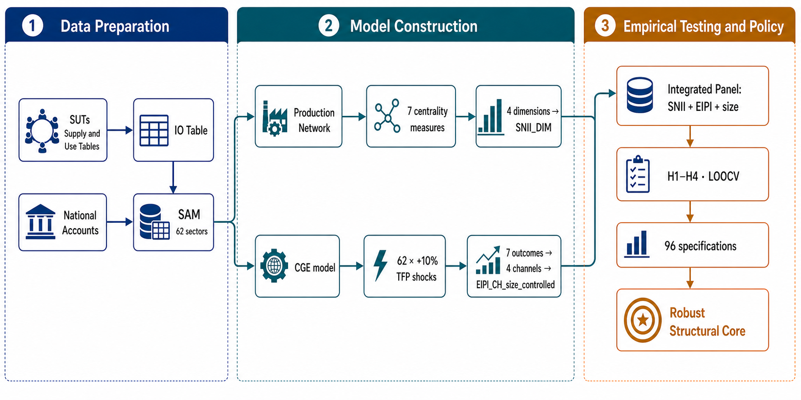
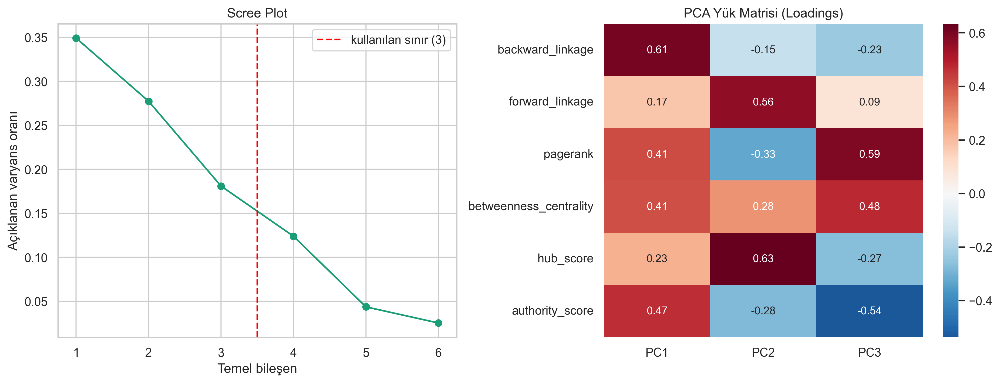
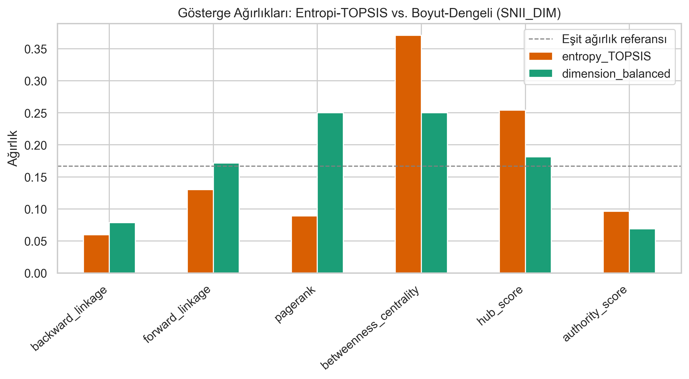
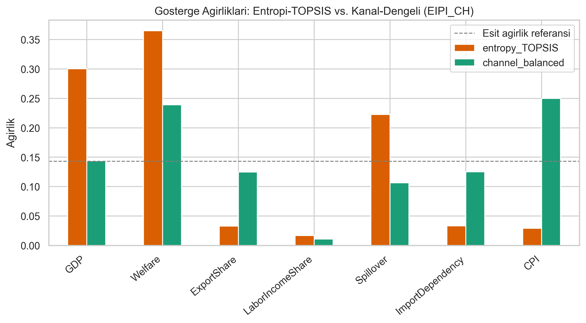
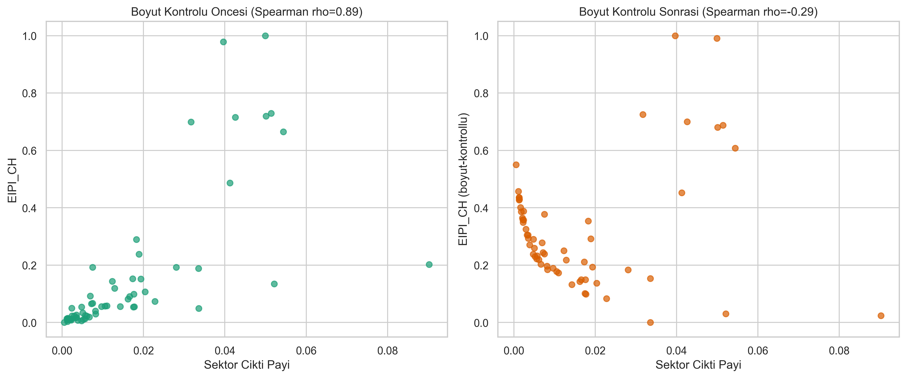
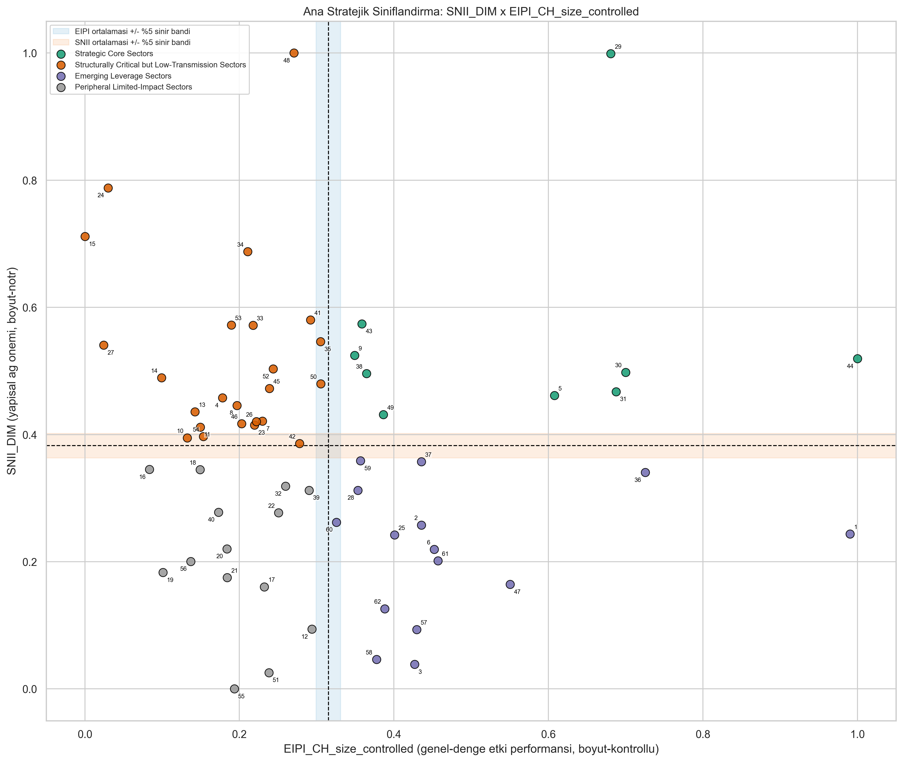

# Üretim Ağı Merkeziliği Genel Denge Etkisini Yansıtır mı? Türkiye İçin Ağ–CGE Tabanlı Bir Sektörel Önceliklendirme Çerçevesi

**Does Production Network Centrality Reflect General Equilibrium Impact? A Network–CGE Based Sectoral Prioritization Framework for Turkey**

---

## ÖZET (Abstract)

Sektörel önceliklendirme, üretim ağındaki yapısal konum ile ekonominin geneli üzerindeki etkisinin aynı bilgi olarak değerlendirilmesi riskini taşır. Bu çalışma, Türkiye’nin 2023 üretim ağı ve Sosyal Hesaplar Matrisi temelli hesaplanabilir genel denge çerçevesinde bu varsayımı sınamaktadır. Aynı 62 sektör için, sektörlerin üretim ağı içindeki yapısal konumunu özetleyen Yapısal Ağ Önem Endeksi (SNII) ile verimlilik şoklarının büyüme, refah, dış denge ve fiyat kanallarındaki sonuçlarını büyüklük etkisinden arındırarak özetleyen Ekonomi Geneli Etki Performans Endeksi (EIPI) karşılaştırılmıştır. Bulgular, ağda merkezi olmanın tek başına yüksek ve dengeli genel denge etkisi anlamına gelmediğini göstermektedir. Ağ göstergeleri sektörlerin üretim ve yayılma etkileri hakkında sınırlı bilgi sunarken, fiyat, dış ticaret ve gelir dağılımı sonuçları sektörün ağdaki konumundan çok büyüklüğü, ithal girdi bağımlılığı ve fiyat ayarlamaları tarafından belirlenmektedir. Bu nedenle çalışma, ağ merkeziliğini dışlamak yerine onu genel denge performansının yerine geçmeyen, tamamlayıcı bir yapısal bilgi olarak konumlandırmaktadır. Önerilen çerçeve, iki eksenli sektör haritasını Pareto önceliği, dengeli performans ve spesifikasyon sağlamlığıyla birleştirerek; sağlam yapısal çekirdek ile açık politika tercihine bağlı adayları ayrıştırmaktadır. Sonuçlar, Türkiye’de sanayi politikasının tek boyutlu bir “kazanan sektörler” listesine değil, amaçlara ve aktarım kanallarına duyarlı, ihtiyatlı bir karar desteğine dayanması gerektiğine işaret etmektedir.

**Anahtar Kelimeler:** üretim ağları; hesaplanabilir genel denge; sektörel önceliklendirme; merkezilik; sanayi politikası; Türkiye.

**JEL Kodları:** C63, C67, C68, D57, L52, O25. 

## 1. GİRİŞ (Introduction)

### 1.1. Çalışmanın Konusu ve Motivasyon

Kamu kaynaklarının kısıtlı olduğu gelişmekte olan ülkelerde, iktisadi büyümeyi tetiklemek ve sistemik kırılganlıkları azaltmak amacıyla sektörel önceliklendirme (*picking winners*) sanayi politikalarının odağında yer almaktadır. Doğru sektörü desteklemek, girdi-çıktı bağlantıları üzerinden çarpan etkileri yaratarak ekonomi genelinde kaynak verimliliği sağlarken; yanlış bir sektörel odaklanma, teşvikin ithalata, fiyat artışlarına veya dar bir kesimin rantına sızmasıyla kamu kaynaklarının israfına yol açmaktadır. Politika pratiğinde bu seçim çoğunlukla iki ayrı analitik gelenekten yalnızca birine dayanılarak yapılır: ya girdi-çıktı tablosundan türetilen bağlantı/merkezilik sıralamaları ya da genel denge simülasyonlarından türetilen etki sıralamaları. Bu çalışmanın konusu, bu iki sıralamanın aynı ekonomi, aynı yıl ve aynı 62 sektör (çalışmada analiz edilen 62 sektörün kod ve isim eşleşmeleri Ek A'da gösterilmiştir) üzerinde ne ölçüde örtüştüğünün sistematik olarak sınanmasıdır.

### 1.2. Literatür Çerçevesi

Kilit sektör araştırmalarının temel sorusu, ekonomide en fazla bağlantıya sahip sektör ile kamu kaynağı bakımından en yüksek toplumsal getiriyi üreten sektörün aynı olup olmadığıdır. Klasik ileri–geri bağlantı yaklaşımı bu iki niteliği büyük ölçüde birleştirir (**Hirschman, 1958; Rasmussen, 1956; Chenery ve Watanabe, 1958**). Ancak farklı anahtar-sektör ölçülerinin farklı sıralamalar üretmesi (**Temurshoev ve Oosterhaven, 2014**), hipotetik çıkarma ile doğrudan bağlantıların aynı sonucu vermemesi (**Pereira López vd., 2021; Bhusal, 2025**) ve hedefin üretim, çevre, bölgesel kalkınma veya dış ticaret olmasına göre seçimin değişmesi (**Alcántara ve Padilla, 2020; Ernawati vd., 2024; Ojaleye ve Narayanan, 2022; Nugroho, 2021**) bu eşitlemeyi tartışmalı kılmaktadır. Türkiye’yi de içeren karşılaştırmalı ağ analizi (**Jahangard ve Keshtvarz, 2012**) ve Türkiye için güncel GÇ-ağ uygulaması (**Çırpıcı, 2024**) bağlantıların vazgeçilmez bir başlangıç bilgisi sunduğunu; fakat politika amacından bağımsız, otomatik bir teşvik listesi vermediğini düşündürmektedir.

Bu tartışma üretim ağları yaklaşımıyla daha somut hâle gelmiştir. Hub/authority, özvektör, PageRank, arasındalık ve rastgele yürüyüş temelli ölçüler sektörlerin yalnızca ne kadar alım-satım yaptığına değil, şokların hangi düğümlerden iletildiğine ve hangi ara konumlarda yoğunlaştığına bakar (**Alatriste-Contreras, 2015; Alatriste-Contreras ve Lugo, 2022; DePaolis vd., 2022; An vd., 2024**). AB, Ekvador, Kore, dünya girdi-çıktı ağı ve çok-ülkeli hassasiyet çalışmaları, merkezi sektörlerin geleneksel bağlantı ölçülerinin seçtiği sektörlerle çoğu zaman yalnız kısmen örtüştüğünü göstermektedir (**Ramírez-Álvarez vd., 2023; Lee ve Ishiro, 2025; Tran vd., 2017; Wirkierman vd., 2021**). Bu kanıt merkeziliği değersizleştirmez; onu daha çok yayılım, kırılganlık ve yapısal aracılık göstergesi olarak konumlandırır. Nitekim dinamik ağ ve ayrıştırılmış şok çalışmalarında da sektör tanımının ayrıntı düzeyi ve bağlantı yapısı sonuçları değiştirmektedir (**Guerrieri vd., 2014; Roson ve Sartori, 2016; Jiang vd., 2024; Kharazi vd., 2025**).

Merkeziliğin politika açısından neden tek başına yeterli olmadığı genel denge yazınında belirgindir. Etkin koşullarda Domar ağırlıkları ve GÇ çarpanları birinci derece toplam etkiyi özetleyebilse de; ikame, aksaklıklar, tamamlayıcılıklar ve faktör hareketliliği devreye girdiğinde sektör şoklarının etkisi doğrusal olmayan biçimde değişir (**Fadinger vd., 2022; Baqaee ve Farhi, 2019b, 2020a, 2020b; Bahal ve Lenzo, 2023**). Uygulamalı CGE çalışmaları verimlilik veya teknoloji şoklarının büyüme, refah, fiyat ve yapısal dönüşüm kanallarını görünür kılmaktadır (**Cutler ve Davies, 2010; Burnett vd., 2012; Antoszewski, 2019; Khan, 2020; Blackburn ve Moreno-Cruz, 2021; Jin ve Li, 2025**); CGE–sektörel model bağlantısının varsayımlara duyarlılığı da özellikle vurgulanmaktadır (**Delzeit vd., 2020; Bolarinwa, 2024; Odior ve Arinze, 2022**). Buna rağmen bu çalışmaların çoğu, ağ merkeziliğinin aynı sektör evreninde büyüklükten arındırılmış çok-kanallı CGE etkilerini dış-örneklemde tahmin edip etmediğini doğrudan sınamamaktadır.

Sanayi politikası yazını bu boşluğu normatif bir uyarıya dönüştürür: teşvik önceliği yalnız topolojik konumdan değil, aksaklıkların nerede biriktiğinden, müdahalenin maliyetinden ve hedeflenen sonuçtan türemelidir (**Liu, 2019; Martinez ve Orrillo, 2024**). Bu nedenle çok kriterli sıralama araçları yararlı olmakla birlikte karar kuralının yerine geçmez. Entropi ağırlığı, PCA, TOPSIS, bulanık çok kriterli karar verme ve makine öğrenmesi temelli uygulamalar farklı göstergeleri şeffaf biçimde bir araya getirmeyi sağlar (**André ve Cardenete, 2009; Jin vd., 2022; Tsoulfidis ve Athanasiadis, 2022; Çalık vd., 2018; Türegün, 2022; Jamwal vd., 2021; Ionașcu vd., 2024; Hlushko vd., 2025; Aliyev, 2024; Faridzad, 2025**). Fakat hangi göstergenin hangi amaç için seçildiği ve sıralamanın farklı makul spesifikasyonlarda korunup korunmadığı ayrıca gösterilmelidir.

Bu çalışma bu iki literatür kümesini Türkiye için aynı ampirik soruda birleştirmektedir. Aynı 62 sektörlük veri evreninde ağın dört yapısal boyutunu, 62 ayrı TFP şokunun SAM/CGE sonuçlarından türetilen büyüklük-kontrollü ve kanal-dengeli EIPI ile karşılaştırmakta; ilişkiyi yalnız korelasyonla değil, sınıflama uyumu, LOOCV öngörüsü, Pareto–denge filtresi ve 96 spesifikasyonlu sağlamlıkla değerlendirmektedir. Böylece merkeziliğin hangi çıktı türleri için bilgi taşıdığını, hangi koşullarda sektör büyüklüğüyle karıştığını ve açık politika tercihleriyle ne ölçüde ayrıştığını sınamaktadır. Bu tasarım, literatürde çoğu kez ayrı yürütülen ağ-haritalama, CGE şok analizi ve bileşik sıralama pratiklerini birbirinin yerine geçen doğrulamalar değil, birbirini sınayan tamamlayıcı kanıtlar olarak ele almaktadır.

### 1.3. Teorik Boşluk, Özgün Değer ve Metodolojik Titizlik

Mevcut yazında topolojik konumun makroekonomik önem taşıdığı varsayılmakta veya topoloji veri alınarak genel denge sonuçları üretilmektedir; bu yaklaşım **Hulten (1978)**, **Gabaix (2011)**, **Acemoglu vd. (2012)**, **Carvalho (2014)** ve **Baqaee ve Farhi (2019a)** tarafından farklı kuramsal mekanizmalarla temellendirilmiştir. Ancak, bu iki analitik yaklaşım arasındaki ampirik ilişki aynı veri, aynı sektör evreni ve aynı ölçüm disiplini altında sistematik olarak sınanmamıştır. Özellikle standart üretim ağı merkezilik ölçütlerinin, boyut-kontrollü genel denge etkilerini aynı sektör kümesinde dış-örneklem geçerliliğiyle tahmin edip edemediği açık bir sorudur. **Baqaee ve Farhi (2020a)** ve **Fadinger vd. (2022)** gibi çalışmalar teorik zemin sunsa da, bu ilişkinin orta ölçekli bir uygulamalı modeldeki ampirik gücünün ne olduğu ortaya konmamıştır.

Bu çalışmanın özgün değeri ve literatüre katkısı beş temel katmanda özetlenebilir:
* **İki Bağımsız Ölçüm Nesnesinin Entegrasyonu:** Aynı sektör evreninde topolojik önemi ve genel denge etkisini ayrı ayrı kurgulayarak aralarındaki ilişkiyi dış-örneklem disipliniyle test etmektedir.
* **Metodolojik Yanlılıkların Yönetimi:** Ampirik sapmaları önlemek amacıyla öz-bağlantı (self-loop) yanlılığı temizliği yapılmış; CPI'nin dejenere olmasını engellemek üzere agregatif yurtiçi soğurma-ağırlıklı fiyat endeksi numeraire olarak seçilmiştir.
* **Sektör Büyüklüğü (Domar Ağırlığı) Kontrolü:** Sektör büyüklüğünün endeksleri domine etmesini önlemek amacıyla performans göstergeleri büyüklük etkisinden arındırılmıştır.
* **Dış-Örneklem Tahmin Disiplini:** Modellerde örneklem-içi uyum yerine LOOCV (Leave-One-Out Cross-Validation) dış-örneklem $R^2$ performansı raporlanmış ve tahmin varyansı düşük modeller elenmiştir.
* **Pozitif ve Açık Politika Karar Katmanlarının Ayrıştırılması:** Betimsel haritalama; Pareto katmanları, telafiyi sınırlayan denge skorları ve 96 farklı spesifikasyonda üyelik kararlılığı analizi ile bilimsel bir çekirdek seçimine dönüştürülmüştür. Ayrıca ampirik sistemik çekirdek, açık politika ağırlıklarına dayalı öznel politika tercihlerinden ayrılarak karar sürecine şeffaflık getirilmiştir.

### 1.4. Araştırma Soruları ve Sınanabilir Hipotezler

Çalışma kapsamında aşağıdaki araştırma soruları ve bunlara karşılık gelen sınanabilir ampirik hipotezler formüle edilmiştir:

* **Araştırma Sorusu 1:** Üretim ağında topolojik olarak merkezi konumda yer alan sektörler, genel denge simülasyonlarında da yüksek makroekonomik ve refah etkisi yaratır mı?
  * **H1 (Uyum):** Yapısal Ağ Önem Endeksi ($SNII_i$) ile boyut-kontrollü Ekonomi Geneli Etki Performans Endeksi ($EIPI_i$) arasında pozitif monoton bir ilişki vardır.
* **Araştırma Sorusu 2:** Ağ tabanlı yapısal önem ile genel denge etki gücü arasındaki ıraksamanın boyutu nedir ve bu uyumsuzluğun arkasındaki sızıntı mekanizmaları nelerdir?
  * **H2 (Iraksama):** Ağ-merkezi/GE-düşük ve ağ-çevre/GE-yüksek gruplar sektörlerin kayda değer bir bölümünü oluşturur.
* **Araştırma Sorusu 3:** Ağ yapısı, genel denge makroekonomik çıktılarını hangi heterojenlikte tahmin edebilir?
  * **H3 (Kanal Heterojenliği):** Ağ alt boyutları, reel miktar ve yayılma çıktılarını, fiyat/ticaret/dağılım çıktılarına göre daha iyi dış-örneklem performansıyla tahmin eder.
* **Araştırma Sorusu 4:** Ağ konumu, sektör büyüklüğünün (Domar ağırlığının) ötesinde genel denge performansını tahmin etmekte anlamlı bir artışsal öngörü değeri sunar mı?
  * **H4 (Artışsal Değer):** Ağ bilgisi, sektör büyüklüğüne eklendiğinde genel denge etki tahminine sınırlı artışsal dış-örneklem katkısı sağlar.
* **Araştırma Sorusu 5:** Alternatif ölçüm ve toplulaştırma yöntemleri altında hangi sektörler yapısal ve açık politika hedefleri açısından öncelikli konumu sürdürmektedir?
  * **H5 (Sağlam Çekirdek):** Ortalama-eşikli Stratejik Çekirdek üyelerinin yalnız bir alt kümesi Pareto-etkin, iki eksende dengeli ve alternatif spesifikasyonlara karşı kararlı bir yapısal çekirdek oluşturur.

### 1.5. Çalışmanın Planı

Bölüm 2 veri altyapısını, SNII/EIPI kuruluşunu, CGE modelini ve sağlam çekirdek algoritmasını; Bölüm 3 ampirik sınamaları; Bölüm 4 Pareto öncelik sınırı, spesifikasyon sağlamlığı ve açık politika tercih sonuçlarını; Bölüm 5 sağlamlık analizlerini; Bölüm 6 tartışmayı; Bölüm 7 sonuçları sunar.

## 2. METODOLOJİ VE VERİ ALTYAPISI (Methodology & Data)

Önerilen metodolojik çerçeve, mikroekonomik düzeydeki sektörel bağlantıları ağ kuramı araçlarıyla ele alan yapısal analiz ile makroekonomik kısıtları, ikame mekanizmalarını ve fiyat dengelerini simüle eden hesaplanabilir genel denge (CGE) modelini entegre etmektedir. İlk olarak sektörlerin girdi-çıktı ağındaki topolojik konumlarını ölçen Yapısal Ağ Önem Endeksi (SNII) tanımlanmış; ardından her bir sektöre yönelik üretkenlik şoklarının ekonomi genelindeki nihai etkilerini simüle eden genel denge tabanlı Ekonomi Geneli Etki Performans Endeksi (EIPI) formüle edilmiştir. Son aşamada ise iki bağımsız analitik kanaldan elde edilen sektörel göstergeler, büyüklük kontrolleri eşliğinde tek bir birleşik kesit panelinde birleştirilerek analiz edilmiştir.

Analizler, Türkiye ekonomisine ait Sosyal Hesaplar Matrisi (SAM) verileri üzerine kalibre edilmiş bir CGE modeli ve bu model üzerinde yürütülen sektörel Toplam Faktör Verimliliği (TFP) şok simülasyonlarına dayanmaktadır. Sektör düzeyindeki veriler ve model kalibrasyonuna ilişkin veri altyapısının detayları ilgili bölümlerde ele alınmaktadır. Veri kaynaklarının SAM'de birleştirilmesinden sağlam yapısal çekirdeğin elde edilmesine kadar izlenen bütünleşik süreç Şekil 1'de özetlenmektedir.

Şekil 1'de, Arz ve Kullanım Tabloları (SUTs) önce girdi-çıktı tablosuna dönüştürülmekte; bu tablo ulusal hesaplarla birlikte SAM'in kurulmasında kullanılmaktadır (**İnce, 2022**). SAM'den türetilen iki eşzamanlı kol, üretim ağının merkeziyet ölçüleri yoluyla dört boyutlu SNII'yı ve CGE modelindeki 62 sektörel %10 TFP şoku yoluyla kanal-dengeli, büyüklük-kontrollü EIPI'yi üretmektedir. Son aşamada bu iki endeks sektör büyüklüğüyle birlikte bütünleşik panele alınmakta; H1–H4 sınamaları, LOOCV ve 96 spesifikasyona dayalı sağlamlık denetimi aracılığıyla politika açısından sağlam yapısal çekirdek belirlenmektedir.

Ampirik veri tabanı, Türkiye İstatistik Kurumu'nun (TÜİK) 2023 yılı Arz ve Kullanım Tablolarına dayanmaktadır. Ürün bazında yayımlanan bu tablolar, sektörler arası üretim ilişkilerini doğrudan temsil eden sektör-bazlı bir analitik yapıya dönüştürülmüş; dönüşüm sonrasında elde edilen girdi-çıktı tablosu hem üretim ağı hem de CGE kalibrasyonu için ortak başlangıç noktası olarak kullanılmıştır. Bu tercih, ağ ölçütleri ile genel denge sonuçlarının farklı veri evrenlerinden değil, aynı ara girdi ve nihai talep muhasebesinden türetilmesini güvence altına almaktadır.

Sektör sınıflaması, ara girdi akımı bulunmayan faaliyetlerin ağ topolojisini mekanik olarak seyreltmesini önleyecek biçimde 64 sektörden 62 sektöre uyumlaştırılmıştır. Bu kapsamda L68A (sahip olunan konutların varsayımsal kiraları) L68B (varsayımsal kiralar hariç gayrimenkul hizmetleri) ile; T (hanehalklarının işveren olarak sunduğu hizmetler ve kendi kullanımı için üretilen mal ve hizmetler) ise S96 (diğer kişisel hizmetler) ile birleştirilmiştir. Böylece ağ, CGE ve tüm endeksler aynı 62 sektörlük evren üzerinde kurulmuştur.

SAM, satır–sütun denklikleri korunarak ulusal hesaplar ve Strateji ve Bütçe Başkanlığı'nın 2023 vergi geliri bilgileriyle tamamlanmıştır. Hanehalkı, hükümet ve yatırım talebine ilişkin KDV bileşenleri ayrıca ayrıştırılmış; sonuçta 135 × 135 boyutunda dengelenmiş bir SAM elde edilmiştir. Bu matris CGE modelinin benchmark dengesini oluştururken, içindeki 62 × 62 ara girdi bloğu öz-bağlantı arındırmasından sonra Bölüm 2.1'deki teknik katsayılar ve merkezilik hesaplarının temelini sağlamaktadır. 

### 2.1. Ağ Tabanlı Yapısal Önem Endeksi (SNII)

Yapısal Ağ Önem Endeksi (SNII), bir sektörün üretim ağı içindeki önemini tek bir bağlantı sayısına veya merkezilik ölçüsüne indirgemeden değerlendiren bileşik bir göstergedir. Endeks; sektörlerin talep ve arz bağlantı gücünü, sistem içindeki gömülülüğünü, üretim akışları arasındaki köprü rolünü ve tedarik–dağıtım konumunu dört tamamlayıcı boyutta bir araya getirir. Böylece SNII, yalnızca çok sayıda bağlantıya sahip sektörleri değil, ekonomi genelinde şokların iletilmesi ve yayılması bakımından stratejik konumda bulunan sektörleri de belirlemeyi amaçlar. 

#### 2.1.1. Girdi-Çıktı Matrisinin Ağ Olarak Modellenmesi ve Öz-Bağlantı Arındırması

Ekonomi, $N = 62$ sektörden (sektörlerin kodları, NACE Rev.2 sınıflaması ve tam açıklamaları Ek A'da verilmiştir) oluşan düğüm kümesi $V = \{1, 2, \dots, N\}$ ve sektörler arasındaki nominal ara girdi akımlarını temsil eden kenar kümesi $E$ ile yönlü, ağırlıklı bir ağ olarak modellenmiştir. Ağın başlangıç noktası girdi-çıktı tablosunun nominal ara işlemler matrisidir ($Z \in \mathbb{R}^{N \times N}$). Kurulan ağın yapısı ve tüm merkezilik metrikleri doğrudan teknik katsayılar matrisi $A$ üzerinden tasarlanmıştır.

Sektörlerin kendi kendilerinden yaptıkları ara malı alımları (köşegen değerleri $Z_{i,i}$) ağ göstergelerine yapay bir ölçek yanlılığı yüklemektedir. Bu yanlılığı gidermek için öz-bağlantılar arındırılmıştır:

$$\tilde{Z}_{i,j} = \begin{cases} Z_{i,j} & \text{eğer } i \neq j \\ 0 & \text{eğer } i = j \end{cases}$$

Arındırılmış nominal ara işlemler matrisi $\tilde{Z}$, her $j$ sektörünün toplam brüt çıktısına ($X_j$) bölünerek teknik katsayılar matrisi elde edilmiştir: $A_{i,j} = \tilde{Z}_{i,j} / X_j$. Ağ yapısını ve sektörler arasındaki girdi-çıktı ilişkilerini gösteren üretim ağı görselleştirmesi doğrudan teknik katsayılar matrisi $A$ temel alınarak yapılmış ve Şekil 2'de sunulmuştur.

Şekil 2, $A$ katsayılar matrisi üzerinden kurulan ve 62 sektör arasındaki yönlü ara girdi ilişkilerini temsil eden öz-bağlantılardan arındırılmış üretim ağını sunmaktadır. Her düğüm bir sektörü temsil etmektedir. Düğümlerin büyüklüğü ve rengi özvektör merkeziliğinin düzeyini yansıtmaktadır; düğümün büyümesi ve rengin açık tonlara yaklaşması ilgili sektörün ağ içinde merkezi konumda bulunan diğer sektörlerle daha güçlü bağlantılara sahip olduğuna işaret eder. Ağdaki oklar ara girdi akışlarının yönünü, bağlantı çizgilerinin kalınlığı ise $A_{i,j}$ teknik katsayılarının göreli büyüklüğünü yansıtmaktadır. Görsel okunabilirliği korumak amacıyla, pozitif teknik katsayı dağılımının üst %10'luk diliminde yer alan en güçlü bağlantılar görselleştirilmiştir. Özvektör merkeziliği yüksek olan sektörler ağın çekirdeğinde yoğunlaşmıştır.

#### 2.1.2. Aday Ağ Merkezilik Göstergeleri

Tekil merkezilik göstergelerinin hesaplanmasından önce, üretim ağındaki doğrudan ve dolaylı tedarik ilişkilerini yakalamak amacıyla Leontief ters matrisi hesaplanmıştır: $L = (I - A)^{-1}$. Burada her bir $L_{i,j}$ katsayısı, $j$ sektöründeki bir birimlik nihai talep artışının üretim zinciri boyunca $i$ sektöründe yaratacağı toplam doğrudan ve dolaylı üretim artışını göstermektedir. Bu çerçevede, sektörlerin ağ içindeki farklı yapısal rollerini temsil etmek üzere 7 aday gösterge hesaplanmıştır:

1. **Geri Bağlantı Etkisi ($BL_j$):** Talep yönlü toplam yayılım gücü, Leontief ters matrisinin sütun toplamı olarak hesaplanmıştır: $BL_j^{raw} = \sum_{i=1}^N L_{i,j}$.
2. **İleri Bağlantı Etkisi ($FL_i$):** Arz yönlü toplam yayılım kapasitesi için önce Ghosh tahsis katsayıları matrisi $B_{i,j}=\tilde{Z}_{i,j}/X_i$ ve Ghosh tersi $G=(I-B)^{-1}$ oluşturulmuş, ardından satır toplamı alınmıştır: $FL_i^{raw} = \sum_{j=1}^N G_{i,j}$. Dolayısıyla ileri bağlantı Leontief tersinin satır toplamından değil, **Ghosh tersinden** elde edilmektedir.
3. **PageRank Merkeziliği ($PR_i$):** Sistem genelindeki özyinelemeli gömülülük ($d = 0.85$):
   $$PR_i = \frac{1-d}{N} + d \sum_{j \in M(i)} \frac{PR_j}{L_{\text{out}}(j)}$$
4. **Arasılık Merkeziliği ($BC_i$):** Üretim zincirleri arasındaki köprü rolü; iktisadi mesafe $D_{i,j} = -\ln(A_{i,j})$ üzerinden en kısa yollarla hesaplanır: $BC_i = \sum_{s \neq i \neq t} \sigma_{st}(i) / \sigma_{st}$ (**Freeman, 1977**).
5. **Hub Skoru ($H_i$):** Kleinberg (1999) HITS algoritmasında bir sektörün kritik otorite düğümlerine girdi sağlama kapasitesini ölçer: $H_i = \mu \sum_{i \to j} A_j$. Yüksek hub skoru, birçok kritik kullanıcıya/tedarik merkezine ara girdi sağlayan “toplayıcı” bir sektöre işaret eder.
6. **Otorite Skoru ($A_i$):** HITS algoritmasında bir sektörün yüksek hub değerli tedarikçilerden girdi alma yoğunluğunu ölçer: $A_i = \lambda \sum_{j \to i} H_j$. Yüksek otorite skoru, birçok kritik tedarikçi tarafından beslenen ana ara malı kullanıcısı veya tedarik merkezi anlamına gelir.
7. **Özvektör Merkeziliği ($EC_i$):** Komşuların önemine dayalı klasik özyinelemeli merkezilik (aşağıda kollinearite gerekçesiyle elenmiştir).

Analizde kullanılan yedi aday göstergenin tamamı fayda yönlü olacak biçimde min–maks dönüşümüyle $[0,1]$ aralığına taşınmıştır. Göstergeler arasındaki Spearman korelasyonları Tablo 1'de sunulmuştur.

#### Tablo 1. SNII aday göstergeleri arasındaki Spearman sıra korelasyonu

| Gösterge | BL | FL | EC | PR | BC | H | A |
|---|---:|---:|---:|---:|---:|---:|---:|
| **BL** | 1.00 | 0.09 | 0.82 | 0.49 | 0.32 | 0.14 | 0.80 |
| **FL** | 0.09 | 1.00 | −0.15 | −0.03 | 0.46 | 0.52 | −0.15 |
| **EC** | 0.82 | −0.15 | 1.00 | 0.71 | 0.18 | −0.10 | 0.82 |
| **PR** | 0.49 | −0.03 | 0.71 | 1.00 | 0.29 | −0.29 | 0.26 |
| **BC** | 0.32 | 0.46 | 0.18 | 0.29 | 1.00 | 0.61 | 0.14 |
| **H** | 0.14 | 0.52 | −0.10 | −0.29 | 0.61 | 1.00 | 0.15 |
| **A** | 0.80 | −0.15 | 0.82 | 0.26 | 0.14 | 0.15 | 1.00 |

*Not: BL = geri bağlantı; FL = ileri bağlantı; EC = özvektör merkeziliği; PR = PageRank; BC = arasılık; H = hub; A = otorite. Kaynak: Yazarın hesaplamaları.*

Tablo 1'de sunulan Spearman korelasyon matrisi, aday göstergelerin tek bir homojen merkezilik boyutunu ölçmediğini, aksine üretim ağı içindeki farklı iktisadi işlevleri yakaladığını göstermektedir. En belirgin korelasyon kümesi özvektör merkeziliği, geri bağlantı ve otorite skoru arasında gözlenmektedir ($\rho \approx 0.80 - 0.82$). Bu yüksek ilişki, üretim ağında güçlü tedarikçilerle ilişkili olma durumu ile doğrudan girdi çekme gücünün büyük ölçüde ortak bilgi taşıdığını ortaya koymaktadır. Ayrıca özvektör merkeziliğinin PageRank ile de yüksek derecede ilişkili olması ($\rho = 0.71$), özyinelemeli sistemik gömülülük bilgisinin PageRank tarafından temsil edilebildiğini göstermektedir. Diğer taraftan, köprü rollerini temsil eden arasılık merkeziliği ile ara malı dağıtım potansiyelini ölçen hub skorları arasında orta-güçlü bir ilişki ($\rho = 0.61$) bulunurken, arz yönlü ileri bağlantıların talep yönlü geri bağlantılar ile neredeyse ilişkisiz olması ($\rho = 0.09$) talep yönlü girdi çekme kapasitesi ile arz yönlü yayılım potansiyelinin farklı yapısal özellikleri yansıttığını göstermektedir. PageRank ile hub skorları arasındaki negatif ilişki ($\rho = -0.29$) ise sistemik olarak gömülü olan sektörlerin mutlaka geniş bir ara malı dağıtım rolü üstlenmediğine işaret etmektedir. Bu korelasyon yapısı, bir yandan farklı ağ kanallarındaki özgün bilgiyi korumak için gösterge çeşitliliğinin sürdürülmesini desteklemekte, diğer yandan ise özvektör merkeziliğinin elenmesiyle çoklu kollinearite riskinin azaltılmasını gerekçelendirmektedir.

#### 2.1.3. Kollinearite Yönetimi: VIF Eleme ve Faktörlenebilirlik Tanıları

Aday göstergeler arasındaki çoklu doğrusal ilişki Varyans Enflasyon Faktörü (VIF) ile ölçülmüş; eşik değer 5.0 olarak belirlenmiştir. Özvektör merkeziliği VIF $=10.57$ ile elenmiş, kalan altı göstergenin tümünde VIF < 3.2 sağlanmış olup sonuçlar Tablo 2'de gösterilmektedir.

#### Tablo 2. Aday gösterge VIF tanıları ve seçim kararı

| Gösterge | VIF (eleme öncesi) | VIF (eleme sonrası) | Karar |
|---|---:|---:|---|
| Geri bağlantı ($BL$) | 3.504 | 3.186 | Tutuldu |
| İleri bağlantı ($FL$) | 1.558 | 1.467 | Tutuldu |
| Özvektör merkeziliği | **10.566** | — | **Elendi** (VIF ≥ 5; $D_2$ boyutunu PageRank temsil eder) |
| PageRank ($PR$) | 6.206 | 2.553 | Tutuldu |
| Arasılık ($BC$) | 1.914 | 1.860 | Tutuldu |
| Hub skoru ($H$) | 2.368 | 2.366 | Tutuldu |
| Otorite skoru ($Auth$) | 4.738 | 2.344 | Tutuldu |

Faktörlenebilirlik tanıları, tek-faktörlü bir gizil yapının veriyi iyi temsil etmediğini göstermektedir: KMO örneklem yeterliliği $0.386$ ("zayıf" bölge, < 0.5) iken Bartlett küresellik testi anlamlıdır ($\chi^2=127.73$, $p=5.9\times10^{-20}$). Bu ikili sonuç — korelasyonlar sıfırdan farklı, ancak ortak faktör yapısı zayıf — göstergelerin tek bir PCA ekseni yerine **kavramsal boyutlar altında** toplulaştırılması kararının ampirik gerekçesidir; bu değerlendirme Şekil 3'teki yamaç grafiği ve bileşen yükleriyle görsel olarak tamamlanmaktadır.

Şekil 3'te sunulan yamaç grafiği ve bileşen yükleri analiz edildiğinde, ilk temel bileşenin toplam varyansın yalnızca %35'ini açıkladığı, ikinci ve üçüncü bileşenlerin ise sırasıyla %28 ve %18 oranında katkı sağladığı görülmektedir. Bilginin tek bir baskın boyutta toplanmayıp ilk üç bileşene dağılması, göstergelerin tek bir merkezilik faktörünün birbirinin yerine geçebilen alternatifleri olmadığını doğrulamaktadır. Yük matrisine bakıldığında, birinci bileşenin talep yönlü entegrasyonu (geri bağlantı, PageRank, arasılık, otorite), ikinci bileşenin ise arz yönlü dağıtım gücünü (ileri bağlantı ve hub skoru) yansıttığı anlaşılmaktadır. Göstergelerin farklı bileşenlerde farklı işaret ve büyüklüklerde yük alması, tekil bir merkezilik endeksi oluşturmak yerine kuramsal olarak tanımlanmış bağlantı gücü, sistemik gömülülük, köprü rolü ve tedarik-dağıtım yönelimi gibi kavramsal boyutların korunmasını desteklemektedir.

#### 2.1.4. Ana SNII Endeksinin Kurulumu ve Metodolojik Alternatifler

Tekil ağ göstergeleri doğrudan ve birbirinden bağımsız nihai ölçütler olarak kullanılmamıştır; çünkü her biri yapısal önemin yalnızca belirli bir yönünü yakalamakta ve bazıları aynı ekonomik mekanizmanın yüksek ölçüde örtüşen temsillerini oluşturmaktadır. Örneğin geri bağlantı doğrudan girdi çekme gücünü, ileri bağlantı çıktıların ekonomiye yayılma kapasitesini, PageRank önemli düğümlerle bağlantılı olmayı, arasılık sektörler arasındaki köprü rolünü, hub ve otorite skorları ise yönlü tedarik–dağıtım konumunu ölçmektedir. Bu göstergelerden herhangi birini tek başına “sektörel yapısal önem” olarak kabul etmek, merkeziliği seçilen metriğin dar bakış açısına indirger; altı göstergenin tümünü ayrı ayrı politika ölçütü olarak kullanmak ise aynı bilgiyi taşıyan metriklerin karar sürecinde birden fazla kez sayılmasına, çoklu kollineariteye ve yorumlanması güç, birbirleriyle çelişebilen sektör sıralamalarına yol açar.

Dört boyutlu yapı bu iki sorunu birlikte çözmek üzere kurulmuştur. İlk olarak, benzer iktisadi iletim mekanizmasını ölçen göstergeler aynı kavramsal başlık altında birleştirilerek bilgi tekrarı azaltılmıştır. İkinci olarak, bağlantı gücü, sistemik gömülülük, köprü rolü ve tedarik–dağıtım yönelimi ayrı tutulmuş; böylece birbirinin yerine geçmeyen ağ işlevlerinin bileşik endekste temsil edilmesi sağlanmıştır. Bu tercih yalnızca kuramsal değildir: düşük KMO değeri tek bir ortak faktörün yetersiz olduğunu, PCA varyansının birden fazla bileşene dağıldığını ve boyutlar arası korelasyonların düşük–orta düzeyde kaldığını göstermektedir. Dolayısıyla amaç tekil metrikleri ortadan kaldırmak değil, onları ekonomik anlamlarını koruyan daha üst düzey iletim kanallarında düzenlemektir. Tekil göstergeler gösterge-düzeyindeki mekanizma analizlerinde korunurken, sektörlerin genel yapısal önemini karşılaştırmak ve politika sınıflandırması yapmak için daha kararlı ve yorumlanabilir dört boyutlu `SNII_DIM` kullanılmıştır.

Kalan 6 gösterge, önceden tanımlanan yapısal iletim kanallarına göre 4 boyutta birleştirilmiştir. Gösterge eleme işlemi boyut üyeliğini değiştirmemiş; yalnızca özvektör merkeziliğini $D_2$ içinden çıkarmıştır:

* **$D_1$ — Talep ve Arz Bağlantı Gücü (Linkage Strength):** Leontief temelli geri bağlantı ($BL$) ile Ghosh temelli ileri bağlantının ($FL$) entropi ağırlıklı TOPSIS bileşimi.
* **$D_2$ — Sistemik Gömülülük (Systemic Embeddedness):** PageRank ($PR$).
* **$D_3$ — Köprü ve Yayılım Aracılığı (Bridge/Spillover Role):** Ağırlıklı arasılık merkeziliği ($BC$).
* **$D_4$ — Tedarik–Dağıtım Yönelimi (Supply–Distribution Role):** HITS hub ($H$) ve otorite ($Auth$) skorlarının entropi ağırlıklı TOPSIS bileşimi.

Tek göstergeli $D_2$ ve $D_3$ boyutları min–maks dönüşümüyle $[0,1]$ aralığına ölçeklenmiştir. Birden fazla göstergeli $D_1$ ve $D_4$ ise basit aritmetik ortalamayla değil, boyut içindeki göstergelerin Shannon entropi ağırlıklarıyla kurulan TOPSIS ideal-çözüme yakınlık skorlarıyla oluşturulmuştur; bu skorlar da tanım gereği $[0,1]$ aralığındadır. Dört boyut daha sonra eşit ağırlıkla birleştirilmiş ve oluşan ham bileşik skor yeniden min–maks ölçeklenmiştir:

$$SNII\_DIM_i^{raw} = \sum_{k=1}^4 w_k D_{k,i}, \qquad w_k = 0.25,$$

#### Tablo 3. Dört SNII boyutu arasındaki Spearman sıra korelasyonu

| Boyut | $D_1$: Bağlantı gücü | $D_2$: Sistemik gömülülük | $D_3$: Köprü rolü | $D_4$: Tedarik–dağıtım yönelimi |
|---|---:|---:|---:|---:|
| **$D_1$: Bağlantı gücü** | 1.00 | 0.06 | 0.48 | 0.44 |
| **$D_2$: Sistemik gömülülük** | 0.06 | 1.00 | 0.29 | −0.21 |
| **$D_3$: Köprü rolü** | 0.48 | 0.29 | 1.00 | 0.56 |
| **$D_4$: Tedarik–dağıtım yönelimi** | 0.44 | −0.21 | 0.56 | 1.00 |

*Kaynak: Yazarın hesaplamaları.*

Tablo 3'te sunulan boyutlar arası Spearman korelasyon matrisi incelendiğinde, alt-skorlar arasındaki ilişkilerin −0.21 ile 0.56 arasında değiştiği ve hiçbir ikili ilişkinin çoklu doğrusal bağlantı (kollinearite) riski taşımadığı görülmektedir. En güçlü ilişki köprü ve yayılım aracılığı ($D_3$) ile tedarik-dağıtım yönelimi ($D_4$) arasındadır ($\rho = 0.56$). Bu durum, ağdaki iletim yollarını bağlayan köprü sektörlerin aynı zamanda tedarik ve dağıtım yönüyle de güçlü olma eğiliminde olduğunu yansıtır. Bağlantı gücü ($D_1$) ise $D_3$ ($\rho = 0.48$) ve $D_4$ ($\rho = 0.44$) ile orta düzeyde ilişkiliyken, sistemik gömülülük boyutu ($D_2$) doğrudan bağlantı gücü ($D_1$) ile neredeyse ilişkisizdir ($\rho = 0.06$). Boyutlar arasındaki korelasyon deseninin genel olarak zayıf ve orta düzeyde seyretmesi, dört boyutun ağ üzerinde farklı ve birbirini tamamlayıcı yapısal iletim kanallarını temsil ettiğini göstermektedir.

Şekil 4'te yer alan ağırlık şemalarının karşılaştırması, Shannon entropisi yönteminin arasılık merkeziliğine (0.37) ve hub skoruna (0.25) yüksek ağırlık tahsis ederek gösterge dağılımını belirgin şekilde eşitsiz hale getirdiğini ortaya koymaktadır. Buna karşılık geri bağlantı, PageRank ve otorite skorlarının ağırlıkları ise %6 ila %10 gibi oldukça düşük seviyelerde kalmaktadır. Veri-temelli olan bu entropi ağırlık şeması, köprü ve hub özelliklerini baskınlaştırırken, boyut-dengeli yaklaşım ise göstergeleri önce dört kavramsal boyutta toplulaştırmakta ve her boyuta %25 eşit ağırlık ($0.25$) vermektedir. Böylelikle boyut-dengeli şema, tek bir yüksek varyanslı merkezilik göstergesinin endeksi domine etmesini engellemekte ve dört teorik iletim kanalının karar üzerindeki etkisini dengelemektedir.

Sıralamaların toplulaştırma ve ağırlıklandırma yöntemlerine olan duyarlılığını test etmek amacıyla, ana boyut-dengeli endeksin yanı sıra üç alternatif yöntemsel varyant hesaplanmış olup Tablo 4'te sunulmuştur.

#### Tablo 4. Ana ve sağlamlık SNII endekslerinin hesaplanması

| Endeks | Statü | Özet formül |
|---|---|---|
| `SNII_DIM` | **Ana endeks** | $SNII\_DIM_i = MM\!\left[\frac{D_{1i}+D_{2i}+D_{3i}+D_{4i}}{4}\right]$ |
| `SNII_TOPSIS` | Sağlamlık varyantı | $C_i^E = \frac{d_i^-}{d_i^+ + d_i^-}$; ağırlıklar $w_j^E$ entropiden gelir |
| `SNII_PCA` | Sağlamlık varyantı | $SNII\_PCA_i = MM\!\left[\sum_{m=1}^{3}\tilde{\lambda}_m\,PC_{im}^{*}\right]$, $\;\tilde{\lambda}_m=\lambda_m/\sum_{r=1}^{3}\lambda_r$ |
| `SNII_AVG` | Sağlamlık/uzlaşma varyantı | $SNII\_AVG_i = MM\!\left[\frac{Z(DIM_i)+Z(TOPSIS_i)+Z(PCA_i)}{3}\right]$ |

Bu varyantlar sırasıyla şu şekildedir:
* **`SNII_TOPSIS`**: Shannon entropisinden elde edilen veri-temelli değişken ağırlıkları kullanan ve ideal-negatif ideal çözümlere uzaklık üzerinden hesaplanan entropi-TOPSIS varyantıdır.
* **`SNII_PCA`**: Göstergelerin ampirik ortak varyans yapısını temsil eden ve ilk üç temel bileşenin açıkladığı varyans oranlarıyla ağırlıklandırılmış doğrusal kombinasyonu üzerinden kurulan varyanttır.
* **`SNII_AVG`**: Tek bir yönteme bağımlılığı azaltmak amacıyla, boyut-dengeli, TOPSIS ve PCA skorlarının standartlaştırılmış değerlerinin aritmetik ortalamasını alan melez bir uzlaşma varyanttır.

Ağ konumlarının ekonomik ölçek ile olan ampirik ilişkisini anlamak ve bu ilişkiden kaynaklanan büyüklük yanlılığını kontrol etmek çalışmanın önemli bir aşamasıdır. Gösterge ve endekslerin brüt üretim çıktılarına dayalı sektör büyüklüğü (Domar ağırlıkları) ile Spearman ve Pearson korelasyonları Tablo 5'de sunulmuştur.

#### Tablo 5. Endeks ve göstergelerin sektör büyüklüğüyle korelasyonu

| Gösterge / Endeks | Spearman $\rho$ | Pearson $r$ |
|---|---:|---:|
| SNII_DIM (birincil) | 0.268 | 0.296 |
| SNII_TOPSIS (entropi) | 0.574 | 0.578 |
| SNII_PCA | 0.378 | 0.397 |
| SNII_AVG | 0.413 | 0.435 |
| Geri bağlantı | 0.168 | 0.256 |
| İleri bağlantı | 0.060 | −0.007 |
| PageRank | −0.342 | −0.267 |
| Arasılık | 0.439 | 0.433 |
| **Hub skoru** | **0.818** | **0.674** |
| Otorite skoru | 0.224 | 0.243 |

Tablo 5 incelendiğinde, tekil göstergelerden hub skorunun sektör büyüklüğüyle son derece yüksek bir Spearman korelasyonuna sahip olduğu ($\rho = 0.818$) görülmektedir. Entropi tabanlı `SNII_TOPSIS` endeksi de bu göstergeye yüksek ağırlık vermesi nedeniyle büyüklükle $0.574$ düzeyinde korelasyon sergilemektedir. Boyut-dengeli `SNII_DIM` endeksinin ana model olarak seçilmesinin önemli bir nedeni, bu endeksin büyüklükle olan ilişkisinin daha sınırlı kalmasıdır ($\rho = 0.268$).

#### 2.1.5. SNII Sonuçları ve Bulgular

Önerilen metodolojik çerçeve kapsamında hesaplanan Yapısal Ağ Önem Endeksi (SNII_DIM), Türkiye ekonomisindeki 62 sektörün üretim ağı üzerindeki göreli topolojik önemini belirlemektedir. Bu bileşik endeks, tekil merkezilik ölçütlerinin aksine, sektörlerin ağdaki konumunu dört farklı iletim kanalı ($D_1$: Bağlantı gücü, $D_2$: Sistemik gömülülük, $D_3$: Köprü rolü, $D_4$: Tedarik-dağıtım yönelimi) üzerinden bütünsel olarak ele alır. Bu sayede, sadece doğrudan girdi alışveriş hacmi yüksek olan sektörlerin değil, aynı zamanda dolaylı yollardan şok yayma kapasitesi bulunan veya kritik üretim zincirleri arasında köprü vazifesi gören stratejik aktörlerin de belirlenmesi mümkün olmuştur. Sektörlerin boyut-dengeli SNII_DIM endeksine göre sıralandığı ve alt boyut performanslarının detaylandırıldığı en önemli ilk 5 sektörün listesi Tablo 6'da sunulmuştur.

#### Tablo 6. SNII sıralaması: ilk 5 sektör ve boyut alt-skorları

| Sıra | Sektör | SNII_DIM | $D_1$ (Bağlantı) | $D_2$ (Gömülülük) | $D_3$ (Köprü) | $D_4$ (Tedarik–dağıtım) |
|---:|---|---:|---:|---:|---:|---:|
| 1 | sec48 | 1.000 | 0.767 | 1.000 | 0.561 | 0.107 |
| 2 | sec29 | 0.999 | 0.304 | 0.640 | 1.000 | 0.490 |
| 3 | sec24 | 0.788 | 1.000 | 0.190 | 0.118 | 0.654 |
| 4 | sec15 | 0.711 | 0.560 | 0.126 | 0.273 | 0.831 |
| 5 | sec34 | 0.688 | 0.587 | 0.392 | 0.284 | 0.474 |

*Kaynak: Model simülasyon sonuçları. En düşük beş sektör: sec57 (0.093), sec58 (0.046), sec3 (0.038), sec51 (0.026), sec55 (0.000).*

Tablo 6'daki sonuçlar, üretim ağında yapısal önemin tek tip bir topolojik özellik olmadığını ve farklı sektörlerin çok farklı ağ rolleriyle ön plana çıkabildiğini doğrulamaktadır. Birinci sırada yer alan sec48 (SNII_DIM = 1.000), gücünü neredeyse tamamen PageRank tabanlı sistemik gömülülük boyutundan ($D_2 = 1.000$) almaktadır. Bu sektör, doğrudan bağlantı gücü ($D_1 = 0.767$) ve köprü rolünde ($D_3 = 0.561$) görece güçlü bir performans sergilese de, tedarik-dağıtım asimetrisinde ($D_4 = 0.107$) oldukça zayıf bir etkiye sahiptir; bu durum onun geniş kitlelere ara malı dağıtan bir hub olmaktan ziyade, ağın yoğun bağlantılı çekirdeğinde konumlanmış bir düğüm olduğunu göstermektedir. Buna karşın ikinci sıradaki sec29 (SNII_DIM = 0.999), üretim ağında kritik akış yollarını birbirine bağlayan en büyük aracı sektördür ($D_3 = 1.000$). Üçüncü sırada yer alan sec24 (SNII_DIM = 0.788) ise doğrudan girdi çekme ve çıktı yayma gücünü ölçen bağlantı boyutunda ($D_1 = 1.000$) ekonominin en yüksek kapasiteli sektörü olarak öne çıkmaktadır.

Tablonun dipnotunda raporlanan ve endeks skoru en düşük olan son beş sektör (sec57, sec58, sec3, sec51, sec55) ise üretim ağının çevre (periferi) bölgesinde yer almaktadır. Bu sektörler, hem doğrudan ara girdi entegrasyonlarının zayıf olması hem de sistemik aracı veya tedarikçi rollerinin bulunmaması nedeniyle yapısal önem açısından en düşük öncelikli grubu oluşturmaktadır. Bulgular, sektörel önceliklendirme kararlarında tekil ağ göstergelerinin kullanılmasının eksik veya yanlı sonuçlar üretebileceğini, dolayısıyla dört boyutlu bileşik yapının sunduğu dengeli yaklaşımın önemini göstermektedir.

### 2.2. Genel Denge Tabanlı Ekonomi Geneli Etki Performans Endeksi (EIPI)

Sektörel verimlilik artışlarının makroekonomik, dış ticaret ve refah yansımalarını simüle etmek amacıyla statik, tek-ülke, açık-ekonomi bir **Hesaplanabilir Genel Denge (CGE)** modeli kurulmuştur. Model, SAM tabanlı kalkınma tipi genel denge modelleme geleneğini izlemekte (**Dervis, de Melo ve Robinson, 1982**), ancak ampirik doğruluğu artırmak için numeraire ve dağılım kanallarında revizyonlar içermektedir. Genel denge etkisini ölçmek amacıyla verimlilik şokunun (özellikle Toplam Faktör Verimliliği - TFP şokunun) tercih edilmesinin nedeni, verimlilik artışlarının sektörel düzeydeki arz taraflı yapısal gelişimleri simüle etmek için en uygun araç olmasıdır. Kamu harcamalarındaki veya nihai talepteki şoklar gibi talep taraflı müdahaleler geçici ve sınırlı yayılma etkileri üretebilirken, sektörel verimlilik şokları üretim teknolojisindeki kalıcı iyileşmeleri yansıtır. Bu şoklar, ara girdi fiyatlarını düşürerek ve üretim ağının bütününde hem doğrudan hem de dolaylı maliyet azalışları yaratarak, ekonominin yapısal kapasitesini ve çarpan mekanizmalarını test etmeyi mümkün kılar.

#### 2.2.1. Model Yapısı ve Sayısal Kurulum

Model, genel denge koşullarını yansıtan doğrusal olmayan bir denklem sistemi (NLP) olarak kurgulanmış ve standart optimizasyon algoritmalarıyla çözülmüştür. Temel bloklar şunlardır:

1. **Katma değer üretimi:** Her sektörde katma değer, emek ($L$) ve sermaye ($K$) girdilerinin CES fonksiyonuyla üretilir:
   $$VA_j = A_j \left[ \delta_j L_j^{-\rho_j} + (1 - \delta_j) K_j^{-\rho_j} \right]^{-1/\rho_j}$$
   Burada ikame esnekliği ($\omega_j = 1/(1+\rho_j)$), Türkiye için verimlilik ve kur şoklarını CGE çerçevesinde inceleyen çalışmadaki kalibrasyon değerlerinden alınmıştır (**İnce ve Tarı, 2023**); $A_j$ şoklanabilir Toplam Faktör Verimliliği (TFP) parametresidir. CES ikame esnekliğine ilişkin ±%20 duyarlılık analizi Ek C, Tablo C2'de sunulmuştur.
2. **Ara malı talebi:** Sektörlerin ara girdi talepleri Leontief katsayılarına göre sabit oranlıdır **(Leontief, 1936)**.
3. **Dış ticaret:** Yurtiçi üretim ($X_i$), ihracat ($E_i$) ile yurtiçi malın yurt içine satılan kısmı ($D_i$) arasında CET (Constant Elasticity of Transformation) fonksiyonu altında tahsis edilir:
   $$X_i = \gamma_i^E \left[ \delta_i^E E_i^{\rho_i^E} + (1 - \delta_i^E) D_i^{\rho_i^E} \right]^{1/\rho_i^E}$$
   İthalat ($M_i$) ile yurtiçi mal ($D_i$) ise Armington CES fonksiyonu altında birleştirilerek bileşik arz ($Q_i$) oluşturulur:
   $$Q_i = \gamma_i^M \left[ \delta_i^M M_i^{-\rho_i^M} + (1 - \delta_i^M) D_i^{-\rho_i^M} \right]^{-1/\rho_i^M}$$
   CET dönüşüm ve Armington ikame esneklikleri, Türkiye'nin enerji-dışı sektörlerine ilişkin CGE uygulamasındaki parametre setinden alınmıştır (**İnce ve Tarı, 2026**). Bu iki esnekliğin birlikte ±%20 değiştirilmesine dayalı duyarlılık analizi Ek C, Tablo C1'de raporlanmıştır. Dış ticaret dengesinde, ithalatın ihracatı aşan kısmı (dış ticaret açığı) makroekonomik kapanış çerçevesinde yabancı tasarruflar (cari açık) ile finanse edilmektedir.
4. **Nominal çıpa (numeraire):** Klasik uygulamaların aksine ücret sabitlenmemiş; agregatif soğurma-ağırlıklı fiyat endeksi sıfıra (log düzeyinde) eşitlenmiştir:
   $$\sum_{i=1}^N \theta_i \ln(pq_i) = 0$$
   Burada, $\theta_i$ her bir $i$ sektörünün ekonomi genelindeki toplam bileşik mal soğurması (yurtiçi talep) içindeki nominal bütçe payını ($\sum_{i=1}^N \theta_i = 1$), $pq_i$ ise $i$ sektörünün bileşik mal fiyatını temsil etmektedir. $N = 62$ toplam sektör sayısıdır. Bu tercih hem $w$ hem $r$'yi endojen bırakır, CPI'nin gerçek göreli fiyat bilgi taşımasını sağlar ve işlevsel gelir dağılumı göstergesinin ($wL/(wL+rK)$) GSYH ile totolojik korelasyonunu önler.
5. **Hanehalkı Davranışı:** Temsili hanehalkının fayda maksimizasyonu Cobb-Douglas tipi bir fayda fonksiyonu ile temsil edilmektedir:
   $$U = \prod_{i=1}^N C_i^{c_i}$$
   Burada $C_i$ hanehalkının $i$ sektörünün bileşik malına olan nihai tüketim talebini, $c_i$ ise $i$ sektörünün toplam tüketim harcamaları içindeki bütçe payını ($\sum_{i=1}^N c_i = 1$) ifade eder. Hanehalkının toplam geliri, emek ve sermaye faktörlerinden elde edilen faktör gelirlerinden oluşur. Hanehalkı bu geliri üzerinden gelir vergisi ödemekte, kalan harcanabilir gelirinin sabit bir oranını tasarruf etmekte ve geri kalan tutarla tüketim harcamalarını gerçekleştirmektedir.
6. **Vergiler ve Hükümet:** Modelde hükümet davranışlarını temsil etmek üzere üç çeşit vergi tanımlanmıştır: gelir vergisi, üretim/faaliyet vergisi ve ürünler üzerindeki katma değer vergisi (KDV). Tüm bu vergi gelirleri devlet bütçesine aktarılmaktadır. Hükümet, elde ettiği bu kamu gelirleriyle kamu harcaması (kamu tüketimi) yapmakta ve gelir-gider farkına göre kamu tasarrufu gerçekleştirmektedir.
7. **Yatırım ve Tasarruf Dengesi:** Yatırım-tasarruf eşitliği (neoklasik tasarruf-güdümlü kapatma) çerçevesinde, özel tasarruflar (hanehalkı tasarrufları), kamu tasarrufları (devlet bütçe dengesi) ve yabancı tasarrufların (cari açık) toplamı, ekonomideki toplam yatırım harcamalarını finanse etmektedir.

Modelin makroekonomik kapanış (closure) kuralları neoklasik varsayımlara dayanmaktadır. Faktör piyasalarında emek ve sermayenin toplam arzı sabittir ve faktör fiyatları (ücret ve sermaye getirisi) tam istihdamı sağlayacak şekilde endojen olarak ayarlanmaktadır. Hükümet bloğunda reel kamu harcamaları sabit tutulurken, devlet tasarrufları bütçe dengesine göre endojen olarak belirlenir. Dış ekonomik ilişkilerde ise döviz kuru çıpa (numeraire) olarak işlev görmekte, cari açık (yabancı tasarruflar) sabit tutulurken reel döviz kuru dış dengeyi sağlayacak biçimde endojen olarak ayarlanmaktadır. Yatırım-tasarruf bloğu ise tasarruf-güdümlü (savings-driven) kapanış kuralına tabi olup, toplam yatırımlar ekonomide oluşan toplam yurt içi ve dışı tasarruflar tarafından belirlenmektedir.

Mevcut CGE modeli, 62 sektörlü ekonomik yapı için kurulan $5471$ adet denklem (kısıt) ve aynı sayıda endojen değişkenden oluşan, kare ve kapalı bir doğrusal olmayan denklem sistemidir (NLP). Sistemde $3844$ adet denklem sektörler arası Leontief tipi ara malı taleplerini temsil eden matris formundaki eşitliklerden oluşurken, kalan $1627$ adet denklem üretim, faktör talebi, dış ticaret ve kurumsal dengeleri tanımlamaktadır. Sistemde ayrıca 16 adet makroekonomik büyüklükleri ve vergi dengelerini belirleyen skaler (sektör bazında olmayan) denklem bulunmaktadır. Dışsal değişkenler ve parametreler; toplam emek ($L_{bar}$) ve sermaye ($K_{bar}$) arzları, dünya ihracat/ithalat fiyatları ($Pwe_i$, $Pwm_i$), vergi oranları, tasarruf eğilimleri ile üretim ve tüketim fonksiyonlarının kalibre edilmiş ölçek ve bütçe payı katsayılarından oluşmaktadır.

Sistemin kararlılığı ve sayısal çözümü açısından, neoklasik genel denge kuramının temel varsayımları geçerlidir. Tüketici ve üreticilerin optimizasyon problemleri (CES, CET ve Cobb-Douglas yapıları altında) dışbükey (convex) olup, bu durum kuramsal olarak benzersiz bir dengenin varlığını garanti etmektedir. Nominal fiyat seviyesinin belirlenmesi ve modelin fiyatlarda sıfırıncı dereceden homojenlik özelliği nedeniyle, agregatif soğurma ağırlıklı fiyat endeksi numeraire (nominal çıpa) olarak sisteme eklenmiş ve Walras Kanunu gereğince commodity market denklemlerinden son sektöre ait olanı dışarıda bırakılmıştır. Sayısal çözümler, Pyomo kütüphanesi aracılığıyla IPOPT (Interior Point Optimizer) çözücüsü kullanılarak gerçekleştirilmiş olup, dengelenmiş Sosyal Hesaplar Matrisi (SAM) üzerine kalibre edilen baseline model $10^{-12}$ tolerans sınırında kararlı bir şekilde yakınsamaktadır.

#### 2.2.2. Karşı-Olgusal Deney Tasarımı

Her bir $s \in \{1,\dots,62\}$ sektörü için sırasıyla ve bağımsız olarak +%10 TFP şoku uygulanmıştır ($A_s^{cf} = 1.10 \times A_s^{base}$) ve her çözümden yedi göstergenin baseline'a göre yüzde değişimi kaydedilmiştir:

* *Fayda yönlü:* reel GSYH (`GDP`), temsili hanehalkı faydası (`Welfare`), ihracat payı (`ExportShare`), işlevsel emek payı (`LaborIncomeShare`), diğer 61 sektörün üretimine dolaylı yayılma (`Spillover`).
* *Maliyet yönlü:* ithalat bağımlılığı (`ImportDependency`) ve tüketici fiyat endeksi (`CPI`).

**Göstergelerin hesaplanması.** Şok uygulanan sektör $s$, temel denge üst simge $0$ ve karşı-olgusal denge üst simge $cf(s)$ ile gösterilsin. Temel değeri sıfır olmayan reel GSYH, ihracat payı, işlevsel emek payı, ithalat bağımlılığı ve CPI için hesaplanan göreli değişim:

$$
\Delta_s(g)=100\,\frac{g^{cf(s)}-g^0}{|g^0|}
$$

biçimindedir. Temel değerler bu beş göstergede pozitif olduğundan paydadaki mutlak değer ekonomik yorumu değiştirmemektedir. Refah ve yayılmanın temel-dengeye karşı temel-denge değerleri tanım gereği sıfırdır; bu nedenle sıfıra bölme yapılmamış, aşağıda tanımlanan ve zaten yüzde biriminde olan karşı-olgusal değerler doğrudan sırasıyla `Welfare_pct_change` ve `Spillover_pct_change` olarak kaydedilmiştir. Yedi göstergenin modeldeki operasyonel tanımları şöyledir:

1. **Reel GSYH (fayda):** Laspeyres-türü sabit temel-yıl fiyatlarıyla harcama tarafından hesaplanmıştır:
   $$GDP^{r,cf}_s=\sum_i\left(p_{C,i}^0C_i^{cf}+p_{G,i}^0G_i^{cf}+p_{I,i}^0I_i^{cf}+p_{E,i}^0E_i^{cf}-p_{M,i}^0M_i^{cf}\right).$$
   Endekse giren değer $\Delta_s(GDP^r)$'dir; pozitif değer daha yüksek reel faaliyet düzeyi anlamında faydadır.
2. **Refah (fayda):** Hanehalkı bütçe payları $c_i$ ile Cobb–Douglas faydası $U=\prod_i C_i^{c_i}$ hesaplanmış; Hicksçi eşdeğer değişim temel fiyatlarda ölçülmüştür:
   $$EV_s=e(p_C^0,U^{cf(s)})-e(p_C^0,U^0),\qquad Welfare_s=100\frac{EV_s}{Y^0},$$
   $$e(p,U)=U\prod_i\left(\frac{p_i}{c_i}\right)^{c_i}.$$
   Dolayısıyla `Welfare` ham fayda düzeyi değil, temel hanehalkı gelirinin yüzdesi olarak eşdeğer değişimdir; $EV_s>0$ refah kazancını gösterir.
3. **İhracat payı (fayda):** Cari fiyatlarla toplam ihracatın nominal GSYH'ye oranıdır:
   $$ExportShare^{cf}_s=100\frac{\sum_i p_{E,i}^{cf}E_i^{cf}}{GDP^{n,cf}},$$
   $$GDP^{n,cf}=\sum_i\left(p_{C,i}^{cf}C_i^{cf}+p_{G,i}^{cf}G_i^{cf}+p_{I,i}^{cf}I_i^{cf}+p_{E,i}^{cf}E_i^{cf}-p_{M,i}^{cf}M_i^{cf}\right).$$
   EIPI girdisi bu payın göreli yüzde değişidir; yüzde-puan değişimi değildir.
4. **İşlevsel emek payı (fayda):** Endojen ücret ve sermaye getirisi kullanılarak:
   $$LaborIncomeShare^{cf}_s=\frac{w^{cf}\bar L}{w^{cf}\bar L+r^{cf}\bar K}$$
   biçiminde hesaplanmıştır. EIPI girdisi bu oranın temel dengeye göre yüzde değişimidir; artış emeğin faktör gelirindeki payının yükselmesi olarak fayda yönlü değerlendirilmiştir.
5. **Sektörler arası yayılma (fayda):** Şoklanan sektör dışarıda bırakılarak diğer 61 sektörün toplam üretim değişimi ölçülmüştür:
   $$Spillover_s=100\frac{\sum_{j\neq s}(Z_j^{cf(s)}-Z_j^0)}{\sum_{j\neq s}Z_j^0}.$$
   Pozitif değer, verimlilik kazancının şoklanan sektörün dışındaki üretimi net olarak genişlettiğini gösterir.
6. **İthalat bağımlılığı (maliyet):** Nominal ithalatın ithalat-nüfuz tarzı yurtiçi kullanım payı olarak hesaplanmıştır:
   $$ImportDependency^{cf}_s=100\frac{M^{n,cf}}{Q^{n,cf}+M^{n,cf}-E^{n,cf}},$$
   burada $Q^{n}=\sum_i p_{Q,i}Q_i$, $M^{n}=\sum_i p_{M,i}M_i$ ve $E^{n}=\sum_i p_{E,i}E_i$'dir. Paydanın dejenere olması halinde ithalat payı toplam yurt içi kullanım üzerinden hesaplanmaktadır. Oranın yükselmesi dış girdiye bağımlılığı artırdığı için maliyet yönlüdür.
7. **Tüketici fiyat endeksi (maliyet):** Temel hanehalkı tüketim paylarıyla geometrik fiyat endeksi olarak kurulmuştur:
   $$CPI^{cf}_s=100\exp\left[\sum_i c_i\ln\left(\frac{p_{C,i}^{cf}}{p_{C,i}^{0}}\right)\right],\qquad CPI^0=100.$$
   Pozitif CPI değişimi tüketim maliyetini artırdığı için maliyet, negatif değişim ise fiyat istikrarı kanalı açısından kazanımdır. 

**Fayda/maliyet yönünün EIPI'ye aktarılması.** Karşı-olgusal analizlerde bütün göstergeler ekonomik işaretleriyle, herhangi bir dönüşüm yapılmadan saklanmıştır. EIPI hesaplanırken fayda göstergeleri aynen korunmuş, maliyet göstergelerinin işareti çevrilmiştir:

$$
y_{is}=\begin{cases}
\Delta_s(g_i), & i\in\mathcal{B}=\{GDP,Welfare,ExportShare,LaborIncomeShare,Spillover\},\\
-\Delta_s(g_i), & i\in\mathcal{C}=\{ImportDependency,CPI\}.
\end{cases}
$$

Böylece bütün dönüştürülmüş kriterlerde daha yüksek değer daha iyi performansı ifade eder. Çok göstergeli kanallarda bu fayda-yönlü seri entropi ağırlıklı TOPSIS'e verilmiş; pozitif ideal sütun maksimumu, negatif ideal sütun minimumu olarak alınmıştır. Tek göstergeli fiyat istikrarı kanalı ise $-\Delta CPI$ serisinin min–maks dönüşümüdür. Bu işlem, ham ekonomik sonuçların işaretini değiştirmez; yalnızca bileşik performans endeksinde “yüksek = daha iyi” yön birliği sağlar. Tablo 7 GSYH etkisine göre ilk 5 sektörün tam kanal profilini sunmaktadır. 

#### Tablo 7. GSYH etkisine göre ilk 10 sektör: tam kanal ayrıştırması (yüzde değişim)

| Sektör | GSYH | Refah | İhracat payı | Emek payı | Yayılma | İthalat bağıml. | CPI |
|---|---:|---:|---:|---:|---:|---:|---:|
| sec1 | 0.640 | 0.638 | −0.723 | 0.169 | 0.156 | −0.195 | −0.289 |
| sec31 | 0.615 | 0.474 | 0.217 | 0.251 | 0.274 | 0.216 | −0.032 |
| sec44 | 0.607 | 0.568 | −0.763 | 0.420 | 0.303 | 0.043 | −0.336 |
| sec30 | 0.589 | 0.436 | 0.055 | −0.012 | 0.228 | 0.083 | −0.087 |
| sec27 | 0.578 | 0.046 | −0.378 | 0.029 | 0.349 | 0.112 | 0.307 |

Aynı büyüklükte GSYH etkisi yaratan sektörlerin kanal imzaları çarpıcı biçimde farklıdır: `sec1` şoku GSYH'yi %0.640 artırırken CPI'yi %0.289 *düşürmekte* ve refahı neredeyse bire bir (%0.638) yükseltmektedir; buna karşılık `sec27` şoku benzer bir GSYH etkisi (%0.578) yaratmasına rağmen CPI'yi %0.307 *yükseltmekte* ve refah kazancı %0.046'da kalmaktadır. Bu karşıtlık, "GSYH çarpanı" tek ölçütünün refah açısından yanıltıcı olabileceğinin model-içi kanıtıdır.

#### Tablo 8. Yedi CGE çıktısı arasındaki Spearman sıra korelasyonu

| Çıktı | GSYH | Refah | İhracat payı | Emek geliri payı | Yayılma | İthalat bağımlılığı | CPI |
|---|---:|---:|---:|---:|---:|---:|---:|
| **GSYH** | 1.00 | 0.88 | −0.19 | −0.06 | 0.74 | 0.17 | 0.07 |
| **Refah** | 0.88 | 1.00 | −0.14 | 0.03 | 0.65 | 0.13 | −0.17 |
| **İhracat payı** | −0.19 | −0.14 | 1.00 | −0.28 | −0.38 | 0.22 | −0.05 |
| **Emek geliri payı** | −0.06 | 0.03 | −0.28 | 1.00 | 0.13 | 0.08 | −0.17 |
| **Yayılma** | 0.74 | 0.65 | −0.38 | 0.13 | 1.00 | 0.32 | 0.12 |
| **İthalat bağımlılığı** | 0.17 | 0.13 | 0.22 | 0.08 | 0.32 | 1.00 | −0.04 |
| **CPI** | 0.07 | −0.17 | −0.05 | −0.17 | 0.12 | −0.04 | 1.00 |

*Kaynak: Model simülasyon sonuçları.*

Tablo 8'de sunulan korelasyon matrisi, yedi karşı-olgusal CGE çıktısı arasındaki ampirik ilişkileri ve doğrusal-olmayan etkileşimleri ortaya koymaktadır. Korelasyon yapısında en göze çarpan bulgu, reel GSYH (`GDP`) ile temsili hanehalkı faydası (`Welfare`) arasındaki son derece yüksek ve pozitif ilişkidir ($\rho = 0.88$). Benzer şekilde, reel GSYH artışı ile diğer sektörlere yönelik dolaylı üretim yayılması (`Spillover`) arasında da güçlü bir pozitif korelasyon ($\rho = 0.74$) mevcuttur. Bu durum, büyüme, refah ve üretim yayılımı kanallarının büyük ölçüde ortak bir iktisadi dinamik tarafından yönlendirildiğini göstermektedir. Buna karşılık, dış ticaret ve fiyat istikrarı göstergelerinin diğer çıktılarla olan ilişkileri oldukça zayıf veya negatiftir; örneğin GSYH artışı ile ihracat payı (`ExportShare`) arasında hafif negatif bir Spearman korelasyonu ($\rho = -0.19$) bulunurken, emek geliri payı (`LaborIncomeShare`) ile ihracat payı arasındaki korelasyon da negatiftir ($\rho = -0.28$). CPI ile diğer göstergeler arasındaki ilişkilerin sıfıra yakın seyretmesi ise fiyat etkilerinin daha sektöre özgü ve heterojen kanallardan etkilendiğine işaret etmektedir. Bu karmaşık ve bazen zıt yönlü korelasyon deseni, yedi tekil CGE çıktısının ham halleriyle doğrudan bir araya getirilmesinin belirli kanallarının (örneğin büyüme ve refah) endeksi domine etmesine yol açabileceğini göstermektedir. Bu ampirik saptama, bir sonraki bölümde ele alınacak kanal-dengeli endeks (EIPI) yapısının metodolojik gerekçesini oluşturmaktadır.

Kollinearite tanıları, özellikle GSYH, refah ve yayılma çıktılarında yüksek ortak varyansa işaret etmektedir (VIF sırasıyla 15.69, 24.89 ve 6.88). Ancak bu değişkenler aynı yapısal kavramın yinelenen teknik ölçüleri değil, birbirinden ayrışan iktisadi sonuçları temsil ettiğinden SNII'deki gibi bir gösterge elemesi yapılmamıştır. Bunun yerine, büyüme-yayılma, refah-dağılım, dış denge ve fiyat istikrarı kanalları ayrıştırılmış; nihai EIPI'de bu dört kanala eşit ağırlık verilmiştir.

#### 2.2.3. Kanal-Dengeli EIPI Endeksi, Metodolojik Alternatifler ve Boyut Kontrolü

Yedi gösterge, aralarındaki kollineariteyi kontrol altına almak amacıyla dört iktisadi kanala bölünmüş ve kanal içi birleştirme TOPSIS ile yapılmıştır. Maliyet göstergeleri (ithalat bağımlılığı ve CPI) işaret çevrimiyle faydaya dönüştürülmüştür:

#### Tablo 9. Kanal-dengeli EIPI'nin iktisadi kanalları ve gösterge bileşimi

| Kanal | İktisadi içerik | İçerdiği metrikler |
|---|---|---|
| $C1$ — Büyüme ve yayılma | Verimlilik şokunun toplam reel faaliyet ile şoklanan sektör dışındaki üretime yayılmasını ölçer | Reel GSYH (`GDP`); diğer 61 sektörün üretim değişimi (`Spillover`) |
| $C2$ — Refah ve işlevsel dağılım | Şokun temsili hanehalkı refahı ve emek–sermaye arasındaki işlevsel gelir dağılımı üzerindeki etkisini ölçer | Hicksçi eşdeğer değişim (`Welfare`); işlevsel emek geliri payı (`LaborIncomeShare`) |
| $C3$ — Dış denge | İhracat yönelimi ile ithal girdiye bağımlılık arasındaki dış ticaret bileşimini ölçer | İhracat payı (`ExportShare`); ithalat bağımlılığı (`ImportDependency`) |
| $C4$ — Fiyat istikrarı | Verimlilik şokunun hanehalkı tüketim maliyeti üzerindeki etkisini ölçer | Tüketici fiyat endeksi (`CPI`) |

Tablodaki iki göstergeli $C1$–$C3$ kanalları, kanal içi Shannon-entropi ağırlıklarıyla hesaplanan TOPSIS yakınlık skorlarıdır; $C3$ için `ImportDependency` önce maliyet yönünden fayda yönüne çevrilmiştir. Tek göstergeli $C4$ kanalı ise $-\Delta CPI$ serisinin min–maks dönüşümüyle kurulmuştur. Kanal bileşenleri oluşturulurken fayda yönlü göstergelerin işaretleri korunurken, maliyet yönlü göstergelerin (ithalat bağımlılığı ve tüketici fiyat endeksi) işaretleri negatif olarak dönüştürülerek yön birliği sağlanmıştır. Kanal-dengeli EIPI tasarımı çerçevesinde, dört ana iktisadi kanalın ($C1$, $C2$, $C3$, $C4$) her birine nihai endeks içinde %25 eşit ağırlık ($0.25$) tahsis edilmiştir. Kanallar arasındaki iktisadi ilişkileri anlamak amacıyla, dört alt-boyut skoru arasındaki Spearman sıra korelasyonu matrisi Tablo 10'da sunulmuştur.

#### Tablo 10. EIPI dört iktisadi kanal alt-skorları arasındaki Spearman sıra korelasyonu

| Kanal | $C1$ Büyüme/Yayılma | $C2$ Refah/Dağılım | $C3$ Dış denge | $C4$ Fiyat istikrarı |
|---|---:|---:|---:|---:|
| **$C1$ Büyüme/Yayılma** | 1.0000 | 0.8310 | −0.3158 | −0.0783 |
| **$C2$ Refah/Dağılım** | 0.8310 | 1.0000 | −0.1630 | 0.1910 |
| **$C3$ Dış denge** | −0.3158 | −0.1630 | 1.0000 | −0.0382 |
| **$C4$ Fiyat istikrarı** | −0.0783 | 0.1910 | −0.0382 | 1.0000 |

*Kaynak: Model simülasyon sonuçları.*

Tablo 10'da sunulan korelasyon matrisi, EIPI endeksini oluşturan dört ana iktisadi kanalın ($C1$–$C4$) birbirleriyle olan ilişkilerini göstermektedir. Beklendiği üzere, en güçlü pozitif ilişki büyüme ve yayılma kanalı ($C1$) ile refah ve gelir dağılımı kanalı ($C2$) arasında gözlenmiştir ($\rho = 0.8310$). Bu durum, modeldeki verimlilik şoklarının büyüme, refah ve faktör payı tepkilerinin çoğu sektörde birlikte hareket ettiğine işaret etmektedir. Diğer taraftan, dış denge kanalı ($C3$) ile büyüme kanalı ($C1$) arasında orta düzeyde negatif bir ilişki ($\rho = -0.3158$) bulunmaktadır; bu durum verimlilik şokunun iç üretimi ve yurt içi talebi tetiklerken ithalat bağımlılığı kanalıyla dış dengeyi olumsuz etkileyebileceğini (veya ithal girdi asimetrilerini) yansıtmaktadır. Fiyat istikrarı kanalı ($C4$) ise diğer kanallarla son derece zayıf korelasyonlar göstermektedir (örneğin büyüme ile ($\rho = -0.0783$), dış denge ile ($\rho = -0.0382$)); bu da modelde fiyat tepkilerinin diğer makro büyüklüklerden daha bağımsız hareket ettiğini göstermektedir. Bu desen, genel denge etkisini tek bir boyuta indirgememek için dört kanalın birlikte raporlanmasını desteklemektedir.

Toplulaştırma ağırlıklarının belirlenmesinde, veri-güdümlü yaklaşımlar ile kuramsal yapıların dengeli bir sentezini oluşturmak önemlidir. Şekil 5'te, tamamen veri-güdümlü Shannon entropisi yöntemi ile belirlenen ağırlık şeması ile önerilen kanal-dengeli şema karşılaştırmalı olarak sunulmaktadır.

Şekil 5'te Shannon entropisi yöntemi, göstergelerin kesit düzeyindeki varyans yapısına duyarlı olduğundan, toplam ağırlığın yaklaşık %80'ini doğrudan reel GSYH ve hanehalkı refahı göstergelerine yığmaktadır. Böyle bir gösterge-düzeyi ağırlıklandırma, politika açısından birbirinden farklı büyüme-yayılma, refah-dağılım, dış denge ve fiyat istikrarı amaçlarının bileşik endekste eşit söz hakkına sahip olmasını güvence altına almamaktadır. Bu nedenle kanal-dengeli EIPI kurgusunda GSYH ve refahın gösterge düzeyindeki ağırlıkları azaltılırken, özellikle CPI ile ithalat bağımlılığının göreli ağırlıkları artırılmış; ihracat payı da dış denge kanalının görünür bir bileşeni hâline getirilmiştir. Böylece endeks, büyüme ve refah bilgisini korurken fiyat istikrarı ile dış denge etkilerini daha dengeli biçimde içeren, amaçlar-arası bir değerlendirme sunmaktadır.

Sektörel verimlilik şoklarının mutlak genel denge etkisi, yalnızca sektörün bağlantı ve yayılma özelliklerini değil, başlangıçtaki ekonomik ölçeğini de yansıtır. Büyük brüt üretim ve Domar ağırlığına sahip sektörler, birim verimlilik artışı karşısında mekanik olarak daha büyük GSYH, refah ve yayılma değişimleri üretebilir; bu ölçek mantığı, teknolojik değişimin ölçümüne ilişkin Domar çerçevesine dayanır (**Domar, 1961**). Bu bilgi politika açısından önemlidir; ancak ağ konumunun, sektörün salt ölçeğinin ötesinde ekonomi geneli performansı açıklayıp açıklamadığını sınamak için mutlak etki ile ölçek-bağımsız kaldıraç ayrıştırılmalıdır. Bu nedenle `EIPI_CH`, log-çıktı üzerine regrese edilmiş; sektöre özgü büyüklükle açıklanan bileşen çıkarıldıktan sonra elde edilen kalıntılar $[0,1]$ aralığına min–maks normalize edilerek birincil `EIPI_CH_size_controlled` endeksi türetilmiştir. Bu dönüşüm büyük sektörlerin politika önemini geçersiz kılmaz; yalnızca ana karşılaştırmada her sektörün kendi ölçeğine göre ürettiği genel denge etkisini öne çıkarır:

$$EIPI\_CH_i = \beta_0 + \beta_1 \ln(X_i) + u_i \implies EIPI\_CH\_size\_controlled_i = \frac{u_i - \min u}{\max u - \min u}$$

Bu işlem "hangi sektör büyük olduğu için değil, birim büyüklük başına en yüksek genel denge kaldıracını ürettiği için önemlidir?" sorusunu yanıtlar. OLS kalıntılaştırma sürecinin etkileri Şekil 6'da sunulmuştur.

Şekil 6'da, sol panelde ham `EIPI_CH` endeksinin sektör büyüklüğüyle olan pozitif ve yüksek düzeyde doğrusal ilişkisi, sağ panelde ise OLS arındırması sonrasında kalıntıların üretim ekseni boyunca tamamen nötralize edildiği görülmektedir. Bu arındırma, sektörel önceliklendirmede sadece büyük ve ölçek etkisiyle makro değişkenleri etkileyen sektörlerin öne çıkmasını engelleyerek, yapısal verimlilik kaldıracı en yüksek olan sektörleri belirlemeye olanak tanır.

EIPI endeksinin toplulaştırma yöntemlerine duyarlılığını, sektör büyüklüğü etkisini sabit tutarak test etmek amacıyla tüm varyantlar aynı log-çıktı kontrolüyle kalıntılaştırılmıştır. Oluşturulan ana ve alternatif endeksler Tablo 11'de gösterilmektedir. 

#### Tablo 11. Ana ve sağlamlık EIPI endekslerinin hesaplanması

| Endeks | Statü | Özet formül |
|---|---|---|
| `EIPI_CH_size_controlled` | **Ana endeks** | Kanal-dengeli $EIPI\_CH$ skorunun $\ln(X_i)$ üzerindeki OLS kalıntısının min–maks dönüşümü |
| `EIPI_TOPSIS_size_controlled` | Sağlamlık varyantı | Entropi-TOPSIS skorunun aynı $\ln(X_i)$ kontrolüyle kalıntılaştırılmış biçimi |
| `EIPI_PCA_size_controlled` | Sağlamlık varyantı | PCA skorunun aynı $\ln(X_i)$ kontrolüyle kalıntılaştırılmış biçimi |
| `EIPI_AVG_size_controlled` | Sağlamlık/uzlaşma varyantı | AVG skorunun aynı $\ln(X_i)$ kontrolüyle kalıntılaştırılmış biçimi |

Ham `EIPI_CH` yalnızca ara hesaplama olarak tutulmuş; yayımlanan ana ve sağlamlık endeksleri büyüklük-kontrollü dört seriden oluşmuştur. Böylece EIPI yöntemleri arasındaki fark, sektör ölçeğinden değil toplulaştırma kuralından kaynaklanmaktadır. Bu dört büyüklük-kontrollü varyant arasındaki Spearman sıra korelasyonu yapısı Tablo 12'de sunulmuştur.

#### Tablo 12. Farklı EIPI endeks varyantları arasındaki Spearman sıra korelasyonu

| Endeks Varyantı | `CH_sc` | `TOPSIS_sc` | `PCA_sc` | `AVG_sc` |
|---|---:|---:|---:|---:|
| **`CH_sc`** | 1.0000 | 0.9022 | 0.9149 | 0.9725 |
| **`TOPSIS_sc`** | 0.9022 | 1.0000 | 0.8917 | 0.9456 |
| **`PCA_sc`** | 0.9149 | 0.8917 | 1.0000 | 0.9684 |
| **`AVG_sc`** | 0.9725 | 0.9456 | 0.9684 | 1.0000 |

*Kaynak: Model simülasyon sonuçları.*

Tablo 12'deki yüksek korelasyonlar ($\rho=0.892$–$0.973$), büyüklük etkisi eşit biçimde çıkarıldığında alternatif toplulaştırma kurallarının genel sıralama bilgisinde büyük ölçüde uzlaştığını göstermektedir. Bu nedenle ana sonuçların bir yöntemin sektör büyüklüğüne daha fazla ağırlık vermesinden kaynaklanması riski azaltılmıştır. Sektörlerin büyüklük-kontrollü `EIPI_CH_size_controlled` endeksine göre sıralandığı ve alt boyut/kanal bazındaki performanslarının detaylandırıldığı en önemli ilk 5 sektörün listesi Tablo 13'te sunulmuştur.

#### Tablo 13. EIPI_CH_size_controlled sıralaması: ilk 5 sektör, büyüklük öncesi sırası ve kanal skorları

| Sıra | Sektör | EIPI_CH_size_controlled | EIPI_CH sırası (büyüklük kontrolü öncesi) | $C1$ Büyüme | $C2$ Refah | $C3$ Dış denge | $C4$ Fiyat |
|---:|---|---:|---:|---:|---:|---:|---:|
| 1 | sec44 | 1.0000 | 2 | 0.9431 | 0.8907 | 0.1987 | 1.0000 |
| 2 | sec1 | 0.9638 | 1 | 0.8965 | 0.9628 | 0.3939 | 0.9268 |
| 3 | sec30 | 0.7267 | 4 | 0.8967 | 0.6784 | 0.4174 | 0.6136 |
| 4 | sec31 | 0.7159 | 3 | 0.9432 | 0.7440 | 0.4088 | 0.5274 |
| 5 | sec36 | 0.6989 | 7 | 0.5755 | 0.5697 | 0.3684 | 0.9660 |

*Kaynak: Model simülasyon sonuçları.*

Tablo 13, büyüklük-kontrollü EIPI endeksine (`EIPI_CH_size_controlled`) göre sıralanmış ilk beş sektörü, büyüklük kontrolü öncesindeki `EIPI_CH` sıralarını ve kanal bazındaki performanslarını sunmaktadır. Sonuçlar, büyüklük arındırma işleminin (OLS kalıntılaştırma) sektörel önceliklendirme sıralamasını nasıl değiştirdiğini göstermektedir. `sec44`, `sec1`, `sec30` ve `sec31` arındırılmış sıralamada da ilk altıda yer almaktadır; bu durum, bu sektörlerin kendi ölçekleri dikkate alındığında da yüksek genel denge performansı sergilediğine işaret eder. Yeni sütun, bu dört sektörün kontrol öncesinde de ilk dört sırada olduğunu; `sec36`'nın ise yedincilikten beşinciliğe yükseldiğini göstermektedir. Etkinin daha keskin örnekleri küçük ölçekli `sec47` (58.'likten 9.'luğa), `sec3` (57.'likten 13.'lüğe) ve `sec2`'dir (52.'likten 11.'liğe); ters yönde ise `sec15` 21.'likten 60.'lığa gerilemektedir. Bu karşıt hareketler, büyüklük kontrolünün mutlak etkiyi değil kendi ölçeğine göre genel denge kaldıraç gücünü öne çıkardığını doğrudan göstermektedir.

### 2.3. Veri Entegrasyonu ve Birleşik Panel

62 sektörün tamamı hizalanmış ve SNII (5 varyant + 4 boyut), EIPI (5 varyant + 4 kanal), 7 ham merkezilik, 7 CGE çıktısı (baseline ve yüzde değişim), toplam çıktı, Domar ağırlığı ve log-çıktı sütunlarından oluşan 62×43 boyutlu tek bir analitik panelde birleştirilmiştir. Bölüm 3'teki tüm hipotez testleri bu panel üzerinde yürütülmüştür; 62 sektörün tam endeks değerleri Ek B'de raporlanmıştır.

İzleyen bölümde bu ortak veri altyapısı sırasıyla ağ merkeziliği ile genel denge etkisi arasındaki ilişkiyi, sektör sınıflamalarındaki uyumu, ağ göstergelerinin öngörü gücünü ve büyüklük ötesindeki artımsal katkısını sınamak için kullanılmaktadır.

## 3. AMPİRİK HİPOTEZ SINAMALARI VE BULGULAR (Empirical Results)

Bu bölüm, üretim ağındaki yapısal önemin sektörlerin genel denge performansını ne ölçüde açıkladığını çok katmanlı olarak sınamaktadır. İlk olarak başlık endeksleri arasındaki ilişki (H1) ve bu endekslerin ürettiği stratejik öncelik sıralamalarının ayrışması (H2) ele alınmakta; ardından ağ göstergelerinin farklı CGE çıktılarını öngörü kapasitesi (H3) ile sektör büyüklüğünün ötesindeki artımsal açıklayıcılığı (H4) değerlendirilmektedir. Böylece bulgular, tek bir korelasyon katsayısına değil, ilişki, tahmin ve karar düzeylerindeki tamamlayıcı kanıtlara dayandırılmaktadır. Tüm sınamalar, Türkiye'nin 2023 arz–kullanım tabloları ve buna dayalı SAM/CGE kalibrasyonu için geçerlidir; sonuçlar farklı ülke, dönem veya üretim ağı yapılarına doğrudan genellenmemelidir.

### 3.1. H1: Ağ Merkeziliği ile Genel Denge Etkisi Arasındaki İlişki

H1, ağ merkeziliğinin genel denge etkisi için yeterli bir vekil olup olmadığını doğrudan sınar. Birincil karşılaştırma, dört kavramsal ağ boyutunun bileşimi olan `SNII_DIM` ile sektör ölçeğinden arındırılmış kanal-dengeli genel denge endeksi `EIPI_CH_size_controlled` arasında, aynı 62 sektör üzerinde yapılmaktadır. Tablo 14 bu ilişkinin hem sıra-temelli hem de doğrusal karşılığını sunmaktadır.

#### Tablo 14. SNII–EIPI başlık korelasyonları

| İlişki çifti | Spearman $r_s$ | %95 bootstrap GA | $p$ | Pearson $r$ | %95 bootstrap GA | $p$ |
|---|---:|---|---:|---:|---|---:|
| SNII_DIM ↔ EIPI_CH_size_controlled (birincil) | **−0.189** | [−0.428, 0.076] | 0.142 | −0.080 | [−0.356, 0.190] | 0.534 |

*Kaynak: Model simülasyon sonuçları.*

Tablo 14 H1'i destekleyen bir kanıt sunmamaktadır: Spearman katsayısı negatif ($r_s=-0.189$) olmakla birlikte istatistiksel olarak anlamlı değildir ($p=0.142$); yeniden örneklemeye dayalı %95 güven aralığı $[-0.428, 0.076]$ sıfırı içermektedir. Pearson katsayısı da sıfıra yakındır ($r=-0.080$, %95 GA: $[-0.356, 0.190]$, $p=0.534$). Dolayısıyla bu örneklemde ağ merkeziliğinin, büyüklükten arındırılmış genel denge etkisinin pozitif monoton ya da doğrusal bir vekili olduğu söylenemez. Bununla birlikte, bu sonuç tam bağımsızlığın kanıtı değildir; $n=62$ gözlemde küçük veya doğrusal olmayan ilişkiler görünmeden kalabilir. İzleyen alt bölüm, bu başlık düzeyindeki kopukluğun hangi gösterge–çıktı eşleşmelerinden kaynaklandığını ayrıştırmaktadır.

#### 3.1.1. Gösterge Düzeyinde Ayrıştırma: Kopukluk Nerede Kırılıyor?

Bileşik endeks düzeyindeki ilişkisizlik, tekil göstergeler düzeyinde de geçerli midir? Tablo 15, yedi ağ göstergesinin boyut-kontrollü EIPI ile ikili korelasyonlarını verir. Ham ikili testte yalnız hub skorunun işareti *negatif* ve $p<0.05$'tir ($\rho=-0.323$, $p=0.011$); ancak aynı test ailesi için Benjamini–Hochberg yanlış keşif oranı düzeltmesi uygulandığında bu bulgu %5 düzeyinde korunmamaktadır ($q=0.074$).

#### Tablo 15. Tekil ağ göstergelerinin boyut-kontrollü EIPI ile korelasyonu

| Gösterge | Spearman $\rho$ | Ham $p$ | BH $q$ | Pearson $r$ | Ham $p$ |
|---|---:|---:|---:|---:|---:|
| Geri bağlantı | −0.125 | 0.333 | 0.388 | −0.152 | 0.239 |
| İleri bağlantı | −0.223 | 0.082 | 0.285 | −0.198 | 0.123 |
| Özvektör merkeziliği | 0.011 | 0.932 | 0.932 | −0.047 | 0.719 |
| PageRank | 0.135 | 0.296 | 0.388 | 0.014 | 0.912 |
| Arasılık | −0.133 | 0.304 | 0.388 | 0.104 | 0.419 |
| **Hub skoru** | **−0.323** | **0.011** | 0.074 | −0.078 | 0.549 |
| Otorite skoru | −0.129 | 0.318 | 0.388 | −0.120 | 0.351 |

*Kaynak: Model simülasyon sonuçları.*

Ancak aynı göstergeler *ham* CGE çıktılarıyla eşleştirildiğinde tablo kökten değişir (Tablo 16). Hub skoru reel GSYH ($\rho=0.697$), refah ($\rho=0.723$) ve yayılma ($\rho=0.638$) ile güçlü pozitif ilişkidedir; arasılık merkeziliği yayılmanın en iyi tekil habercisidir ($\rho=0.557$); otorite skoru ve özvektör merkeziliği ithalat bağımlılığı *artışıyla* ilişkilidir ($\rho=0.571$ ve $0.440$); ileri bağlantı hem emek payı ($\rho=0.311$) hem CPI ($\rho=0.343$) ile pozitif ilişkilidir.

#### Tablo 16. Ağ göstergesi × CGE çıktısı Spearman korelasyon matrisi

| Gösterge | GSYH | Refah | İhracat payı | Emek payı | Yayılma | İthalat bağıml. | CPI |
|---|---:|---:|---:|---:|---:|---:|---:|
| Geri bağlantı | 0.004 | 0.034 | 0.138 | −0.049 | 0.181 | **0.369** | −0.089 |
| İleri bağlantı | −0.048 | 0.106 | −0.042 | **0.311** | 0.181 | −0.084 | **0.343** |
| Özvektör | −0.143 | −0.146 | 0.176 | −0.106 | 0.124 | **0.440** | −0.193 |
| PageRank | −0.293 | −0.238 | −0.147 | 0.011 | 0.010 | 0.163 | −0.184 |
| Arasılık | **0.382** | **0.436** | −0.081 | 0.097 | **0.557** | 0.162 | 0.077 |
| Hub skoru | **0.697** | **0.723** | 0.106 | 0.033 | **0.638** | 0.162 | 0.240 |
| Otorite skoru | 0.071 | 0.054 | **0.362** | −0.150 | 0.191 | **0.571** | −0.118 |

*Kaynak: Model simülasyon sonuçları.*

Tablo 15 ve Tablo 16'ün birlikte okunması çalışmanın merkezi mekanizmasını açığa çıkarır. (i) Hub-türü arz-yönlü merkezilik, GE etkisinin *ölçeğini* güçlü biçimde öngörür; fakat hub skoru aynı zamanda sektör büyüklüğüyle $\rho=0.818$ korelasyonludur (Tablo 5). Büyüklük arındırıldığında (Tablo 15) işaret tersine döner: hub konumunun büyüklükten bağımsız kısmı, birim-büyüklük başına GE kaldıracıyla *negatif* ilişkilidir. Bu örüntü, Hulten (1978) mantığıyla tutarlıdır — TFP şokunun birinci-derece etkisi Domar ağırlığıyla orantılıdır ve merkezilik büyük ölçüde bu büyüklük kanalının topolojik yansımasıdır. (ii) Otorite/özvektör-türü merkezilik ile ithalat bağımlılığı artışı arasındaki pozitif ilişki, "ağda derin gömülü sektörlerin verimlilik kazancının kısmen ithal ara girdi talebine sızdığı" biçimindeki sızıntı hipotezini destekler. (iii) İleri bağlantının CPI ile pozitif ilişkisi, arz-yönlü yayılımı güçlü sektörlerdeki şokların göreli fiyat yapısını tüketici aleyhine değiştirebildiğini gösterir. Bu üç kanal, bileşik endeksler arasındaki "ilişkisizliğin" bilgisizlikten değil, işaretleri zıt kanalların birbirini netleştirmesinden kaynaklandığını ortaya koyar.

### 3.2. H2: Sınıflandırma Uyumu, Iraksamanın Boyutu ve Sızıntı Mekanizmaları

Bu alt bölümde, ağ merkeziliği sıralaması ile genel denge etkililik sıralaması arasındaki sistematik karar uyumsuzluğunun (ıraksamanın) boyutu ve yönü sınanmaktadır. H2 hipotezi kapsamında, sektörlerin ağ merkeziliğine göre (Merkezi/Çevre) ve genel denge etkililiğine göre (Yüksek/Düşük etki) örneklem ortalama eşikleri üzerinden yapılan ikili karar eşleşmeleri test edilmiştir. İki endeksin sektörel önceliklendirme kararlarındaki uyuşma/ayrışma düzeyini gösteren hata (karışıklık) matrisi ve Cohen's Kappa karar uyum katsayısı Tablo 17'de sunulmaktadır.

#### Tablo 17. SNII × EIPI karar matrisi

| | EIPI: Yüksek etkili | EIPI: Düşük etkili | Toplam |
|---|---:|---:|---:|
| **SNII: Merkezi** | 9 | 24 | 33 |
| **SNII: Çevre** | 15 | 14 | 29 |
| **Toplam** | 24 | 38 | 62 |

**Cohen's $\kappa = -0.240$.** *Kaynak: Model simülasyon sonuçları.*

Tablo 17 bulguları, iki endeksin sektörel sınıflandırma kararlarında belirgin bir uyumsuzluk olduğunu göstermektedir. Ortalama eşiklerine göre yapılan ikili sınıflamada 62 sektörün 39'u (%62.9) köşegen-dışı (uyumsuz) çeyreklerde yer almaktadır. Ağ topolojisine göre "Merkezi" olarak sınıflandırılan 33 sektörün yalnızca 9'u (%27) genel denge simülasyonlarında yüksek etkili çıkarken; ağda "Çevre" konumunda yer alan 29 sektörün 15'i (%52) genel denge açısından yüksek etki grubunda yer almaktadır. Negatif nokta tahmini $\kappa = -0.240$, gözlenen karar uyumunun marjinal oranlardan beklenen şans uyumunun altında olduğunu işaret eder. Ancak bootstrap \%95 güven aralığı ($[-0.432, 0.111]$) sıfırı içerdiğinden, ters uyumun şans düzeyinin altında olduğuna ilişkin istatistiksel kanıt kesin değildir. Bu nedenle bulgu, salt ağ merkeziliğine dayalı bir sınıflandırmanın bu örneklemde genel denge etkisini güvenilir biçimde yansıtmadığı şeklinde yorumlanmalıdır.

Diğer taraftan Tablo 17'nin sol üst hücresindeki dokuz sektör, ağda merkezi ve genel denge etkisinde yüksek oldukları için, Hirschman'ın “anahtar sektör” fikrine karşılık gelen **operasyonel anahtar sektörler** olarak okunabilir. Bu sınıfın sektör kodları `sec5`, `sec9`, `sec29`, `sec30`, `sec31`, `sec38`, `sec43`, `sec44` ve `sec49`'dur. Bu etiket, klasik Hirschman bağlantı katsayılarının doğrudan yeniden hesaplandığı anlamına gelmemekte; yüksek yapısal gömülülük ile yüksek büyüklük-kontrollü GE etkisini aynı anda sağlayan başlangıç sınıflamasını ifade etmektedir. Bu dokuzlu küme, ilerideki spesifikasyon sağlamlığı analizinde referans başlangıç grubu olarak yeniden ele alınmaktadır.

### 3.3. H3: Ağ Göstergeleri Hangi GE Çıktılarını Dış-Örneklemde Tahmin Edebilir?

H3, ağ yapısının genel denge sonuçlarına ilişkin öngörü bilgisini, aynı verinin dışında bırakılan sektörlerde sınamaktadır. Tablo 18'de `D1–D4`, tek tek değerlendirilen dört ayrı model değil, her CGE çıktısını birlikte tahmin eden tek bir çok değişkenli tahminci setidir; bu nedenle her çıktı için tek bir LOOCV performans sonucu raporlanmaktadır. Dört ağ boyut alt-skoru (`D1–D4`) ile yedi CGE çıktısının LOOCV dış-örneklem tahmin performansı Tablo 18'de; tahminci setine duyarlılık ise Tablo 19'da sunulmuştur.

#### Tablo 18. LOOCV dış-örneklem öngörü performansı (tahminci: 4 ağ boyutu, ElasticNet)

| Bağımlı değişken (yüzde değişim) | LOOCV $R^2$ | Spearman $\rho$ (tahmin–gerçek) | Durum |
|---|---:|---:|---|
| **Reel GSYH** | **0.301** | 0.677 | Başarılı öngörü |
| **Yayılma** | **0.290** | 0.523 | Başarılı öngörü |
| Refah | 0.041 | 0.599 | Zayıf öngörü |
| Emek geliri payı | −0.059 | 0.032 | Sinyal yok |
| İhracat payı | −0.037 | — | Dejenere |
| İthalat bağımlılığı | −0.096 | −0.913 | Negatif $R^2$ / kalibrasyon sorunu |
| CPI | −0.033 | — | Dejenere |

*Kaynak: Model simülasyon sonuçları.*

Tablo 16'nın ortaya koyduğu desen H3 ile uyumludur: ağ konumu **miktar-yönlü** çıktıları (GSYH, yayılma) anlamlı dış-örneklem gücüyle tahmin ederken, **fiyat, dış ticaret ve dağılım** çıktılarında hiçbir tahminci seti pozitif dış-örneklem $R^2$ üretememektedir. Buradaki %30.1 ve %29.0, etkinin yüzdesi değil, LOOCV tahminlerinin sabit-ortalama tahminine göre hata azaltımını gösteren $R^2$ değerleridir. Negatif $R^2$, modelin tutulmuş gözlemlerde ortalama tahmininden daha kötü olduğu anlamına gelir. İthalat bağımlılığında $R^2=-0.096$ iken rank korelasyonunun $-0.913$ olması başarı değil, yön/kalibrasyon uyarısıdır: ağ boyutları ithalat-sızıntı *sıralamasını* güçlü biçimde taşımakta fakat düzey kalibrasyonu ters işlemektedir. CPI (tahmin std. sapması, bağımlı değişken std. sapmasının %1.64'ü) ve ihracat payı (%2.08) modellerinin tahmin varyansı %3.0 eşiğinin altındadır; düzenlenmiş model tüm sektörlere neredeyse aynı sabiti atadığından bu modellerin rank korelasyonları yapay (spurious) kabul edilip elenmiştir.

#### Tablo 19. Tahminci seti duyarlılığı: LOOCV $R^2$ (seçilmiş çıktılar)

| Tahminci seti | GSYH | Yayılma | Refah |
|---|---:|---:|---:|
| 4 boyut alt-skoru (birincil) | **0.301** | **0.290** | 0.041 |
| Seçilmiş 5 gösterge | 0.263 | 0.238 | −0.114 |
| Ham 7 gösterge | 0.231 | 0.151 | −0.115 |
| Tekil SNII_DIM kompoziti | −0.064 | 0.115 | −0.038 |

*Kaynak: Model simülasyon sonuçları.*

Tablo 19'un iki mesajı vardır. Birincisi, gösterge sayısı arttıkça ($5 \to 7$) dış-örneklem performansı *düşmektedir*: küçük kesitte aşırı öğrenmeyi en iyi kontrol eden, kavramsal boyutlara indirgeme stratejisidir. İkincisi ve daha çarpıcısı, dört boyutun *bileşik ortalaması* olan tekil `SNII_DIM` GSYH tahmininde tüm sinyali kaybetmektedir ($R^2=-0.064$): eşit ağırlıklı toplulaştırma, işaretleri zıt kanalları (örneğin gömülülük ile arz gücünü) birbirine karıştırarak bilgiyi imha etmektedir. Bu, H1'deki bileşik-endeks ilişkisizliğinin mekanik açıklamasıdır ve bileşik merkezilik endeksleriyle politika sıralaması yapan uygulamalar için doğrudan bir uyarıdır.

### 3.4. H4: Ağ Konumu Sektör Büyüklüğünün Ötesinde Değer Katar mı?

H4, ağ konumunun yalnızca sektör ölçeğiyle birlikte hareket eden bir özellik mi, yoksa ölçeğin ötesinde bağımsız bir öngörü bilgisi mi taşıdığını sınamaktadır. Sektör büyüklüğü (log-çıktı) ve ağ bilgisinin göreli/artışsal tahmin güçleri iç içe (nested) LOOCV modelleriyle karşılaştırılmış; sonuçlar Tablo 20'de raporlanmıştır.

#### Tablo 20. İç içe LOOCV öngörü sonuçları (ElasticNet; ağ bloğu = 4 boyut)

| Hedef | Model A: Yalnız büyüklük | Model B: Büyüklük + ağ | Model C: Yalnız ağ | Artışsal katkı (B−A) |
|---|---:|---:|---:|---:|
| EIPI_CH_size_controlled (birincil) | −0.079 | −0.033 | −0.033 | +0.046 (dejenere) |
| EIPI_CH (boyut-dahil) | **0.276** | 0.193 | 0.091 | **−0.083** |

*Kaynak: Model simülasyon sonuçları.*

Tabloda **Model A**, yalnızca sektör büyüklüğünün (log-çıktı); **Model B**, büyüklük ile dört ağ boyutunun ($D_1$–$D_4$) birlikte; **Model C** ise yalnızca dört ağ boyutunun dış-örneklem öngörü gücünü göstermektedir. Her sütundaki değer LOOCV $R^2$'dir: sıfırın üzerindeki değer sabit ortalama tahminine göre hata azalmasını, negatif değer ise daha zayıf tahmini ifade eder. Son sütundaki **artışsal katkı (B−A)**, ağ boyutlarının büyüklüğün sağladığı bilgiye ek olarak tahmin performansını artırıp artırmadığını gösterir.

Tablo 20, ağ bilgisinin sektör büyüklüğünün ötesinde artışsal dış-örneklem değeri sağladığına ilişkin kanıt sunmamaktadır:

* Boyut-kontrollü birincil endeks hedeflendiğinde ne büyüklük ne ağ konumu dış-örneklem öngörüsü üretebilmekte; modeller dejenere olmaktadır. Büyüklükten arındırılmış GE kaldıracı, bu tahminci kümeleriyle *öngörülemez* görünmektedir.
* Boyut-dahil `EIPI_CH` hedeflendiğinde yalnız sektör büyüklüğü $R^2_{LOOCV}=0.276$ üretmekte; dört ağ boyutu eklendiğinde performans 0.193'e *gerilemektedir*. Ağ bloğu, büyüklüğün taşımadığı ek dış-örneklem bilgisi sunmamaktadır. Bu, "bu model ve örneklemde artışsal katkı yoktur" kanıtıdır; "ağ bilgisi hiçbir koşulda değersizdir" biçiminde mutlak bir iddia değildir.

H3 ve H4 birlikte tutarlı bir resim çizer: ağ konumunun ham GE çıktılarını öngörme gücü (H3) büyük ölçüde büyüklük kanalı üzerinden çalışmaktadır; büyüklük ayrıca kontrol edildiğinde (H4) topolojiden geriye ölçülebilir artışsal sinyal kalmamaktadır. Bu, Hulten teoreminin birinci-derece hükmünün — sektörel şokun makro etkisi ≈ Domar ağırlığı — 62 sektörlü uygulamalı bir CGE'de ampirik karşılığıdır; Baqaee–Farhi tipi ikinci-derece topolojik etkiler bu çözünürlükte ve bu şok büyüklüğünde tespit edilebilir güçte değildir.

---

## 4. STRATEJİK SEKTÖR SINIFLANDIRMASI VE BİLİMSEL/AÇIK POLİTİKA ÇEKİRDEK SEÇİMİ (Strategic Classification & Scientific/Policy Core)

Bu bölüm, önce sektörleri ana ağ ve genel denge endekslerinin düzey değerleriyle betimsel olarak sınıflandırmakta; ardından aynı iki ekseni yüzdelik sıralar üzerinden Pareto dominasyonu, denge ve spesifikasyon sağlamlığı açısından daha seçici biçimde değerlendirmektedir. Böylece ortalama-eşikli ilk tarama, nihai bilimsel çekirdek seçimiyle karıştırılmadan, onun başlangıç noktası olarak kullanılmaktadır.

`SNII_DIM` dikey eksende, büyüklük-kontrollü `EIPI_CH_size_controlled` yatay eksende gösterilmiştir. Kesikli yatay ve dikey çizgiler kesit ortalamalarını (sırasıyla 0.3825 ve 0.3780), renkli bantlar ise bu eşiklerin ±%5 sınırını temsil eder. Bu çizgiler politika için mutlak optimumları değil, sektörleri karşılaştırmak üzere kullanılan betimsel sınıflama eşiklerini ifade eder. Bu ilk sınıflama görünümü Şekil 7'de sunulmaktadır.

Şekil 7'de sağ üst çeyrek, hem ağ önemi hem de büyüklükten arındırılmış genel denge etkisi ortalamanın üzerindeki **Stratejik Çekirdek** adaylarını göstermektedir: `sec5`, `sec9`, `sec29`, `sec30`, `sec31`, `sec38`, `sec43`, `sec44` ve `sec49`. Sol üst çeyrekteki sektörler yapısal olarak kritik, fakat genel denge iletimi görece düşük adaylardır; sağ alt çeyrekteki sektörler ise ağda daha çevresel kalmalarına karşın büyüklüklerine göre yüksek genel denge kaldıracı üreten gelişen kaldıraçlardır. Sol alt çeyrek, her iki eksende de ortalama altında kalan çevresel/sınırlı etkili sektörleri içerir. Bu çeyrekler ilk bir tarama sağlar; özellikle sınır bantlarındaki sektörlerin sınıfı eşik tercihine duyarlı olduğundan, aşağıda bu ilk görünüm yüzdelik sıralama, Pareto dominasyonu ve dengeli performans ölçüleriyle güçlendirilmektedir.

### 4.1. Pareto Öncelik Sınırı ve Dengeli Performans Filtresi

Sanayi politikası tasarımı açısından, sektörlerin ağ topolojisi ve genel denge etki düzleminde keyfi eşiklerden bağımsız, yöntemsel olarak sağlam ve katı bir ampirik sınamayla belirlenmesi gereklidir. Bu doğrultuda, ilk aşamada sektörlerin iki eksende birden (ağ topolojisi ve genel denge etkisi) domine-edilmeyen en üst verimlilik sınırını belirlemek amacıyla **Pareto Etkinlik (Dominasyon) Analizi** uygulanmıştır.

Bu çerçevede, ana SNII ve boyut-kontrollü EIPI değerleri, sektörler-arası yüzdelik sıralara dönüştürülmüştür:
$$S_i = F_{SNII}(SNII_i), \qquad E_i = F_{EIPI}(EIPI_i).$$

Eğer bir $j$ sektörü için $S_j \geq S_i$ ve $E_j \geq E_i$ koşulları sağlanıyorsa ve en az bir boyutta katı üstünlük varsa ($S_j > S_i$ veya $E_j > E_i$), $j$ sektörü $i$ sektörünü domine ediyor demektir. Hiçbir sektör tarafından domine edilmeyen en üst seviyedeki sektörler **Birinci Pareto Katmanını (Pareto-1)** oluşturur. Birinci katman üyeleri çıkarıldıktan sonra geriye kalan alt küme üzerinde dominasyon aranarak ikinci katman elde edilir ve bu süreç ardışık olarak tekrarlanır. Pareto katmanı baskınlık ilişkisini verir; iki eksendeki dengeyi ise aşağıdaki üç tamamlayıcı skor ölçer:

$$G_i = \sqrt{S_i E_i}, \qquad M_i = \min(S_i,E_i), \qquad H_i = 0.5G_i+0.5M_i.$$

Burada $G_i$ geometrik dengeyi, $M_i$ en zayıf ekseni esas alan darboğaz kuralını, $H_i$ ise ikisinin eşit ağırlıklı hibritini ifade eder. Böylece Tablo 21, Pareto sıralaması ile dengeli performans bilgisini aynı adaylar için birlikte sunmaktadır.

#### Tablo 21. Pareto sıralamasında ilk ve son beş sektör: katman ve dengeli performans profili

| Pareto öncelik sırası | Sektör | $S_i$ | $E_i$ | Katman | $G_i$ | $M_i$ | Hibrit $H_i$ | Pareto-1 |
|---:|---|---:|---:|---:|---:|---:|---:|---|
| 1 | sec29 | 0.984 | 0.919 | 1 | 0.951 | 0.919 | **0.935** | Evet |
| 2 | sec44 | 0.806 | 1.000 | 1 | 0.898 | 0.806 | **0.852** | Evet |
| 3 | sec48 | 1.000 | 0.500 | 1 | 0.707 | 0.500 | **0.604** | Evet |
| 4 | sec30 | 0.774 | 0.968 | 2 | 0.866 | 0.774 | 0.820 | Hayır |
| 5 | sec9 | 0.823 | 0.677 | 2 | 0.746 | 0.677 | 0.712 | Hayır |
| ⋮ | ⋮ | ⋮ | ⋮ | ⋮ | ⋮ | ⋮ | ⋮ | ⋮ |
| 58 | sec19 | 0.177 | 0.145 | 11 | 0.160 | 0.145 | 0.153 | Hayır |
| 59 | sec56 | 0.194 | 0.129 | 11 | 0.158 | 0.129 | 0.144 | Hayır |
| 60 | sec51 | 0.032 | 0.419 | 11 | 0.116 | 0.032 | 0.074 | Hayır |
| 61 | sec17 | 0.129 | 0.177 | 12 | 0.151 | 0.129 | 0.140 | Hayır |
| 62 | sec55 | 0.016 | 0.339 | 12 | 0.074 | 0.016 | 0.045 | Hayır |

*Kaynak: Yazarın hesaplamaları.*

Tablo 21, Pareto sıralamasının iki ucunu birlikte göstermektedir. Üst uçta `sec29`, `sec44` ve `sec48` Birinci Pareto Katmanında yer almaktadır: `sec29` ve `sec44` her iki yüzdelikte de yüksek değerler alırken, `sec48` ağ öneminde uç bir konumdadır. İkinci katmandaki `sec30` ve `sec9` ise iki eksende de görece yüksek sıralara sahip olmakla birlikte, Birinci Katman sektörleri tarafından domine edildikleri için Pareto-1'e girememektedir. Alt uçta yer alan `sec19`, `sec56` ve `sec51` Katman 11'de; `sec17` ile `sec55` ise son katman olan Katman 12'dedir. Bu sektörler iki endeksli önceliklendirme kuralında daha üst katmanlardaki sektörler tarafından ardışık biçimde domine edilmekte, dolayısıyla ilk-elenecek adayları oluşturmaktadır. Bu ayrım, Pareto-uygun adayların kendi içindeki denge profilinin ayrıca değerlendirilmesini gerekli kılmaktadır. Tablo 21'deki katmanların tüm sektörler üzerindeki dağılımı ile ilk üç, dokuzuncu ve en alt üç Pareto sınırı Şekil 8'de birlikte görselleştirilmektedir.

Şekil 8, 62 sektörün tamamını iki boyutlu bir sıralama (yüzdelik) düzlemine yerleştirmektedir. Yatay eksen, sektörlerin log-çıktı büyüklüğünden arındırılmış genel denge performans skorlarının ($EIPI$) yüzdelik sırasını ($E_i$); dikey eksen ise Yapısal Ağ Önem Endeksi ($SNII\_DIM$) değerlerinin yüzdelik sırasını ($S_i$) göstermektedir. Düzlem üzerindeki her bir nokta bir sektörü temsil eder.

Grafik, Pareto dominasyonunun tek başına adayların iki eksendeki dengesini göstermediğini ortaya koymaktadır. Şekil 7'deki ortalama-eşikli Stratejik Çekirdek adayları ile Pareto-1 kümesi de bu nedenle bire bir örtüşmemektedir: sağ üst çeyrekte yer alan `sec5`, `sec9`, `sec30`, `sec31`, `sec38`, `sec43` ve `sec49` iki endekste ortalama üstünde olsalar da Pareto-1'e girememiş; bu gruptan yalnızca `sec29` ve `sec44` Birinci Katmana ulaşmıştır. Karşıt örnek `sec48`dir: Şekil 7'de Stratejik Çekirdek adayı değildir, çünkü büyüklük-kontrollü EIPI düzeyi kesit ortalamasının altındadır; buna karşın ağ topolojisinde birinci sırada ($S=1.000$) olduğu ve hiçbir sektör her iki yüzdelik eksende birden onu aşamadığı için Pareto-1'de yer almaktadır. Örneğin, `sec1` (Tarım) genel denge etkisinde çok yüksek bir yüzdeliğe sahip olsa da ($E=0.984$), `sec44` hem daha yüksek EIPI yüzdeliğine hem de çok daha yüksek ağ yüzdeliğine sahip olduğundan onu domine etmekte ve `sec1` ikinci katmanda kalmaktadır. Diğer yandan, `sec30` iki eksende birden yüksek ve dengeli sıralara ($S=0.774$, $E=0.968$) sahip olmasına karşın, hem dikey hem de yatayda kendisinden daha üstün olan `sec29` tarafından domine edildiği için Pareto sınırının hemen altında (katman 2) yer almaktadır. 

Tablo 21'deki hibrit skor için tüm sektörler arasındaki 75. yüzdelik referans eşiği $H_{0.75}=0.5162$'dir. `sec29` ($H=0.935$) ve `sec44` ($H=0.852$) iki eksende güçlü ve dengeli profiller sergilerken, `sec48` Pareto-1 üyesi olmasına karşın daha düşük hibrit skoruyla ($H=0.604$) ağ-ağırlıklı ve görece dengesizdir. Alt uçta `sec17` ($H=0.140$), `sec55` ($H=0.045$) ve `sec51` ($H=0.074$), en az bir eksendeki belirgin zayıflık nedeniyle düşük özellikle darboğaz skorları almaktadır. `sec30`un $H=0.820$ değeri yüksek olsa da Pareto-1 üyesi değildir; dolayısıyla denge skoru dominasyon kuralının yerine geçen bağımsız bir seçim ölçütü değildir. Bu ilk ampirik filtre, izleyen alt bölümde spesifikasyon sağlamlığıyla sınanmaktadır.

### 4.2. Spesifikasyon Sağlamlığı

Ana modeldeki üç adayın ölçüm ve toplulaştırma yöntemlerine olan duyarlılığı, 96 farklı spesifikasyonun birleşimiyle test edilmiştir. Bu spesifikasyonlar, dört farklı SNII yöntemi (`DIM`, `TOPSIS`, `PCA`, `AVG`), dört farklı boyut-kontrollü EIPI varyantı, iki farklı normalizasyon/dönüşüm (yüzdelik, min-max) ve üç farklı denge kuralının tam faktöriyel kombinasyonundan oluşturulmuştur:
$$4 \times 4 \times 2 \times 3 = 96 \text{ spesifikasyon}.$$

TOPSIS, PCA ve AVG EIPI varyantları, log-çıktı üzerine OLS kalıntısı alınarak büyüklük etkisinden arındırılmıştır. Her bir sektörün spesifikasyon-kararlılık oranı ($R_i$), 96 spesifikasyonun kaçında stratejik çekirdek üyesi olarak seçildiği ile ölçülmüştür:
$$R_i = \frac{1}{96} \sum_{m=1}^{96} \mathbb{1}(i \in Core_m).$$

Sağlam Çekirdek (`Robust Core`) eşiği önceden $R_i \geq 0.80$ olarak tanımlanmıştır. Spesifikasyon-kararlılık oranına göre ilk beş sektörün durumu Tablo 22'de sunulmuştur.

#### Tablo 22. 96 spesifikasyonda çekirdek üyeliği kararlılığı

| Sektör | Seçilme | Kararlılık $R_i$ | Pareto-1 frekansı | Sınıf | Nihai sağlam çekirdek |
|---|---:|---:|---:|---|---|
| `sec29` | 96/96 | **1.000** | 1.000 | Robust Core | Evet |
| `sec44` | 96/96 | **1.000** | 1.000 | Robust Core | Evet |
| `sec30` | 48/96 | 0.500 | 0.500 | Spesifikasyona Duyarlı | Hayır |
| `sec48` | 21/96 | 0.219 | 0.250 | Sağlam Çekirdek Değil | Hayır |
| `sec31` | 18/96 | 0.188 | 0.188 | Sağlam Çekirdek Değil | Hayır |
| `sec1` | 12/96 | 0.125 | 0.250 | Sağlam Çekirdek Değil | Hayır |

*Kaynak: Yazarın hesaplamaları.*

Tablo 22'deki sonuçlar ampirik hipotez H5'i güçlü şekilde desteklemektedir: Ortalama-eşikli dokuz Stratejik Çekirdek üyeden yalnızca `sec29` ve `sec44`, Pareto-etkinlik, denge ve $R_i \geq 0.80$ kararlılık koşullarını birlikte sağlayarak **Sağlam Yapısal Çekirdek** olarak kalmıştır. Eski dokuz üyeden yedisinin bu sınıfta yer almaması, onların ekonomik olarak önemsiz olduğunu değil, çekirdek statülerinin yöntem tercihlerine karşı duyarlı olduğunu göstermektedir.

Bu geçiş yapısı, tekil bir analitik kurguya veya basit ortalama eşiklerine dayalı önceliklendirme kararlarının seçilen yöntem tercihine duyarlı olabileceğini göstermektedir; burada istatistiksel anlamda bir type-I error oranı tahmin edilmemektedir. Sağlamlık filtresi seçici ve muhafazakâr bir süzgeçtir; yeni yöntemde sonradan çekirdeğe giren hiçbir sektörün bulunmaması bunun doğal sonucudur. Sonuç olarak, teşvik politikası açısından `sec29` ve `sec44` mevcut endeks ailesi ve 96 spesifikasyon altında sağlam adaylar; diğerleri ise yöntem duyarlılığı taşıyan adaylar olarak değerlendirilmelidir.

### 4.3. Açık Politika Fonksiyonu ve Tercih Sağlamlığı

Ağ tabanlı ampirik çekirdek üyeliği ile politika yapıcıların farklı öncelik ve tercihlerini yansıtan karar modelleri arasındaki ilişkiyi ortaya koymak amacıyla, SNII ve dört iktisadi kanalın yüzdelik sıraları kullanılarak ağırlıklı bir açık politika değer fonksiyonu ($V_i$) tanımlanmıştır:

$$V_i = w_N S_i + w_1 C1_i + w_2 C2_i + w_3 C3_i + w_4 C4_i, \qquad \sum_k w_k = 1.$$

Eşitlikte yer alan değişkenler ve parametreler şu şekilde tanımlanmaktadır:
* $V_i$: $i$ sektörünün farklı politik hedefler altındaki bileşik açık politika değer skoru (öncelik skoru),
* $S_i$: Sektörün Yapısal Ağ Önem Endeksi ($SNII$) cinsinden ağ merkeziliği yüzdelik sırasını,
* $C1_i, C2_i, C3_i, C4_i$: Genel denge modeli çıktıları üzerinden hesaplanan dört iktisadi kanalın (sırasıyla Büyüme, Refah, Dış Denge ve Fiyat İstikrarı / Ağ Dayanıklılığı kanallarının) yüzdelik sıralarını,
* $w_N, w_1, w_2, w_3, w_4$: İlgili ağ boyutu ve iktisadi kanallara politika yapıcılar tarafından atanan göreli politika ağırlıkları (katsayılar) olup, ağırlıkların toplamı 1'e eşittir ($\sum_k w_k = 1$).

Bu çerçevede belirlenen dört farklı açık politika senaryosu ve bu senaryolarda ağ topolojisi ($w_N$) ile iktisadi kanallara ($w_1, \dots, w_4$) atanan göreli katsayılar Tablo 23'te sunulmuştur. Ayrıca, tercih uzayındaki belirsizliği taramak ve ağırlık duyarlılığını test etmek amacıyla Dirichlet$(1,1,1,1,1)$ dağılımından 10.000 rastgele ağırlık simülasyonu çekilmiştir.

#### Tablo 23. Açık politika senaryoları ve ağırlık dağılımları

| Senaryo | Ağ | Büyüme | Refah | Dış denge | Fiyat |
|---|---:|---:|---:|---:|---:|
| Dengeli | 0.20 | 0.20 | 0.20 | 0.20 | 0.20 |
| Büyüme odaklı | 0.20 | 0.35 | 0.20 | 0.15 | 0.10 |
| Fiyat istikrarı | 0.15 | 0.15 | 0.20 | 0.15 | 0.35 |
| Ağ dayanıklılığı | 0.40 | 0.15 | 0.15 | 0.20 | 0.10 |

Tablo 23'teki değerler, her bir politika senaryosunun temsil ettiği iktisadi odağı ve ilgili kanallara verilen göreli öncelik katsayılarını göstermektedir:
* **Dengeli Senaryo:** Ağ merkeziliği ve dört iktisadi kanalın tamamına eşit (%20) ağırlık vererek tam bir tarafsızlık varsayar.
* **Büyüme Odaklı Senaryo:** Üretkenlik ve katma değer artışını merkeze alarak büyüme kanalının ağırlığını %35'e çıkarırken fiyat kanalının ağırlığını %10'a düşürür.
* **Fiyat İstikrarı Senaryosu:** Enflasyonist baskıları ve fiyat artışlarını dizginleyen kanala %35 ağırlık vererek makroekonomik istikrarı önceler.
* **Ağ Dayanıklılığı Senaryosu:** Sistemik konum ve üretim ağı topolojisine %40 ağırlık vererek ağ çekirdeğindeki şok yayma kapasitesini merkeze alır.

10.000 rassal simülasyon ve senaryo duyarlılıkları altında en yüksek sağlamlığı gösteren ilk beş sektörün performansı Tablo 24'te sunulmuştur.

#### Tablo 24. Politika tercihi sağlamlığına göre ilk beş sektör

| Politika konsensüs sırası | Sektör | İlk 10'a girdiği açık senaryo (4 üzerinden) | Ortalama senaryo sırası | En iyi sıra | En kötü sıra | 10.000 tercihte ilk-10 frekansı | Birinci sıra frekansı | Bilimsel $R_i$ |
|---:|---|---:|---:|---:|---:|---:|---:|---:|
| 1 | sec29 | 4 | 1.00 | 1 | 1 | 0.9983 | 0.6666 | 1.000 |
| 2 | sec5 | 4 | 2.00 | 2 | 2 | 0.9828 | 0.0087 | 0.000 |
| 3 | sec30 | 4 | 4.50 | 3 | 6 | 0.8477 | 0.0000 | 0.500 |
| 4 | sec44 | 4 | 4.75 | 3 | 7 | 0.7589 | 0.1262 | 1.000 |
| 5 | sec31 | 4 | 6.25 | 5 | 8 | 0.7183 | 0.0044 | 0.188 |

*Kaynak: Yazarın hesaplamaları.*

Tablo 24'teki sütunlar iki farklı bilgi kümesini bir araya getirir. **Politika konsensüs sırası**, sektörün dört açık senaryo ve rassal tercih çekilişleri altındaki toplam konumuna göre oluşturulan sırasıdır; **sektör** ilgili `sec` kodunu gösterir. **İlk 10'a girdiği açık senaryo**, sektörün önceden tanımlanmış dört senaryonun kaçında ilk 10'a kaldığını; **ortalama senaryo sırası** bu dört senaryodaki ortalama konumunu (düşük değer daha yüksek öncelik); **en iyi** ve **en kötü sıra** ise senaryolar arasındaki ulaşabildiği sınırları verir. **10.000 tercihte ilk-10 frekansı**, Dirichlet ağırlık çekilişlerinde sektörün ilk 10'a girme payını; **birinci sıra frekansı** ise aynı çekilişlerde ilk sırayı alma payını ölçer. Son sütundaki **bilimsel $R_i$**, politika tercihi değil, sektörün 96 endeks/normalizasyon/denge spesifikasyonunda sağlam çekirdeğe seçilme oranıdır.

Bu ayrım, açık politika tercihlerine göre tanımlanan tüm senaryolarda en yüksek ortalama önceliğe sahip adaylardan biri olan `sec5`'in (Gıda, İçecek ve Tütün Ürünleri) bilimsel kararlılık oranının $R_i=0.000$ olduğunu göstermektedir; yani sektör hiçbir ampirik duyarlılık modelinde veri-temelli sağlam çekirdeğe girememektedir. Buradaki 96 duyarlılık spesifikasyonu; farklı endeks kurguları (SNII boyut-dengeli, TOPSIS, PCA, AVG), varyant hesaplamaları, normalizasyon yöntemleri ve denge kurallarının kombinasyonundan oluşur. Bu bulgu, politika yapıcıların belirlediği “öncelikli politik hedefler” ile verinin ortaya koyduğu “ampirik kararlılık ve yapısal çekirdek üyeliği” arasındaki temel ayrımı gösterir. Ağırlık senaryoları altındaki sektörel sıralama duyarlılıkları Şekil 9'da sunulmuştur.

Şekil 9'da sunulan ısı haritası (heatmap), ilk 20 sektörün belirlenen dört farklı politika senaryosu (Dengeli, Büyüme Odaklı, Ağ Dayanıklılığı ve Fiyat İstikrarı) altındaki öncelik sıralamalarını ve bu senaryolara bağlı sıralama değişimlerini göstermektedir:
* **Mutlak Kararlı Sektörler (`sec29` ve `sec5`):** `sec29` (Toptan Ticaret) dört senaryonun tamamında 1. sırada yer alarak politika ağırlıklarından bağımsız mutlak bir öncelik sergilemiştir. Benzer biçimde `sec5` (Gıda, İçecek ve Tütün Ürünleri) de tüm senaryolarda 2. sıradaki yerini korumuştur.
* **Üst Sıra Kararlılığı Gösteren Sektörler (`sec30`, `sec44`, `sec31`):** `sec30` (Perakende Ticaret), `sec44` (Gayrimenkul Hizmetleri) ve `sec31` (Kara Taşımacılığı) sektörleri senaryolar arasında küçük konum değişiklikleri yaşasalar da (örneğin `sec44` Fiyat İstikrarı senaryosunda 3., Ağ Dayanıklılığında 7. sıradadır) tüm senaryolarda ilk 10 içerisindeki güçlü konumlarını sürdürmüşlerdir.
* **Senaryolara Yüksek Duyarlılık Gösteren Sektörler (`sec1`, `sec28`, `sec34`):** Bazı sektörler politik hedeflere yüksek hassasiyet göstermektedir. Örneğin `sec1` (Tarım) Dengeli, Büyüme Odaklı ve Fiyat İstikrarı senaryolarında ilk 10 içinde yer alırken (9., 8. ve 7. sıralar), ağ merkeziliğinin baskın olduğu Ağ Dayanıklılığı senaryosunda 33. sıraya gerilemektedir. Buna karşılık `sec34` (Taşımacılık için depolama ve destek hizmetleri), Ağ Dayanıklılığı senaryosunda 3. sıraya yükselirken, Fiyat İstikrarı senaryosunda 15. sıraya düşmektedir.

Bu bulgular, sektörel önceliklendirme kararlarında tek bir sabit sıralamaya dayanılmaması gerektiğini, politik hedefler ve senaryolar değiştikçe bazı sektörlerin öncelik sıralarının belirgin şekilde farklılaşabileceğini ortaya koymaktadır.

Elde edilen tüm bulgular, sektörel önceliklendirme kararlarında tek boyutlu sıralamaların ötesine geçilmesi gerektiğini ortaya koymaktadır. Bu doğrultuda nihai karar çerçevesi üç ana karar sınıfı tanımlamaktadır:
1. **Sağlam Yapısal Çekirdek (`sec29`, `sec44`):** Hem ağ topolojisinde hem genel denge kaldıracında tüm yöntem ve varsayımlardan bağımsız olarak kararlı bir biçimde en üst sırada yer alan sektörlerdir.
2. **Politika-Öncelikli Adaylar (başta `sec5`, `sec30`, `sec31`, `sec6`):** Belirli politika ağırlıkları ve senaryoları altında ön plana çıkan, ancak yöntem duyarlılıklarına karşı sağlam çekirdek kadar kararlı olmayan politika hedefleridir.
3. **Kanal-Uzmanı / Dengesiz Sektörler (örneğin `sec1`, `sec48`):** Yalnızca tek bir eksende (örneğin sadece refahta veya sadece ağ gömülülüğünde) olağanüstü yüksek değere sahip olan fakat iki eksende denge sağlayamayan niş sektörlerdir.

İkame ve dönüşüm esnekliklerine ilişkin dar kapsamlı duyarlılık denetimi ayrıca yürütülmüştür. CET ve Armington esneklikleri birlikte %20 azaltılıp artırıldığında, en büyük ve en küçük üç sektör için %10 TFP şoklarının GSYH ve refah etkilerinin yönü korunmuştur; yalnız `sec37` için yayılma etkisi sıfır çevresinde yön değiştirmektedir. Senaryo değerleri ve ayrıntılı sonuçlar Ek C'de sunulmuştur.

**[YAYIN ÖNCESİ ZORUNLU]** Aşağıdaki senaryolar çalıştırılmalı ve her biri için (i) çözüm başarısı, (ii) EIPI sıra korelasyonu, (iii) ilk/son 10 sektör geçişi, (iv) çeyrek değişim sayısı raporlanmalıdır: TFP şoku %5/%20; $\omega,\psi,\sigma$ için tek tek ±%25; alternatif makro kapanış; büyüklük-normalize şok. Bu, Q1 hakeminin model-bağımlılığı itirazını karşılayacak temel tablodur.

---

## 6. TARTIŞMA (Discussion)

### 6.1. H1–H4 Bulgularının Bütünleşik Değerlendirmesi

H1–H4 birlikte okunduğunda, Türkiye'nin 2023 üretim ağı ve bu ağa kalibre edilmiş SAM/CGE çerçevesinde ağ merkeziliğinin ekonomik önem taşıdığı; ancak bu önemin tek başına genel denge önceliğine dönüşmediği görülmektedir. Bu ayrım, merkezilik ile geleneksel anahtar-sektör ölçülerinin her zaman aynı sıralamayı vermediğini gösteren uygulamalarla uyumludur (**Alatriste-Contreras, 2015; Çırpıcı, 2024; Ramírez-Álvarez vd., 2023; DePaolis vd., 2022**). H1, ana SNII ve büyüklük-kontrollü EIPI arasında güvenilir bir başlık ilişkisi saptamamaktadır. H2 de bu ayrışmanın sınıflama düzeyindeki sonucunu gösterir: Türkiye'de ağda merkezi görünen sektörlerin önemli bir bölümü genel denge etkisi bakımından aynı konumu paylaşmamaktadır. Dolayısıyla “ağda merkezi olmak” ile “ekonominin tamamında yüksek ve dengeli getiri üretmek” aynı karar kuralı değildir.

H3, ağ göstergelerinin özellikle üretim ve yayılma gibi miktar odaklı sonuçlar için sınırlı bir öngörü bilgisi taşıdığını göstermektedir. Buna karşılık refah, dış denge, gelir dağılımı ve fiyat istikrarı gibi sonuçlar; ikame, ithal ara girdi kullanımı ve göreli fiyat ayarlamaları nedeniyle ağ topolojisinden daha bağımsız hareket etmektedir. Bu tür çok kanallı ayrışmalar, alternatif yayılım teorileri, doğrusal olmayan üretim ağları ve genel denge geri beslemelerine ilişkin bulgularla tutarlıdır (**Roson ve Sartori, 2016; Baqaee ve Farhi, 2020a, 2020b; Blackburn ve Moreno-Cruz, 2021**). H4'ün bulgusu bu resmi tamamlar: sektör büyüklüğü hesaba katıldığında ağ bilgisinin ek öngörü değeri belirgin biçimde zayıflamaktadır. Bu sonuç, şokun toplam etkisinde sektör ölçeğinin önemli rolünü vurgulayan Hulten–Domar mantığı ve Domar-ağırlığı vurgusuyla uyumludur (**Fadinger vd., 2022; Bahal ve Lenzo, 2023**); ağ konumu ise ölçekten bağımsız bir “otomatik politika üstünlüğü” sağlamamaktadır.

Bu ayrışmanın iktisadi karşılığı üç kanalda izlenmektedir. Bazı merkezi sektörlerde ithal ara girdi sızıntısı veya fiyat artışı, verimlilik kazancının refah ve genel denge etkisini sınırlandırabilmektedir. Diğer taraftan, ağda daha çevresel kalan bazı sektörler fiyat, refah ya da dış denge kanallarındaki olumlu bileşim sayesinde yüksek göreli kaldıraç üretebilmektedir. Bu nedenle sonuçlar, merkezilik-temelli teşvikin tümüyle reddi değil; merkeziliğin sektör ölçeği, ithalat yapısı ve fiyat etkileriyle birlikte değerlendirilmesi gerektiği anlamına gelir. Bu yorum, ağ-temelli sanayi politikasında yayılımın yanı sıra politika amacına, dışa bağımlılığa ve genel denge aktarımına bakılması gerektiğini vurgulayan çalışmalarla da örtüşmektedir (**Liu, 2019; Martinez ve Orrillo, 2024**).

Bulgular küçük kesit yapısı nedeniyle ihtiyatla yorumlanmalıdır. H1 için yeniden örneklemeye dayalı %95 güven aralıkları hem Spearman hem Pearson katsayısında sıfırı içermekte; gösterge düzeyinde hub skoru için görülen ham anlamlılık da çoklu sınama düzeltmesi sonrasında %5 eşiğini geçmemektedir. Bu nedenle çıkarımlar tek bir korelasyona değil, ilişki, sınıflama, dış-örneklem öngörüsü ve 96-spesifikasyon sağlamlığının birlikte verdiği tabloya dayanmaktadır.

Sonuç olarak SNII ve EIPI rakip iki ölçü değil, Türkiye'deki sektörler için farklı sorulara yanıt veren tamamlayıcı endekslerdir: SNII sektörün üretim ağındaki yapısal konumunu ve yayılım potansiyelini; EIPI ise bu konumun büyüklük etkisi arındırıldıktan sonra büyüme, refah, dış denge ve fiyat kanallarındaki genel denge karşılığını ifade eder. İki endeksin farklı şeyler söylemesi bir çelişki değil, Türkiye'de politika seçiminin tek boyutlu bir sıralamaya indirgenemeyeceğinin temel bulgusudur.

### 6.2. Politika Çıkarımları

Politika seçiminin ilk adımı Şekil 7'deki iki eksenli taramadır. Sağ üst çeyrek, hem ağ konumu hem de büyüklükten arındırılmış genel denge etkisi yüksek olan adayları görünür kılar; sol üst çeyrek yapısal olarak kritik ancak düşük iletimli sektörlere, sağ alt çeyrek ise gelişen kaldıraçlara işaret eder. Bu çerçeve, yalnız girdi–çıktı çarpanlarına ya da yalnız merkeziliğe dayalı teşviklerin yaratabileceği iki hatayı aynı anda azaltır: genel dengede karşılığı sınırlı merkezi sektörleri otomatik olarak önceliklendirmek ve ağda daha çevresel olduğu hâlde güçlü refah/fiyat bileşimi taşıyan sektörleri gözden kaçırmak. Ancak ortalama çizgileri betimsel eşiklerdir; Şekil 7 nihai teşvik listesinden çok, birinci aşama karar haritası olarak kullanılmalıdır.

İkinci aşamada Şekil 7'deki adaylar Pareto sınırı, dengeli performans ve spesifikasyon sağlamlığı ile elenir; üçüncü aşamada ise açık politika tercihlerinin hangi sektörleri öne çıkardığı değerlendirilir. Tablo 25, Hirschman-tipi bağlantı filtresini, SNII–EIPI ortak yüksek grubunu, ilk üç Pareto katmanını ve dört senaryoda ortak ilk-10'a giren politika-konsensüsü adaylarını aynı 62 sektörlük evrende karşılaştırmaktadır.

#### Tablo 25. Yapısal bağlantı, çift-endeks, Pareto ve politika seçimlerinin karşılaştırılması

| Seçim yaklaşımı | Operasyonel kural | Seçilen sektörler | Diğer seçimlerle temel örtüşme |
|---|---|---|---|
| Hirschman-tipi anahtar sektör | $BL>\overline{BL}$ ve $FL>\overline{FL}$ | `sec7`, `sec8`, `sec9`, `sec13`, `sec14`, `sec15`, `sec24`, `sec34`, `sec35`, `sec44`, `sec46`, `sec48` (12) | Çift-endeks grubuyla: `sec9`, `sec44` (2); Pareto 1–3 ile: `sec9`, `sec15`, `sec24`, `sec34`, `sec35`, `sec44`, `sec48` (7); politika-konsensüsüyle: yalnız `sec44` |
| SNII–EIPI ortak yüksek grup | $SNII>\overline{SNII}$ ve $EIPI>\overline{EIPI}$ | `sec5`, `sec9`, `sec29`, `sec30`, `sec31`, `sec38`, `sec43`, `sec44`, `sec49` (9) | Pareto 1–3 ile: `sec9`, `sec29`, `sec30`, `sec31`, `sec38`, `sec43`, `sec44` (7); politika-konsensüsüyle: `sec5`, `sec29`, `sec30`, `sec31`, `sec44` (5) |
| Pareto-admissible sektörler | SNII–EIPI yüzdelik düzleminde katman 1–3 | Katman 1: `sec29`, `sec44`, `sec48`; katman 2: `sec1`, `sec9`, `sec15`, `sec24`, `sec30`, `sec34`, `sec41`, `sec43`; katman 3: `sec31`, `sec33`, `sec35`, `sec38`, `sec53` (16) | Politika-konsensüsüyle: `sec29`, `sec30`, `sec31`, `sec44` (4); Hirschman grubuyla 7, çift-endeks grubuyla 7 ortak sektör |
| Politika-konsensüsü adayları | Dört açık senaryonun tamamında ilk 10 | `sec29`, `sec5`, `sec30`, `sec44`, `sec31` (5) | Beşi de çift-endeks grubundadır; dördü Pareto 1–3'tedir. Hirschman filtresini geçen tek aday `sec44`'tür. |

*Kaynak: Yazarın hesaplamaları; geri/ileri bağlantılar için birleşik sektör paneli, Pareto katmanları için ana SNII ve büyüklük-kontrollü ana EIPI endeksleri, politika-konsensüsü için dört açık senaryo sonuçları.*

Türkiye için eko-politik kullanım, Şekil 7'deki kategoriye göre farklılaşmalıdır. Sağ üstteki Stratejik Çekirdek adayları, özellikle `sec29` ve `sec44` gibi sağlamlık filtresini de geçenler, geniş ve koşulsuz teşvikten çok lojistik, dijitalleşme, beceri ve işlem maliyetlerini azaltan yatay politikalar için öncelikli izleme alanıdır. Sol üstteki yapısal-kritik/düşük-iletimli sektörlerde tedarik güvenliği, ithal ara girdi riskinin azaltılması ve şok dayanıklılığı hedeflenebilir; fakat genel denge karşılığı sınanmadıkça yüksek ölçekli destekler temkinle uygulanmalıdır. Sağ alttaki gelişen kaldıraç sektörlerinde ise sınırlı süreli yatırım, finansmana erişim veya kapasite geliştirme denemeleri; fiyat ve ithalat etkileri düzenli izlenerek tasarlanabilir. Sol alttaki çevresel/sınırlı etkili sektörler için genel teşvik önceliği daha düşük olmakla birlikte, bölgesel istihdam, sosyal amaçlar veya stratejik kamu hizmetleri gibi endekslerin kapsamı dışındaki gerekçeler ayrıca değerlendirilebilir.

Tablo 25, girdi–çıktı temelli “anahtar sektör” etiketinin tek başına genel denge önceliği olmadığını somutlaştırmaktadır. On iki Hirschman-tipi sektörün yalnızca ikisi (`sec9` ve `sec44`) aynı anda SNII ve EIPI ortalamalarının üzerindedir; yalnızca `sec44` dört politika filtresini de geçmektedir. Özellikle `sec7`, `sec8`, `sec13`, `sec14` ve `sec46` yüksek çift bağlantıya rağmen çift-endeks ve Pareto taramalarının dışında kalmaktadır. Bu sektörler ağ içinde güçlü yayılım/tedarik bağları taşısa da, bu yapısal avantajın EIPI'nin toplulaştırdığı refah, dış denge ve fiyat kanallarında yeterli ve dengeli karşılık bulmadığı adaylar olarak okunmalıdır.

Pareto katmanları bu resmi tamamlar, fakat yapısal bağlantı filtresinin yerine geçmez. İlk üç katmandaki 16 sektör, iki endeks ekseninde daha yüksek başka bir sektör tarafından doğrudan domine edilmemektedir; bunların yedisi Hirschman filtresini ve yedisi çift-endeks filtresini karşılamaktadır. Politika-konsensüsündeki beş sektörün tamamının çift-endeks grubunda yer alması, açık politika tercihlerinin genel denge ve ağ bilgisinden tamamen kopuk olmadığını gösterir. Bununla birlikte `sec5` Pareto'da dördüncü katmanda ve Hirschman grubunun dışındadır; yine de her açık senaryoda ilk 10'dadır. Bu örnek, politika tercihinin ağ bağlantısı ya da iki-endeksli baskınlıkla otomatik olarak ikame edilemeyeceğini; amaç ağırlıklarının ayrıca görünür kılınması gerektiğini gösterir.

Bu nedenle en dar ve en güçlü ortak aday `sec44` iken, `sec29`, `sec30` ve `sec31` yapısal bağlantı testini geçmemelerine rağmen çift-endeks, Pareto ve politika konsensüsünde birleşen tamamlayıcı adaylardır; `sec9` ise bağlantı, çift-endeks ve Pareto açısından güçlü olup açık politika senaryolarının hiçbirinde ilk 10 eşiğini geçememektedir. Politika uygulamasında Hirschman filtresi ilk yapısal tarama, çift-endeks ve Pareto katmanları ampirik eleme, açık senaryolar ise tercih-koşullu portföy seçimi olarak ardışık kullanılmalıdır. Böyle bir sıralama, hem yalnız çarpanlara dayalı yanlış pozitifleri hem de politika hedefleri açısından değerli fakat ağ-yoğun olmayan sektörleri gözden kaçırma riskini azaltır.

#### Pozitif Ölçüm ile Açık Politika Tercihlerinin Ayrılması

Analiz IV'ün temel kavramsal katkısı, “sistemik olarak sağlam” ile “politika hedefi altında tercih edilen” sektörleri ayırmasıdır. Pareto ve 96-spesifikasyon katmanı, mevcut veri ve endeks ailesi altında doğrudan domine edilemeyen ve ölçüm tercihlerine dirençli sektörleri belirler; bu pozitif-ampirik bir kararlılık sorusudur. Açık politika katmanı ise büyüme, refah, fiyat istikrarı, dış denge ve ağ dayanıklılığı arasında açık ağırlıklar gerektirir. `sec5`in sağlam çekirdek olmayıp bütün politika senaryolarında ikinci sırada kalması bu ayrımın ampirik örneğidir: sektör iki-endeksli yapısal çekirdek tanımını karşılamasa bile politika amaçları bileşiminde yüksek toplumsal değer üretebilir. Tersine, `sec48` ana Pareto sınırında olsa da spesifikasyon kararlılığı düşük olduğundan otomatik teşvik gerekçesi oluşturmaz.

Bu nedenle politika raporlaması tek bir “kazanan sektörler” listesi yerine üç sütun üretmelidir: (i) yöntemden bağımsız sağlam çekirdek, (ii) tercih-koşullu politika adayları, (iii) hangi eksen veya kanalda uzmanlaştığı açıkça belirtilen dengesiz sektörler. Kamu bütçesi ve sektörel destek maliyetleri sağlandığında bu katman, bütçe kısıtlı portföy optimizasyonuna genişletilmelidir.

### 6.3. Çalışmanın Limitleri ve Gelecek Çalışmalar

Bu çalışma, Türkiye'nin 2023 üretim ağı ve tek bir SAM/CGE kalibrasyonu üzerinde kuruludur; dolayısıyla sonuçlar farklı dönemlere veya ülkelere doğrudan aktarılmamalıdır. Endeksler, model kapanışı, dış ticaret esneklikleri ve temsilî hane varsayımlarına koşulludur; ortalama-eşikli sınıflama ise sınır bandındaki sektörlerde değişebilmektedir. Ayrıca $n=62$ kesiti çok değişkenli tahminde sınırlı güç yaratmakta, min–maks normalizasyonu ve seçilen 96 spesifikasyon endeks sonuçlarını belirli ölçüde tasarım tercihlerine bağlı kılmaktadır. Bu sınırlamalar bulguları geçersiz kılmaz; sonuçların kesin bir teşvik listesi olarak değil, Türkiye için yapılandırılmış ve ihtiyatlı bir karar desteği olarak okunmasını gerektirir.

Gelecek çalışmalar, sektörel `sec` kodlarını ayrıntılı faaliyet adlarıyla eşleştirerek mekanizma yorumlarını derinleştirebilir; farklı SAM yılları, alternatif makro kapanışlar ve esneklik setleriyle zamanlararası ve yapısal duyarlılık sınamaları yapabilir. Dinamik yatırım, teknoloji yayılımı ve hane grupları arasındaki dağılım etkilerinin eklenmesi, özellikle gelişen kaldıraç sektörlerinin Türkiye'deki uzun dönemli politika değerini daha iyi değerlendirmeye yardımcı olacaktır. Politika ağırlıkları da uzman, firma ve yurttaş tercihleriyle kalibre edildiğinde, mevcut tercih-duyarlılığı analizi daha somut portföy seçeneklerine dönüştürülebilir.

### 6.4. Ekonomik Yorumlama Protokolü

Her sektör için yorum şu sırayla yapılmalıdır: (i) SNII düzeyi ve sürükleyici alt boyut; (ii) EIPI ve sürükleyici CGE kanalı; (iii) GSYH/refah kazanımına karşı CPI ve ithalat sızıntısı; (iv) büyüklük arındırıldığında sıra değişimi; (v) Pareto katmanı ve denge skoru; (vi) 96 spesifikasyondaki üyelik kararlılığı; (vii) açık politika senaryolarındaki sıra ve tercih-ağırlığı duyarlılığı. Bu protokol korelasyonu nedensellik, model sonucunu tarihsel gerçeklik ve endeks sırasını otomatik teşvik kararı gibi sunma riskini azaltır.

---

## 7. SONUÇ (Conclusion)

Bu çalışma, Türkiye'nin 2023 üretim ağı ve buna dayalı SAM/CGE kalibrasyonunda, ağ merkeziliğinin sektörlerin genel denge performansı için tek başına yeterli bir vekil olup olmadığını 62 sektör üzerinden sınamıştır. Sonuç, üretim ağında yapısal konumun önemli fakat tek başına belirleyici olmadığıdır. Ana ağ endeksi (`SNII_DIM`) ile büyüklük-kontrollü genel denge endeksi (`EIPI_CH_size_controlled`) arasında güvenilir bir pozitif ilişki bulunmamış; ortalama-eşikli sınıflamada sektörlerin %62.9'u iki endeksin farklı karar verdiği çeyreklerde yer almıştır. Bu bulgu, Türkiye'de “ağda merkezi” bir sektörün otomatik olarak büyüme, refah, dış denge ve fiyat istikrarı bakımından en yüksek genel denge getirisini sağlayacağı varsayımını desteklememektedir.

Hipotez testleri bu ayrışmanın nedenini de aydınlatmaktadır. Ağ boyutları reel GSYH ve üretim yayılması gibi miktar odaklı sonuçlar için sınırlı dış-örneklem bilgisi taşırken, refah, dış denge, gelir dağılımı ve fiyat etkileri aynı ölçüde öngörülememektedir. Sektör büyüklüğü hesaba katıldığında ağ bilgisinin artışsal tahmin değeri zayıflamakta; ithal ara girdi sızıntısı ve göreli fiyat hareketleri bazı merkezi sektörlerde verimlilik kazançlarının genel denge karşılığını sınırlayabilmektedir. Tersine, ağda daha çevresel görünen bazı sektörler, kanal bileşimleri sayesinde göreli olarak güçlü genel denge kaldıracı yaratabilmektedir. Bu nedenle SNII, Türkiye'deki sektörlerin üretim ağı içindeki yayılım ve yapısal konumunu; EIPI ise bu konumun büyüklük etkisi arındırıldıktan sonra ekonomi geneline yansıyan çok kanallı sonucunu ölçmektedir. Endekslerin farklı sektörleri öne çıkarması bir tutarsızlık değil, iktisadi mekanizmaların farklılığına ilişkin temel bulgudur.

Çalışmanın karar katkısı, bu iki bilgiyi tek bir sıralamada eritmek yerine aşamalı bir çerçevede birleştirmesidir. Şekil 7'deki dört çeyrek ilk taramayı sağlar; Pareto sınırı ve dengeli performans skoru iki eksendeki baskınlık ve dengeyi görünür kılar; 96 spesifikasyonlu sağlamlık sınaması ise yöntem tercihine dirençli adayları ayırır. Bu süreç sonunda `sec29` ve `sec44`, Türkiye için Sağlam Yapısal Çekirdek olarak öne çıkmaktadır. Buna karşılık `sec5`, `sec30` ve `sec31` gibi sektörlerin açık politika senaryolarında yüksek konumda bulunması, bilimsel sağlamlık ile tercih-koşullu politika değerinin ayrı raporlanması gerektiğini göstermektedir. Dolayısıyla çerçeve, tek bir “kazanan sektörler” listesi değil; sağlam çekirdek, politika-koşullu adaylar ve belirli kanallarda uzmanlaşmış sektörlerden oluşan şeffaf bir karar desteği sunmaktadır.

Bu sonuçlar, Türkiye için sektörel teşviklerin yalnız çarpanlara veya merkezilik sıralamasına bağlanmaması; büyüklük, ithalat bağımlılığı, fiyat etkileri ve açık politika hedefleriyle birlikte değerlendirilmesi gerektiğine işaret eder. Çerçeve, farklı SAM yılları, alternatif makro kapanışlar, dinamik yatırım süreçleri ve daha ayrıntılı hane/işgücü ayrımlarıyla geliştirilebilir. Böyle genişletmeler, burada sunulan tarama aracını zaman içinde güncellenebilen ve kamu bütçesi kısıtları altında portföy seçimine yardımcı olabilen bir politika değerlendirme altyapısına dönüştürebilir.

---

## KAYNAKÇA (References)

Aşağıdaki tekil kaynakça, metinde atıf verilen ve yöntemsel çerçevede yararlanılan tüm çalışmaları içerir. Kaynaklar yinelenmeden tek listede sunulmuştur.

* Acemoglu, D., Carvalho, V. M., Ozdaglar, A., & Tahbaz-Salehi, A. (2012). The network origins of aggregate fluctuations. *Econometrica*, 80(5), 1977–2016.
* Armington, P. S. (1969). A theory of demand for products distinguished by place of production. *IMF Staff Papers*, 16(1), 159–178.
* Baqaee, D. R., & Farhi, E. (2019a). The macroeconomic impact of microeconomic shocks: Beyond Hulten's theorem. *Econometrica*, 87(4), 1155–1203. https://doi.org/10.3982/ECTA15202
* Carvalho, V. M. (2014). From micro to macro via production networks. *Journal of Economic Perspectives*, 28(4), 23–48.
* Carvalho, V. M., & Tahbaz-Salehi, A. (2019). Production networks: A primer. *Annual Review of Economics*, 11, 635–663.
* Chenery, H. B., & Watanabe, T. (1958). International comparisons of the structure of production. *Econometrica*, 26(4), 487–521.
* Dervis, K., de Melo, J., & Robinson, S. (1982). *General Equilibrium Models for Development Policy*. Cambridge University Press.
* Domar, E. D. (1961). On the measurement of technological change. *Economic Journal*, 71(284), 709–729.
* Freeman, L. C. (1977). A set of measures of centrality based on betweenness. *Sociometry*, 40(1), 35–41.
* Gabaix, X. (2011). The granular origins of aggregate fluctuations. *Econometrica*, 79(3), 733–772.
* Hirschman, A. O. (1958). *The Strategy of Economic Development*. Yale University Press.
* Hulten, C. R. (1978). Growth accounting with intermediate inputs. *Review of Economic Studies*, 45(3), 511–518.
* İnce, M. R. (2022). Arz, kullanım ve girdi çıktı tabloları arasındaki ilişkiler kapsamında Türkiye ekonomisi için sanayi bazlı girdi çıktı tablosu üretilmesi. *Gazi Journal of Economics and Business*, 8(1), 145–163.
* İnce, M. R., & Tarı, R. (2023). Verimlilik ve kur şoklarının ihracat, ekonomik büyüme ve refah üzerindeki etkisi: Türkiye üzerine hesaplanabilir genel denge analizi. *Necmettin Erbakan Üniversitesi Siyasal Bilgiler Fakültesi Dergisi*, 5, 15–32.
* İnce, M. R., & Tarı, R. (2026). Assessing the impact of potential energy wealth on Türkiye's non-energy sectors: A CGE model approach. *Economia Politica*, 43, 89–127.
* Kleinberg, J. M. (1999). Authoritative sources in a hyperlinked environment. *Journal of the ACM*, 46(5), 604–632.
* Leontief, W. (1936). Quantitative input and output relations in the economic system of the United States. *Review of Economics and Statistics*, 18(3), 105–125.
* Liu, E. (2019). Industrial policies in production networks. *Quarterly Journal of Economics*, 134(4), 1883–1948. https://doi.org/10.1093/qje/qjz024
* Lofgren, H., Harris, R. L., & Robinson, S. (2002). *A Standard Computable General Equilibrium (CGE) Model in GAMS*. IFPRI.
* Miller, R. E., & Blair, P. D. (2009). *Input-Output Analysis: Foundations and Extensions* (2nd ed.). Cambridge University Press.
* Page, L., Brin, S., Motwani, R., & Winograd, T. (1999). *The PageRank citation ranking: Bringing order to the web*. Stanford InfoLab.
* Rasmussen, P. N. (1956). *Studies in Inter-Sectoral Relations*. Einar Harcks Forlag.

* Baqaee, D. R., & Farhi, E. (2019b). The microeconomic foundations of aggregate production functions. NBER Working Paper No. 25293. https://doi.org/10.3386/w25293
* Baqaee, D. R., & Farhi, E. (2020a). Productivity and misallocation in general equilibrium. *Quarterly Journal of Economics*, 135(1) / NBER WP 24007. https://doi.org/10.3386/w24007
* Baqaee, D., & Farhi, E. (2020b). Nonlinear production networks with an application to the Covid-19 crisis. NBER Working Paper No. 27281. https://doi.org/10.3386/w27281
* Fadinger, H., Ghiglino, C., & Teteryatnikova, M. (2022). Income differences, productivity, and input-output networks. *American Economic Journal: Macroeconomics*, 14(2). https://doi.org/10.1257/mac.20180342
* Bahal, G., & Lenzo, D. (2023). Beyond Domar weights: A new measure of systemic importance in production networks. *SSRN Electronic Journal*. https://doi.org/10.2139/ssrn.4512514
* Blackburn, C. J., & Moreno-Cruz, J. (2021). Energy efficiency in general equilibrium with input-output linkages. *Journal of Environmental Economics and Management* / SSRN. https://doi.org/10.2139/ssrn.3518953
* Alatriste-Contreras, M. G. (2015). The relationship between the key sectors in the European Union economy and the intra-European Union trade. *Journal of Economic Structures*, 4(14). https://doi.org/10.1186/s40008-015-0024-5
* Ramírez-Álvarez, J., Chungandro-Carranco, V., Montenegro-Rosero, N., & Guevara-Rosero, C. (2023). Central industries in the Ecuadorian input–output network. An application of social network analysis. *Networks and Spatial Economics*, 23. https://doi.org/10.1007/s11067-023-09605-z
* DePaolis, F., Murphy, P., & De Paolis Kaluza, M. C. (2022). Identifying key sectors in the regional economy: A network analysis approach using input–output data. *Applied Network Science*, 7, 86. https://doi.org/10.1007/s41109-022-00519-2
* An, P., Qu, S., Yu, K., & Xu, M. (2024). Mapping analytical methods between input–output economics and network science. *Journal of Industrial Ecology*, 28(4). https://doi.org/10.1111/jiec.13493
* Tran, T. K., Sato, H., & Namatame, A. (2017). Key economic sectors and their transitions: Analysis of world input-output network. *Studies in Computational Intelligence* (Robustness in Econometrics), Springer. https://doi.org/10.1007/978-3-319-50742-2_23
* Wirkierman, A. L., Bianchi, M., & Torriero, A. (2021). Leontief meets Markov: Sectoral vulnerabilities through circular connectivity. *Networks and Spatial Economics*, 21. https://doi.org/10.1007/s11067-021-09551-8
* Lee, S., & Ishiro, T. (2025). Identifying key industries and assessing their economic impacts in Korea's regional economies: A network centrality and input–output approach from 2005 to 2015. *Evolutionary and Institutional Economics Review*. https://doi.org/10.1007/s40844-025-00322-5
* Khan, M. A. (2020). Cross sectoral linkages to explain structural transformation in Nepal. *Structural Change and Economic Dynamics*, 52. https://doi.org/10.1016/j.strueco.2019.11.005
* Jin, T., & Li, Z. (2025). Sectoral linkages and their influence on structural change: The case of China. *PLOS ONE*, 20(9). https://doi.org/10.1371/journal.pone.0330908
* Martinez, T. S., & Orrillo, M. (2024). Industrial policy in production networks: Which sectors to promote in Brazil? *Revista Tempo do Mundo*, 36. https://doi.org/10.38116/rtm36art5
* Delzeit, R., Beach, R., Bibas, R., Britz, W., Chateau, J., Freund, F., … Wojtowicz, K. (2020). Linking global CGE models with sectoral models to generate baseline scenarios: Approaches, opportunities and pitfalls. *Journal of Global Economic Analysis*, 5(1). https://doi.org/10.21642/jgea.050105af
* Bolarinwa, T. (2024). Computable general equilibrium (CGE) models: A comprehensive review and future directions. *Management and Economics Review*, 9(1). https://doi.org/10.24818/mer/2024.01-10
* Odior, E. S. O., & Arinze, S. (2022). The concept of computable general equilibrium models. *International Journal of Research in Commerce and Management Studies*, 4(2). https://doi.org/10.38193/ijrcms.2022.4201

* Alcántara, V., & Padilla, E. (2020). Key sectors in greenhouse gas emissions in Spain: An alternative input–output analysis. *Journal of Industrial Ecology*. https://doi.org/10.1111/jiec.12948
* Aliyev, A. (2024). Issues of application of machine learning methods in forecasting the formation of prospective sectors of the new generation economy. *Artificial Societies and Information Technologies*, 19.
* Alatriste-Contreras, M. G., & Lugo, I. (2022). Strategic sectors and the diffusion of the effect of a shock in Mexico for 2008 and 2012.
* André, F. J., & Cardenete, M. A. (2009). Designing efficient subsidy policies in a regional economy: A multicriteria decision-making (MCDM)–computable general equilibrium (CGE) approach. *Regional Studies*.
* Antoszewski, M. (2019). Assessment of energy-related technological shocks within a CGE model for the Polish economy. *Gospodarka Narodowa*, 1(297), 9–45. https://doi.org/10.33119/GN/105510
* Bhusal, L. B. (2025). Key sector identification of Nepal: An integrated approach with linkage and hypothetical extraction method.
* Burnett, P., Cutler, H., & Davies, S. (2012). Understanding the unique impacts of economic growth variables. *Journal of Regional Science*, 52(3), 451–468.
* Cutler, H., & Davies, S. (2010). The economic consequences of productivity changes: A computable general equilibrium (CGE) analysis. *Regional Studies*, 44(10), 1415–1426. https://doi.org/10.1080/00343400701654210
* Çalık, A., Çizmecioğlu, S., & Akpınar, A. (2018). An integrated AHP–TOPSIS framework for foreign direct investment in Turkey.
* Çırpıcı, Y. A. (2024). Key sector analysis by IO networks: Evidence from Türkiye. *Panoeconomicus*, 71(3), 395–432. https://doi.org/10.2298/PAN230326023C
* Ernawati, Ilyas, & Asri, M. (2024). Key industrial sectors in the Sulampua area as a result of Nusantara capital city development. *Iqtishaduna*, 13(1), 50–64.
* Faridzad, A. (2025). Applying machine learning to input–output analysis: A new perspective on identifying key Australian industries.
* Guerrieri, L., Henderson, D., & Kim, J. (2014). Modeling investment-sector efficiency shocks: When does disaggregation matter? *International Economic Review*, 55(3).
* Hlushko, A., Laktionov, O., Yanko, A., & Isaiev, O. (2025). Models for industry differentiation in decision-making systems with an application to the Ukrainian economy. *Modelling and Digitalization*, 37. https://doi.org/10.32620/reks.2025.3.03
* Ionașcu, A. E., Goswami, S. S., Dănilă, A., Horga, M.-G., Barbu, C. A., & Șerban-Comănescu, A. (2024). Analyzing primary sector selection for economic activity in Romania: An interval-valued fuzzy multi-criteria approach. *Mathematics*, 12, 1157. https://doi.org/10.3390/math12081157
* Jahangard, E., & Keshtvarz, V. (2012). Identification of key sectors for Iran, South Korea and Turkey economies: A network theory approach. *Iranian Economic Review*, 16(32).
* Jamwal, A., Agrawal, R., Sharma, M., & Kumar, V. (2021). Review on multi-criteria decision analysis in sustainable manufacturing decision making. *International Journal of Sustainable Engineering*.
* Jiang, L., Kim, Y. S., & Zhang, L. (2024). Sectoral shocks, production linkages, and business cycles in China. *China Economic Review*, 87, 102211.
* Jin, Y., Xu, Y., Li, R., Zhao, C., & Yuan, Z. (2022). Comprehensive evaluation of China’s input–output sector status based on the entropy weight–social network analysis method. *Sustainability*, 14, 14588. https://doi.org/10.3390/su142114588
* Kharazi, A., Hopkinson, P., Zils, M., & Kobayashi, T. (2025). A dynamic production network approach to model resource productivity shocks from policy interventions in the UK. *International Economics and Economic Policy*, 22, 63. https://doi.org/10.1007/s10368-025-00690-8
* Nugroho, Y. D. (2021). Analysis of input–output table: Identifying leading sectors in Indonesia (case study in 2010, 2016, and 2020).
* Ojaleye, D., & Narayanan, B. (2022). Identification of key sectors in Nigeria: Evidence of backward and forward linkages from input–output analysis. *SocioEconomic Challenges*, 6(1), 41–62. https://doi.org/10.21272/sec.6(1).41-62.2022
* Pereira López, X., Węgrzyńska, M. A., & Fernández Fernández, M. (2021). Methodological contribution to the detection of backward linkages between sectors of the economy. *Argumenta Oeconomica*, 1(46).
* Roson, R., & Sartori, M. (2016). Input–output linkages and the propagation of domestic productivity shocks: Assessing alternative theories with stochastic simulation. *Economic Systems Research*, 28(1), 38–54.
* Temurshoev, U., & Oosterhaven, J. (2014). Analytical and empirical comparison of policy-relevant key sector measures. *Spatial Economic Analysis*, 9(3), 284–308. https://doi.org/10.1080/17421772.2014.930168
* Tsoulfidis, L., & Athanasiadis, I. (2022). A new method of identifying key industries: A principal component analysis.
* Türegün, N. (2022). Financial performance evaluation by multi-criteria decision-making techniques.

---

---

## EK A. NACE Rev.2 Sektör Tanımları

| Sektör No | Sektör Kodu | NACE Rev.2 | Sektör Açıklaması (İngilizce) | Ana Sektör |
|---|---|---|---|---|
| 1 | sec1 | A01 | Agriculture, hunting and related services | Agriculture |
| 2 | sec2 | A02 | Forestry and logging | Agriculture |
| 3 | sec3 | A03 | Fishing and aquaculture | Agriculture |
| 4 | sec4 | B | Mining and quarrying | Industry |
| 5 | sec5 | C10-C12 | Food, beverages and tobacco products | Industry |
| 6 | sec6 | C13-C15 | Textiles, wearing apparel, leather and related products | Industry |
| 7 | sec7 | C16 | Wood and products of wood and cork, except furniture | Industry |
| 8 | sec8 | C17 | Paper and paper products | Industry |
| 9 | sec9 | C18 | Printing and recording services | Industry |
| 10 | sec10 | C19 | Coke and refined petroleum products | Industry |
| 11 | sec11 | C20 | Chemicals and chemical products | Industry |
| 12 | sec12 | C21 | Basic pharmaceutical products and pharmaceutical preparations | Industry |
| 13 | sec13 | C22 | Rubber and plastic products | Industry |
| 14 | sec14 | C23 | Other non-metallic mineral products | Industry |
| 15 | sec15 | C24 | Basic metals | Industry |
| 16 | sec16 | C25 | Fabricated metal products, except machinery and equipment | Industry |
| 17 | sec17 | C26 | Computer, electronic and optical products | Industry |
| 18 | sec18 | C27 | Electrical equipment | Industry |
| 19 | sec19 | C28 | Machinery and equipment n.e.c. | Industry |
| 20 | sec20 | C29 | Motor vehicles, trailers and semi-trailers | Industry |
| 21 | sec21 | C30 | Other transport equipment | Industry |
| 22 | sec22 | C31-C32 | Furniture and other manufactured goods | Industry |
| 23 | sec23 | C33 | Repair and installation services of machinery and equipment | Industry |
| 24 | sec24 | D35 | Electricity, gas, steam and air conditioning | Industry |
| 25 | sec25 | E36 | Water collection, treatment and supply services | Industry |
| 26 | sec26 | E37-E39 | Sewerage, waste management and remediation services | Industry |
| 27 | sec27 | F | Construction and construction works | Industry |
| 28 | sec28 | G45 | Wholesale and retail trade and repair of motor vehicles and motorcycles | Service |
| 29 | sec29 | G46 | Wholesale trade services, except of motor vehicles and motorcycles | Service |
| 30 | sec30 | G47 | Retail trade services, except of motor vehicles and motorcycles | Service |
| 31 | sec31 | H49 | Land transport services and transport services via pipelines | Service |
| 32 | sec32 | H50 | Water transport services | Service |
| 33 | sec33 | H51 | Air transport services | Service |
| 34 | sec34 | H52 | Warehousing and support services for transportation | Service |
| 35 | sec35 | H53 | Postal and courier services | Service |
| 36 | sec36 | I | Accommodation and food services | Service |
| 37 | sec37 | J58 | Publishing services | Service |
| 38 | sec38 | J59-J60 | Motion picture, broadcasting and media services | Service |
| 39 | sec39 | J61 | Telecommunications services | Service |
| 40 | sec40 | J62-J63 | Computer programming, consultancy and information services | Service |
| 41 | sec41 | K64 | Financial services, except insurance and pension funding | Service |
| 42 | sec42 | K65 | Insurance, reinsurance and pension funding services | Service |
| 43 | sec43 | K66 | Services auxiliary to financial and insurance services | Service |
| 44 | sec44 | L68B + L68A | Real estate services excluding imputed rents / Imputed rents of owner-occupied dwellings | Service |
| 45 | sec45 | M69-M70 | Legal, accounting, head office and management consultancy services | Service |
| 46 | sec46 | M71 | Architectural, engineering and technical testing services | Service |
| 47 | sec47 | M72 | Scientific research and development services | Service |
| 48 | sec48 | M73 | Advertising and market research services | Service |
| 49 | sec49 | M74-M75 | Other professional, scientific, technical and veterinary services | Service |
| 50 | sec50 | N77 | Rental and leasing services | Service |
| 51 | sec51 | N78 | Employment services | Service |
| 52 | sec52 | N79 | Travel agency, tour operator and reservation services | Service |
| 53 | sec53 | N80-N82 | Security, building support and business support services | Service |
| 54 | sec54 | O84 | Public administration and defence; compulsory social security services | Service |
| 55 | sec55 | P85 | Education services | Service |
| 56 | sec56 | Q86 | Human health services | Service |
| 57 | sec57 | Q87-Q88 | Residential care and social work services | Service |
| 58 | sec58 | R90-R92 | Arts, entertainment, cultural and gambling services | Service |
| 59 | sec59 | R93 | Sports, amusement and recreation services | Service |
| 60 | sec60 | S94 | Services furnished by membership organisations | Service |
| 61 | sec61 | S95 | Repair services of computers and personal and household goods | Service |
| 62 | sec62 | S96 + T | Other personal services / Services of households as employers | Service |

---

## EK B. Tam Endeks Paneli

| Sektör | SNII_DIM | EIPI_CH (ham) | EIPI_CH (ham; tekrar kontrolü) | log-çıktı |
|---|---:|---:|---:|---:|
| sec1 | 0.244 | 1.000 | 1.000 | 7.96 |
| sec2 | 0.258 | 0.023 | 0.484 | 4.24 |
| sec3 | 0.038 | 0.018 | 0.481 | 4.24 |
| sec4 | 0.458 | 0.093 | 0.280 | 7.33 |
| sec5 | 0.461 | 0.679 | 0.660 | 8.04 |
| sec6 | 0.219 | 0.613 | 0.630 | 7.78 |
| sec7 | 0.421 | 0.015 | 0.293 | 5.70 |
| sec8 | 0.446 | 0.055 | 0.274 | 6.30 |
| sec9 | 0.524 | 0.018 | 0.406 | 4.80 |
| sec10 | 0.395 | 0.085 | 0.231 | 7.30 |
| sec11 | 0.412 | 0.165 | 0.293 | 7.40 |
| sec12 | 0.094 | 0.036 | 0.365 | 5.73 |
| sec13 | 0.436 | 0.105 | 0.235 | 6.93 |
| sec14 | 0.489 | 0.041 | 0.158 | 6.97 |
| sec15 | 0.711 | 0.117 | 0.150 | 8.05 |
| sec16 | 0.345 | 0.093 | 0.177 | 7.24 |
| sec17 | 0.161 | 0.059 | 0.326 | 6.58 |
| sec18 | 0.345 | 0.153 | 0.272 | 7.18 |
| sec19 | 0.183 | 0.131 | 0.251 | 7.34 |
| sec20 | 0.220 | 0.263 | 0.323 | 7.76 |
| sec21 | 0.175 | 0.070 | 0.289 | 6.41 |
| sec22 | 0.277 | 0.165 | 0.332 | 6.62 |
| sec23 | 0.415 | 0.028 | 0.285 | 5.88 |
| sec24 | 0.788 | 0.068 | 0.041 | 7.91 |
| sec25 | 0.242 | 0.021 | 0.454 | 4.45 |
| sec26 | 0.420 | 0.043 | 0.311 | 6.24 |
| sec27 | 0.541 | 0.099 | 0.000 | 8.48 |
| sec28 | 0.312 | 0.278 | 0.396 | 6.88 |
| sec29 | 0.999 | 0.726 | 0.719 | 7.90 |
| sec30 | 0.498 | 0.736 | 0.751 | 7.72 |
| sec31 | 0.467 | 0.744 | 0.734 | 7.88 |
| sec32 | 0.319 | 0.060 | 0.343 | 5.61 |
| sec33 | 0.572 | 0.124 | 0.284 | 6.55 |
| sec34 | 0.688 | 0.140 | 0.261 | 6.90 |
| sec35 | 0.546 | 0.023 | 0.363 | 5.15 |
| sec36 | 0.340 | 0.677 | 0.731 | 7.45 |
| sec37 | 0.357 | 0.026 | 0.492 | 4.75 |
| sec38 | 0.496 | 0.021 | 0.420 | 4.93 |
| sec39 | 0.312 | 0.054 | 0.344 | 5.58 |
| sec40 | 0.278 | 0.051 | 0.231 | 6.45 |
| sec41 | 0.580 | 0.206 | 0.317 | 6.96 |
| sec42 | 0.386 | 0.097 | 0.339 | 6.07 |
| sec43 | 0.574 | 0.025 | 0.418 | 4.98 |
| sec44 | 0.519 | 0.932 | 0.961 | 7.05 |
| sec45 | 0.472 | 0.051 | 0.282 | 6.09 |
| sec46 | 0.417 | 0.014 | 0.259 | 5.96 |
| sec47 | 0.164 | 0.017 | 0.596 | 3.40 |
| sec48 | 1.000 | 0.014 | 0.332 | 5.44 |
| sec49 | 0.431 | 0.021 | 0.440 | 4.71 |
| sec50 | 0.480 | 0.027 | 0.357 | 5.51 |
| sec51 | 0.026 | 0.000 | 0.289 | 5.53 |
| sec52 | 0.503 | 0.063 | 0.299 | 5.96 |
| sec53 | 0.572 | 0.023 | 0.219 | 6.24 |
| sec54 | 0.397 | 0.154 | 0.188 | 7.50 |
| sec55 | 0.000 | 0.142 | 0.249 | 6.92 |
| sec56 | 0.200 | 0.084 | 0.182 | 6.98 |
| sec57 | 0.093 | 0.026 | 0.481 | 4.28 |
| sec58 | 0.046 | 0.188 | 0.422 | 5.98 |
| sec59 | 0.359 | 0.031 | 0.411 | 4.85 |
| sec60 | 0.262 | 0.026 | 0.379 | 5.05 |
| sec61 | 0.201 | 0.027 | 0.508 | 4.10 |
| sec62 | 0.126 | 0.056 | 0.439 | 4.70 |

*Kaynak: Model simülasyon sonuçları.*

---

## EK C. Seçilmiş Sektörler İçin Esneklik Duyarlılık Analizi

Bu ek, duyarlılık analizi çerçevesindeki başlangıç–düşük–yüksek esneklik karşılaştırmasını Türkiye CGE modeline uygular. Sektörler benchmark dengesindeki brüt çıktılarına göre en büyük üç (`sec27`, `sec5`, `sec24`) ve en küçük üç (`sec47`, `sec61`, `sec37`) sektör olarak seçilmiştir. Her sektöre ayrı ayrı %10 TFP şoku uygulanmıştır. Başlangıç durumunda CET dönüşüm esnekliği $\psi=1.12$ ve Armington ikame esnekliği $\sigma=1.81$'dir; düşük ve yüksek senaryolarda iki parametre birlikte sırasıyla %20 azaltılmış ($\psi=0.896$, $\sigma=1.448$) ve %20 artırılmıştır ($\psi=1.344$, $\sigma=2.172$). CES katma-değer esnekliği sabit tutulmuştur. Tüm çözümler optimuma ulaşmıştır.

#### Tablo C1. Seçilmiş sektörlerde CET–Armington esneklik duyarlılığı (%10 TFP şoku; yüzde değişim)

| Sektör | GSYH: düşük / başlangıç / yüksek | Refah: düşük / başlangıç / yüksek | Yayılma: düşük / başlangıç / yüksek | Yön kararlılığı |
|---|---:|---:|---:|---|
| `sec27` | 0.536 / 0.536 / 0.536 | 0.052 / 0.052 / 0.052 | 0.428 / 0.428 / 0.427 | Tüm kanallarda pozitif |
| `sec5` | 0.356 / 0.362 / 0.368 | 0.556 / 0.557 / 0.558 | 0.148 / 0.129 / 0.111 | Tüm kanallarda pozitif |
| `sec24` | 0.213 / 0.214 / 0.215 | 0.241 / 0.241 / 0.241 | 0.203 / 0.204 / 0.204 | Tüm kanallarda pozitif |
| `sec47` | 0.009 / 0.009 / 0.009 | 0.0003 / 0.0003 / 0.0004 | 0.0023 / 0.0022 / 0.0020 | Tüm kanallarda pozitif |
| `sec61` | 0.015 / 0.016 / 0.016 | 0.0198 / 0.0199 / 0.0200 | 0.0076 / 0.0075 / 0.0073 | Tüm kanallarda pozitif |
| `sec37` | 0.012 / 0.012 / 0.012 | 0.0139 / 0.0140 / 0.0142 | 0.0034 / 0.0016 / −0.0002 | GSYH/refah pozitif; yayılma yönü duyarlı |

*Not: Düşük ve yüksek sütunları, $\psi$ ve $\sigma$ parametrelerinin birlikte başlangıç değerlerine göre sırasıyla −%20 ve +%20 değiştirilmesini gösterir. CPI, modeldeki nominal çıpa nedeniyle bu karşılaştırmada raporlanmamıştır. Kaynak: Yazarın hesaplamaları.*

CES katma-değer ikame esnekliğinin ayrı etkisini görmek için, bu kez dış ticaret esneklikleri başlangıç değerlerinde sabit tutulmuş; yalnız CES esnekliği $\omega$ %20 azaltılıp artırılmıştır. Bu sınama da aynı altı sektör ve %10 TFP şoku için yürütülmüş, tüm çözümler optimuma ulaşmıştır.

#### Tablo C2. Seçilmiş sektörlerde CES ikame esnekliği duyarlılığı (%10 TFP şoku; yüzde değişim)

| Sektör | GSYH: düşük / başlangıç / yüksek | Refah: düşük / başlangıç / yüksek | Yayılma: düşük / başlangıç / yüksek | Yön kararlılığı |
|---|---:|---:|---:|---|
| `sec27` | 0.536 / 0.536 / 0.536 | 0.051 / 0.052 / 0.053 | 0.428 / 0.428 / 0.428 | Tüm kanallarda pozitif |
| `sec5` | 0.362 / 0.362 / 0.362 | 0.556 / 0.557 / 0.557 | 0.129 / 0.129 / 0.129 | Tüm kanallarda pozitif |
| `sec24` | 0.214 / 0.214 / 0.214 | 0.244 / 0.241 / 0.239 | 0.204 / 0.204 / 0.203 | Tüm kanallarda pozitif |
| `sec47` | 0.009 / 0.009 / 0.009 | 0.0002 / 0.0003 / 0.0004 | 0.0022 / 0.0022 / 0.0022 | Tüm kanallarda pozitif |
| `sec61` | 0.016 / 0.016 / 0.016 | 0.0200 / 0.0199 / 0.0199 | 0.0075 / 0.0075 / 0.0075 | Tüm kanallarda pozitif |
| `sec37` | 0.012 / 0.012 / 0.012 | 0.0141 / 0.0140 / 0.0140 | 0.0016 / 0.0016 / 0.0016 | Tüm kanallarda pozitif |

*Not: Düşük ve yüksek sütunları yalnız $\omega$ parametresinin başlangıç değeri 0.678'e göre sırasıyla −%20 ($\omega=0.5424$) ve +%20 ($\omega=0.8136$) değiştirilmesini gösterir; $\psi=1.12$ ve $\sigma=1.81$ sabittir. CPI, modeldeki nominal çıpa nedeniyle raporlanmamıştır. Kaynak: Yazarın hesaplamaları.*
